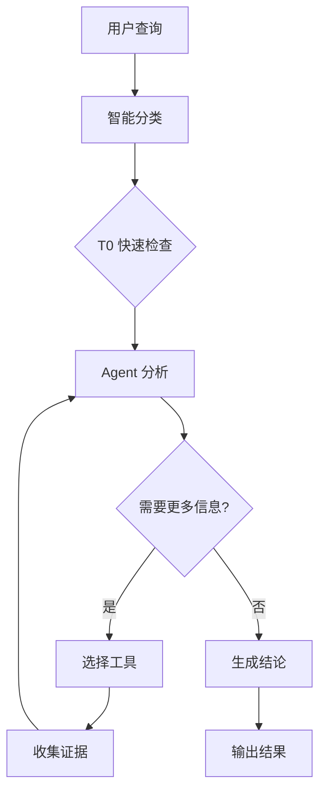

# 🏗️ 系统架构概述

本文档提供 Kube-OVN-LangGraph-Checker 的架构概览，帮助您理解系统设计原理、核心组件和技术选型。

## 📍 系统定位

**Kube-OVN-LangGraph-Checker** 是一个基于 LLM Agent 的智能 Kube-OVN 网络诊断工具，通过自主决策和渐进式推理，将运维人员从繁琐的手动排查中解放出来。

### 核心价值

| 传统方法 | Kube-OVN Checker |
|---------|-----------------|
| 手动执行 20+ 命令 | AI 自主选择工具 |
| 需要专家经验 | 智能诊断，降低门槛 |
| 耗时 30-60 分钟 | 5-10 分钟完成 |
| 易遗漏细节 | 系统化检查 |
| 依赖个人记忆 | 知识库驱动 |

## 🎯 设计原则

### 1. Agent 自主决策

> **"LLM 自主决定使用哪些工具，而不是硬编码决策树"**

**传统方法的问题**:
```python
# 硬编码决策树
if pod_restart:
    if ovs_error:
        check_ovs_log()
    else:
        check_kubelet_log()
else:
    check_network()
```

**ReAct Agent 的优势**:
```python
# 自主决策
Thought: Pod 一直在重启，需要查看日志
Action: collect_pod_logs("my-pod")

Observation: 日志显示 "Failed to create OVS port"

Thought: OVS 端口创建失败，需要检查 OVS 状态
Action: collect_ovs_vsctl()
```

**价值**:
- ✅ 灵活应对未知问题
- ✅ 组合多个工具的能力
- ✅ 渐进式推理收敛到根因

---

### 2. 分层诊断策略

> **"从快速检查到深度分析，渐进式收敛"**

```
T0 (10秒)     T1 (30秒)     T2 (深度)
   ↓             ↓              ↓
快速检查   →  详细诊断   →  根因分析
健康扫描   →  证据收集   →  深度推理
筛选问题   →  验证假设   →  收敛结论
```

**优势**:
- **快速反馈** - T0 在 10 秒内完成
- **按需深入** - 只对问题区域详细分析
- **避免盲目** - 不"大海捞针"

---

### 3. 证据驱动分析

> **"不猜测不假设，每个结论都有数据支撑"**

**诊断流程**:
1. **T0 发现异常** - 如 Pod 重启
2. **形成假设** - 可能是 OVS 配置错误
3. **收集证据** - ovn-trace, 日志等
4. **验证假设** - 证据支持或推翻假设
5. **收敛到根因** - 重复直到找到根本原因

---

### 4. 知识库增强

> **"将 Kube-OVN 专家知识注入 LLM"**

**知识库内容**:
- 控制平面原理 (2 个文档)
- 数据平面原理 (10 个文档)
- 诊断工作流 (3 个文档)

**增强方式**:
- 触发词匹配
- 元数据检索
- LLM 智能检索

---

## 🏛️ 技术栈

```
┌─────────────────────────────────────────────────┐
│              用户层 (CLI)                       │
│          Python 3.9+ / Rich 终端               │
└─────────────────────────────────────────────────┘
                       ↓
┌─────────────────────────────────────────────────┐
│         Agent 智能层 (LangGraph)                │
│    LangChain 0.3.0+ / LangGraph 1.0.3+         │
│     ReAct 模式 / 工具调用 / 多轮推理            │
└─────────────────────────────────────────────────┘
                       ↓
┌─────────────────────────────────────────────────┐
│         工具层 (26 个诊断工具)                   │
│      kubectl / kubectl-ko / OVN/OVS 命令        │
└─────────────────────────────────────────────────┘
                       ↓
┌─────────────────────────────────────────────────┐
│         数据收集层 (K8s API)                    │
│      Kubernetes Python Client                  │
└─────────────────────────────────────────────────┘
                       ↓
┌─────────────────────────────────────────────────┐
│      LLM 推理层 (OpenAI / 兼容服务)             │
│   GPT-4o / DeepSeek / 智谱 AI / Ollama         │
└─────────────────────────────────────────────────┘
```

### 核心框架

| 框架 | 版本 | 用途 |
|-----|------|------|
| **Python** | 3.9+ | 主要开发语言 |
| **LangGraph** | 1.0.3+ | Agent 状态机 |
| **LangChain** | 0.3.0+ | LLM 抽象层 |
| **Pydantic** | 2.0+ | 数据验证 |
| **asyncio** | - | 异步并发 |
| **Rich** | 13.0+ | 终端美化 |

---

## 🧩 核心组件

### 1. CLI 层

**文件**: `kube_ovn_checker/cli/main.py`

**职责**:
- 解析命令行参数
- 获取用户查询
- 初始化 Analyzer
- 展示诊断进度
- 格式化输出结果

**关键代码**:
```python
async def main():
    # 1. 获取查询
    query = get_user_query()

    # 2. 初始化 Analyzer
    analyzer = LLMAgentAnalyzer(
        model=os.getenv("LLM_MODEL", "gpt-4o"),
        api_key=os.getenv("OPENAI_API_KEY")
    )

    # 3. 执行诊断
    result = await analyzer.diagnose(
        query,
        progress_callback=print_progress
    )

    # 4. 输出结果
    print_diagnosis(result)
    save_report(result)
```

---

### 2. 分类层

**文件**: `kube_ovn_checker/classifier.py`

**职责**:
- 将用户查询分类到 5 个场景
- 触发相关知识库注入

**支持的场景**:
```python
class DiagnosisCategory(Enum):
    GENERAL = "general"                    # 通用查询
    POD_TO_POD = "pod_to_pod"             # 同节点 Pod 通信
    POD_TO_POD_CROSS_NODE = "pod_to_pod_cross_node"  # 跨节点 Pod 通信
    POD_TO_SERVICE = "pod_to_service"     # Service 访问
    POD_TO_EXTERNAL = "pod_to_external"   # 外部网络访问
```

**分类器工作流程**:
```
用户查询
    ↓
LLM 分类 (gpt-4o-mini)
    ↓
softmax 概率计算
    ↓
置信度 > 0.7?
    ↓ 是
返回场景分类
    ↓ 否
返回 GENERAL (默认)
```

---

### 3. Agent 层

**文件**: `kube_ovn_checker/analyzers/llm_agent_analyzer.py`

**核心类**: `LLMAgentAnalyzer`

**状态机** (LangGraph):
```python
from langgraph.graph import StateGraph

class AgentState(TypedDict):
    query: str
    category: str
    t0_result: Dict
    collected_evidence: List[Dict]
    current_hypothesis: str
    rounds: int
    diagnosis: Optional[Diagnosis]

# 定义状态转换
workflow = StateGraph(AgentState)

workflow.add_node("t0_check", t0_check_node)
workflow.add_node("analyze", analyze_node)
workflow.add_node("collect", collect_node)
workflow.add_node("conclude", conclude_node)

workflow.add_edge("t0_check", "analyze")
workflow.add_conditional_edges(
    "analyze",
    should_collect_more,
    {
        "collect": "collect",
        "conclude": "conclude"
    }
)
workflow.add_edge("collect", "analyze")

workflow.set_entry_point("t0_check")
workflow.set_finish_point("conclude")
```

**ReAct 循环**:
```
┌─────────────────────────────────────┐
│  分析当前状态                         │
│  - 查看 T0 结果                      │
│  - 查看已收集证据                     │
│  - 形成或更新假设                     │
└─────────────────────────────────────┘
              ↓
┌─────────────────────────────────────┐
│  推理 (Thought)                       │
│  - 需要什么信息?                     │
│  - 哪些工具能提供?                   │
│  - 是否已经收敛到根因?                │
└─────────────────────────────────────┘
              ↓
    ┌─────────┴─────────┐
    ↓                   ↓
[需要更多信息]      [已收敛]
    ↓                   ↓
┌─────────────────────────────────────┐
│  行动 (Action)                        │
│  - 选择工具                           │
│  - 执行收集                           │
│  - 更新证据                           │
└─────────────────────────────────────┘
    ↓
    返回分析状态
```

---

### 4. 工具层

**文件**: `kube_ovn_checker/analyzers/tools/__init__.py`

**工具分类**:

#### Pod 工具 (4 个)
1. `collect_pod_logs` - 收集 Pod 日志
2. `collect_pod_events` - 收集 Pod 事件
3. `collect_pod_describe` - 收集 Pod 详情
4. `collect_pod_ip` - 获取 Pod IP

#### Subnet 工具 (1 个)
5. `collect_subnet_status` - 收集 Subnet 状态

#### Node 工具 (6 个)
6. `collect_node_info` - 节点基本信息
7. `collect_node_ip_addr` - IP 地址
8. `collect_node_ip_route` - 路由表
9. `collect_node_iptables` - 防火墙规则
10. `collect_node_ipvs` - IPVS 规则
11. `collect_node_sysctl` - 内核参数

#### Controller 日志 (5 个)
12. `collect_kube_ovn_controller_logs` - kube-ovn-controller 日志
13. `collect_kube_ovn_cni_logs` - kube-ovn-cni 日志
14. `collect_ovn_controller_logs` - ovn-controller 日志
15. `collect_ovn_northd_logs` - ovn-northd 日志
16. `collect_ovs_vswitchd_logs` - ovs-vswitchd 日志

#### OVN/OVS 工具 (7 个)
17. `collect_ovn_trace` - OVN 微流追踪 ⭐ **首选工具**
18. `collect_ovn_nbctl` - OVN 北向 DB
19. `collect_ovn_sbctl` - OVN 南向 DB
20. `collect_ovs_vsctl` - OVS 交换机配置
21. `collect_ovs_ofctl` - OpenFlow 流表
22. `collect_ovs_dpctl` - OVS 数据路径
23. `collect_ovn_appctl` - OVS 守护进程控制

#### 网络抓包 (2 个)
24. `collect_tcpdump` - Pod 流量抓包
25. `collect_node_tcpdump` - 节点网卡抓包

#### T0 检查 (1 个)
26. `collect_t0_check` - T0 快速健康检查

---

### 5. 收集层

**文件**: `kube_ovn_checker/collectors/resource_collector.py`

**核心类**: `K8sResourceCollector`

**特点**:
- **异步并发**: 使用 `asyncio.gather()`
- **缓存机制**: 避免重复 API 调用
- **统一格式**: 所有工具返回相同结构

**异步并发示例**:
```python
async def collect_multiple_pods(
    pod_names: List[str],
    namespace: str
) -> List[Dict]:
    """并发收集多个 Pod 的信息"""

    # 创建并发任务
    tasks = [
        collect_pod_logs(name, namespace)
        for name in pod_names
    ]

    # 并发执行
    results = await asyncio.gather(*tasks)

    return results
```

---

### 6. 知识库层

**文件**: `kube_ovn_checker/knowledge/`

**知识库结构**:
```
knowledge/
├── principles/              # 技术原理 (12 个文档)
│   ├── control-plane/
│   │   ├── control-plane-architecture.md
│   │   └── control-plane-reference.md
│   └── dataplane/
│       ├── pod-communication/ (4 个)
│       ├── node-communication/ (3 个)
│       └── service-communication/ (3 个)
│
└── workflows/               # 诊断工作流 (3 个文档)
    ├── network-connectivity.md
    ├── ip-management.md
    └── general.md
```

**知识注入机制**:
```python
class KnowledgeInjector:
    async def inject_for_scenario(
        self,
        category: DiagnosisCategory,
        query: str
    ) -> str:
        """为特定场景注入相关知识"""

        # 1. 元数据快速匹配
        docs = self.retriever.retrieve_by_metadata(
            category=category,
            triggers=self._extract_triggers(query)
        )

        # 2. LLM 智能检索
        if not docs:
            docs = await self.llm_retriever.retrieve(query)

        # 3. 限制长度
        content = self._limit_length(docs, max_tokens=2000)

        return content
```

---

## 📊 诊断流程概览



### 诊断流程详解

#### 第 1 步: 智能分类 (0.5 秒)
```
用户查询: "Pod A 无法访问 Pod B"
    ↓
LLM 分类器 (gpt-4o-mini)
    ↓
场景分类: POD_TO_POD (置信度 0.92)
    ↓
注入相关知识: Pod 通信原理
```

#### 第 2 步: T0 快速检查 (10 秒)
```
并发执行 20+ 检查:
    - Deployments 健康状态
    - DaemonSets 健康状态
    - Endpoints 可用性
    - Controller 状态
    - Pod 统计信息
    - Subnet 概览
    ↓
生成 T0 报告
```

#### 第 3 步: Agent 多轮推理 (每轮 5-15 秒)
```
Round 1: 分析 T0 结果
    Thought: 所有组件健康，可能是配置问题
    Action: collect_ovn_trace(src=PodA, dst=PodB)
    Observation: 流量被 ACL 拒绝

Round 2: 验证假设
    Thought: ACL 拒绝，需要查看 NetworkPolicy
    Action: collect_network_policies()
    Observation: 存在 deny-all 策略

Round 3: 收敛结论
    Thought: 确认是 NetworkPolicy 导致
    Conclusion: 生成诊断报告
```

#### 第 4 步: 生成结果
```json
{
  "issue": "Pod A 无法访问 Pod B",
  "root_cause": "NetworkPolicy 'deny-all' 阻止流量",
  "severity": "high",
  "solutions": [
    {
      "priority": 1,
      "description": "创建允许流量的 NetworkPolicy",
      "commands": ["kubectl apply -f ..."]
    }
  ],
  "evidence": {
    "ovn_trace": "...",
    "network_policies": ["deny-all"]
  },
  "diagnosis_status": "completed",
  "rounds": 3
}
```

---

## 🎯 质量属性

| 属性 | 目标 | 实现策略 |
|-----|------|---------|
| **诊断速度** | < 2 分钟 | T0 快速检查、并发收集 |
| **准确率** | > 85% | 知识库增强、多轮推理 |
| **可用性** | 99.9% | 降级机制、规则兜底 |
| **可扩展性** | 1000+ 节点 | 缓存机制、分页收集 |
| **安全性** | 只读操作 | RBAC 权限限制 |

---

## 🔒 安全边界

### 只读保证

工具遵循 **只读原则**，不会修改集群状态：

✅ **允许的操作**:
- `kubectl get` - 查看资源
- `kubectl logs` - 查看日志
- `kubectl describe` - 查看详情
- `kubectl exec` - 执行只读命令

❌ **不允许的操作**:
- `kubectl delete` - 删除资源
- `kubectl apply` - 修改配置
- `kubectl edit` - 编辑资源
- 任何写入操作

### 数据隐私

**发送给 LLM 的数据**:
- T0 检查结果（汇总信息）
- 工具收集的日志和配置
- Pod 名称、命名空间
- 诊断问题描述

**不会发送**:
- 敏感配置（Secret、ConfigMap 内容）
- 用户密码和密钥
- 私有证书

**隐私建议**:
- 审查诊断报告后再分享
- 使用本地 LLM (Ollama) 处理敏感数据
- 在 .env 中配置脱敏规则

---

## 🆚 与其他工具对比

| 工具 | 类型 | 优势 | 局限 |
|-----|------|------|------|
| **Kube-OVN Checker** | LLM Agent | 智能决策、自适应 | 依赖 LLM |
| **kubectl-kubeovn** | CLI | 精确控制 | 需要专家经验 |
| **Kubernetes Event** | 监控 | 被动收集 | 不提供根因 |
| **Prometheus** | 指标 | 趋势分析 | 无上下文 |

---

## 📈 性能特征

### 时间分解

| 阶段 | 耗时 | 说明 |
|-----|------|------|
| 查询分类 | 0.5s | LLM 分类 (gpt-4o-mini) |
| T0 检查 | 10s | 并发执行 20+ 检查 |
| Agent 每轮 | 5-15s | LLM 推理 + 工具执行 |
| **总计 (3 轮)** | **30-60s** | 大部分问题在 3 轮内解决 |

### 并发性能

```python
# T0 检查并发执行
import asyncio

async def t0_check():
    # 20+ 检查并发执行
    tasks = [
        check_deployments(),      # 2s
        check_daemonsets(),       # 2s
        check_endpoints(),        # 1s
        check_pod_stats(),        # 3s
        check_subnet_status(),    # 2s
        ...
    ]

    # 总耗时 = max(各任务) ≈ 10s
    # 而非 sum(各任务) ≈ 50s
    results = await asyncio.gather(*tasks)
```

### 缓存效果

| 数据类型 | 缓存时间 | 命中率 | 性能提升 |
|---------|---------|--------|---------|
| Pod 列表 | 30s | 80% | 10x |
| Subnet 状态 | 60s | 90% | 5x |
| Node 信息 | 120s | 95% | 3x |

---

## 🎓 架构亮点

### 1. ReAct Agent 模式

**传统方法**:
```python
if pod_restart:
    if ovs_error:
        check_ovs_log()
    else:
        check_kubelet_log()
else:
    check_network()
```

**ReAct Agent**:
```python
Thought: Pod 一直在重启，需要查看日志
Action: collect_pod_logs("my-pod")
Observation: 日志显示 "Failed to create OVS port"
Thought: OVS 端口创建失败，需要检查 OVS 状态
Action: collect_ovs_vsctl()
```

### 2. 渐进式诊断

```
Round 1: T0 → 发现 Controller Pod 重启
Round 2: 查看 Controller 日志
Round 3: OVN NB 连接失败
Round 4: 确认根因: ovn-nb 服务不可达
```

### 3. 工具优先级系统

| 优先级 | 工具类型 | 示例 | 原因 |
|-------|---------|------|------|
| **P0 首选** | 逻辑路径分析 | `ovn-trace` | 准确、快速 |
| **P1** | 配置检查 | `ovn-nbctl` | 无侵入 |
| **P2** | 日志分析 | `collect_logs` | 详细但慢 |
| **P3** | 流量抓包 | `tcpdump` | 最后手段 |

---

## 🔮 未来展望

### 短期计划 (3 个月)
- [ ] 支持更多 LLM 提供商
- [ ] 添加更多诊断工具
- [ ] 优化知识库检索

### 中期计划 (6 个月)
- [ ] 多语言支持（英文）
- [ ] Web UI 界面
- [ ] API 接口

### 长期愿景 (1 年)
- [ ] 自动修复建议执行
- [ ] 集成到监控告警系统
- [ ] 预测性分析

---

## 📚 相关文档

- [构建块视图](building-blocks.md) - 详细的模块职责
- [运行时视图](runtime-view.md) - 诊断流程详解
- [诊断流程详解](diagnostic-workflow.md) - T0/T1/T2 分层
- [工具系统](tool-system.md) - 26 个工具详解

---

**下一步**: [构建块视图](building-blocks.md) | [运行时视图](runtime-view.md)
