# 🔧 添加新工具教程

本教程将指导你如何添加一个新的诊断工具到 Kube-OVN Checker。

## 🎯 教程概述

我们将添加一个新工具：`collect_ovn_version` - 收集 OVN 版本信息

## 📋 工具的生命周期

```mermaid
graph LR
    A[实现工具函数] --> B[创建 Pydantic Schema]
    B --> C[注册为 LangChain Tool]
    C --> D[添加到工具集]
    D --> E[编写单元测试]
    E --> F[更新文档]
```



## 🚀 完整示例

### 步骤 1: 实现收集函数

**文件**: `kube_ovn_checker/collectors/resource_collector.py`

```python
async def collect_ovn_version(
    node_name: Optional[str] = None
) -> Dict[str, Any]:
    """收集 OVN 版本信息

    Args:
        node_name: 节点名称，None 表示所有节点

    Returns:
        Dict: 版本信息
            - ovn_version: OVN 版本
            - ovs_version: OVS 版本
            - nodes: 节点版本列表
    """
    try:
        if node_name:
            # 单个节点
            cmd = f"kubectl exec {node_name} -n kube-system -- "
            cmd += "ovs-vswitchd --version"
            result = await kubectl_exec(cmd)
            # 解析版本...
        else:
            # 所有节点
            nodes = await get_ovn_nodes()
            versions = {}
            for node in nodes:
                versions[node] = await collect_ovn_version(node)

        return {
            "success": True,
            "data": {
                "ovn_version": extract_version(result),
                "ovs_version": extract_ovs_version(result),
                "nodes": versions
            }
        }

    except Exception as e:
        return {
            "success": False,
            "error": str(e)
        }
```

### 步骤 2: 创建 Pydantic Schema

**文件**: `kube_ovn_checker/analyzers/tools/schemas.py`

```python
from pydantic import BaseModel, Field

class CollectOvnVersionInput(BaseModel):
    """collect_ovn_version 工具的输入参数"""

    node_name: str = Field(
        default="",
        description="节点名称。空字符串表示检查所有节点"
    )
```

### 步骤 3: 创建 LangChain Tool

**文件**: `kube_ovn_checker/analyzers/tools/__init__.py`

```python
from langchain_core.tools import tool
from .schemas import CollectOvnVersionInput
from kube_ovn_checker.collectors.resource_collector import (
    collect_ovn_version
)

@tool(args_schema=CollectOvnVersionInput)
async def collect_ovn_version_tool(
    node_name: str = ""
) -> str:
    """收集 OVN 和 OVS 版本信息

    用途:
    - 验证 OVN 版本兼容性
    - 诊断版本相关的 bug
    - 检查集群版本一致性

    使用场景:
    - 升级前检查
    - 版本不一致问题
    - 新功能兼容性验证

    参数:
        node_name: 可选的节点名称。
                  留空检查所有节点，
                  提供节点名只检查该节点

    返回:
        JSON 格式的版本信息，包含:
        - ovn_version: OVN 版本号
        - ovs_version: OVS 版本号
        - nodes: 各节点的版本列表
        - consistency_check: 版本一致性检查

    示例输出:
    {
        "ovn_version": "22.03.0",
        "ovs_version": "2.17.0",
        "nodes": {
            "node-1": {"ovn": "22.03.0", "ovs": "2.17.0"},
            "node-2": {"ovn": "22.03.0", "ovs": "2.17.0"}
        },
        "consistency_check": {
            "consistent": true,
            "message": "所有节点版本一致"
        }
    }
    """
    result = await collect_ovn_version(
        node_name=node_name if node_name else None
    )

    return json.dumps(result, ensure_ascii=False, indent=2)
```

### 步骤 4: 注册到工具集

**文件**: `kube_ovn_checker/analyzers/tools/__init__.py`

```python
# 在文件底部的工具列表中添加
ALL_TOOLS = [
    # ... 现有工具 ...
    collect_ovn_version_tool,  # ← 添加新工具
]
```

### 步骤 5: 编写单元测试

**文件**: `tests/test_collect_ovn_version.py`

```python
import pytest
import json
from kube_ovn_checker.analyzers.tools import collect_ovn_version_tool

@pytest.mark.asyncio
async def test_collect_ovn_version_all_nodes():
    """测试收集所有节点的 OVN 版本"""
    result = await collect_ovn_version_tool.invoke("")

    data = json.loads(result)
    assert data["success"] is True
    assert "ovn_version" in data["data"]
    assert "nodes" in data["data"]
    assert len(data["data"]["nodes"]) > 0

@pytest.mark.asyncio
async def test_collect_ovn_version_single_node():
    """测试收集单个节点的 OVN 版本"""
    result = await collect_ovn_version_tool.invoke("node-1")

    data = json.loads(result)
    assert data["success"] is True
    assert "node-1" in data["data"]["nodes"]

@pytest.mark.asyncio
async def test_collect_ovn_version_invalid_node():
    """测试无效节点名称"""
    result = await collect_ovn_version_tool.invoke("invalid-node")

    data = json.loads(result)
    assert data["success"] is False
    assert "error" in data
```

### 步骤 6: 运行测试

```bash
# 运行新测试
pytest tests/test_collect_ovn_version.py -v

# 运行所有测试确保没有破坏
pytest tests/ -v
```

### 步骤 7: 更新文档

**文件**: `docs/architecture/tool-system.md`

在工具列表中添加:

```markdown
### OVN/OVS 工具

| 工具 | 描述 | 用途 |
|-----|------|------|
| `collect_ovn_version` | 收集 OVN 版本 | 版本检查、升级规划 |
| `collect_ovn_nbctl` | OVN 北向 DB | 配置验证 |
```

## 🎨 工具开发最佳实践

### 1. 命名规范

```python
# ✅ 好的命名
async def collect_pod_logs(...)
async def collect_subnet_status(...)

# ❌ 不好的命名
async def get_logs(...)
async def check_subnet(...)
```

### 2. 错误处理

```python
# ✅ 好的错误处理
async def collect_something(param: str) -> Dict:
    try:
        result = await do_something(param)
        return {
            "success": True,
            "data": result
        }
    except SpecificError as e:
        return {
            "success": False,
            "error": f"Specific error: {e}"
        }
    except Exception as e:
        logger.exception("Unexpected error")
        return {
            "success": False,
            "error": f"Unexpected error: {e}"
        }
```

### 3. 文档字符串

```python
# ✅ 好的文档字符串
@tool
async def my_tool(param: str) -> str:
    """工具简短描述（一句话）

    详细说明工具的功能、使用场景和注意事项。

    用途:
    - 场景 1
    - 场景 2
    - 场景 3

    参数:
        param1: 参数1的说明
        param2: 参数2的说明，默认值

    返回:
        JSON 格式，包含:
        - field1: 字段1说明
        - field2: 字段2说明

    示例:
        输入: param1="value"
        输出: {"field1": "result"}
    """
    pass
```

### 4. 异步并发

```python
# ✅ 好的并发模式
async def collect_multiple(items: List[str]):
    tasks = [collect_one(item) for item in items]
    results = await asyncio.gather(*tasks, return_exceptions=True)

    # 处理结果和异常
    for i, result in enumerate(results):
        if isinstance(result, Exception):
            logger.error(f"Error collecting {items[i]}: {result}")
        else:
            logger.info(f"Collected {items[i]}")

    return results
```

### 5. 参数验证

```python
from pydantic import BaseModel, Field, validator

class ToolInput(BaseModel):
    """工具输入参数"""

    pod_name: str = Field(..., min_length=1, description="Pod 名称")
    namespace: str = Field(..., description="命名空间")
    tail_lines: int = Field(
        default=100,
        ge=1,
        le=10000,
        description="日志行数"
    )

    @validator("namespace")
    def validate_namespace(cls, v):
        if not v:
            raise ValueError("namespace 不能为空")
        return v
```

## 🧪 工具测试模板

```python
import pytest
import json
from kube_ovn_checker.analyzers.tools import my_tool

class TestMyTool:
    """my_tool 的测试套件"""

    @pytest.mark.asyncio
    async def test_basic_functionality(self):
        """测试基本功能"""
        result = await my_tool.invoke("test-param")
        data = json.loads(result)
        assert data["success"] is True

    @pytest.mark.asyncio
    async def test_error_handling(self):
        """测试错误处理"""
        result = await my_tool.invoke("")
        data = json.loads(result)
        assert data["success"] is False
        assert "error" in data

    @pytest.mark.asyncio
    async def test_return_format(self):
        """测试返回格式"""
        result = await my_tool.invoke("test")
        data = json.loads(result)
        assert "success" in data
        assert "data" in data or "error" in data
```

## ❓ 常见问题

### Q1: 工具没有被 Agent 使用？

**原因**: LLM 可能不知道工具的存在或不知道何时使用

**解决方案**:
1. 改进工具描述（docstring）
2. 添加更多使用场景示例
3. 在系统提示词中提及

### Q2: 工具执行超时？

**原因**: kubectl 命令执行时间过长

**解决方案**:
```python
async def my_tool():
    try:
        result = await asyncio.wait_for(
            long_running_command(),
            timeout=30.0
        )
    except asyncio.TimeoutError:
        return {"success": False, "error": "Timeout"}
```

### Q3: 工具返回格式 LLM 无法理解？

**原因**: 返回的 JSON 格式不清晰

**解决方案**:
```python
# 使用清晰的字段名和结构化数据
return json.dumps({
    "summary": "一句话总结",
    "details": {
        "key1": "value1",
        "key2": "value2"
    },
    "recommendations": [
        "建议1",
        "建议2"
    ]
}, indent=2)
```

## 📝 总结

添加新工具的步骤：

1. ✅ 实现收集函数
2. ✅ 创建 Pydantic Schema
3. ✅ 创建 LangChain Tool
4. ✅ 注册到工具集
5. ✅ 编写单元测试
6. ✅ 更新文档
7. ✅ 提交 PR

遵循最佳实践可以确保工具质量高、易维护、LLM 易理解。

---

**相关文档**: [开发环境设置](development-setup.md) | [代码结构](code-structure.md) | [测试指南](testing.md)
