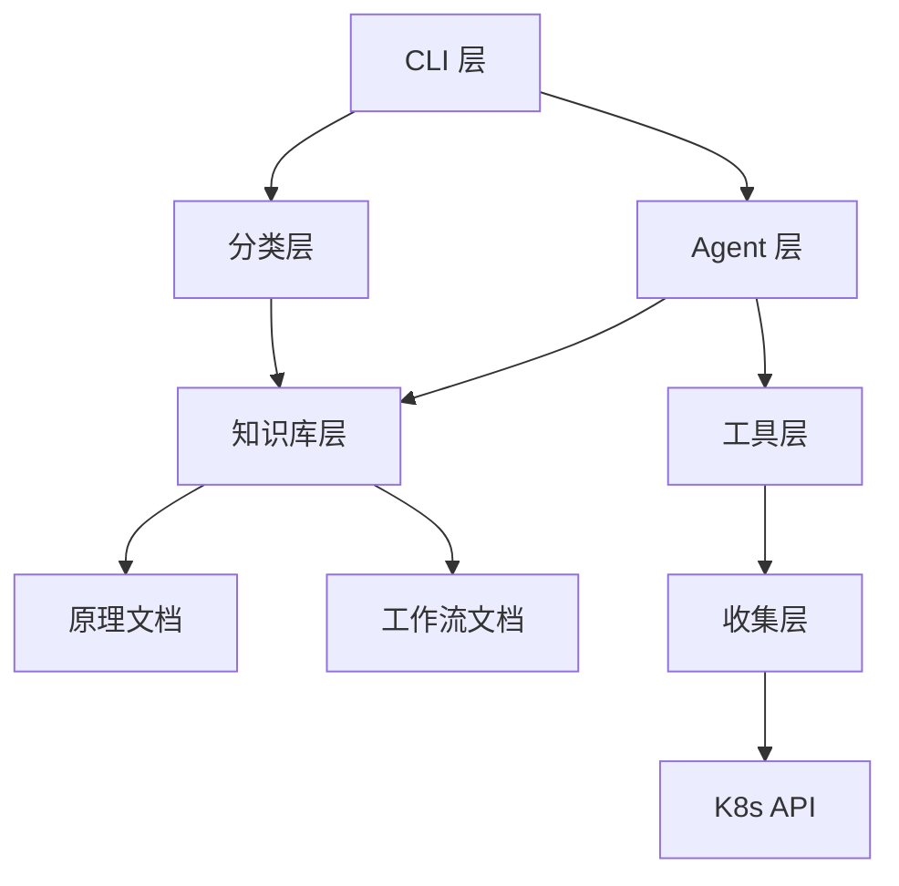

# 🧩 代码结构详解

本文档详细说明 Kube-OVN-LangGraph-Checker 的代码组织、模块职责和依赖关系。

## 📂 项目结构

```
kube-ovn-langgraph-checker/
├── kube_ovn_checker/          # 主代码包
│   ├── __init__.py
│   ├── cli/                   # 命令行接口
│   │   └── main.py            # 主入口 (412 行)
│   │
│   ├── collectors/            # 数据收集器
│   │   ├── __init__.py
│   │   ├── k8s_client.py      # Kubernetes 客户端 (485 行)
│   │   ├── cache.py           # K8s API 缓存
│   │   ├── models.py          # 数据模型
│   │   ├── t0_collector.py    # T0 快速检查 (620 行)
│   │   └── resource_collector.py  # 资源收集 (2612 行, 26 个方法)
│   │
│   ├── analyzers/             # LLM 分析器
│   │   ├── __init__.py
│   │   ├── llm_agent_analyzer.py  # LLM Agent (667 行)
│   │   └── tools/
│   │       └── __init__.py    # LangChain Tools (1133 行)
│   │
│   ├── knowledge/             # 知识库
│   │   ├── __init__.py
│   │   ├── rules.py           # 规则系统 (332 行)
│   │   ├── retriever.py       # 元数据检索器
│   │   ├── llm_retriever.py   # LLM 智能检索
│   │   └── injector.py        # 知识注入器 (245 行)
│   │
│   ├── llm/                   # LLM 客户端
│   │   └── client.py          # LLM API 封装
│   │
│   ├── utils/                 # 工具模块
│   │   ├── errors.py          # 错误定义
│   │   ├── parsers.py         # 数据解析器 (320 行)
│   │   └── retry.py           # 重试机制
│   │
│   └── classifier.py          # 智能分类器 (217 行)
│
├── tests/                     # 测试文件
│   ├── test_diagnosis_flow.py
│   ├── test_tool_registration.py
│   └── ...
│
├── docs/                      # 文档
│   ├── user-guide/
│   ├── architecture/
│   └── developer-guide/
│
├── .env.example               # 环境变量模板
├── pyproject.toml             # 项目配置
├── requirements.txt           # 依赖列表
└── kube-ovn-checker           # 启动脚本
```

## 🏗️ 分层架构

```
┌────────────────────────────────────────────────────┐
│  CLI 层 (用户接口)                                  │
│  - 参数解析                                         │
│  - 进度显示                                         │
│  - 结果格式化                                       │
└────────────────────────────────────────────────────┘
                        ↓
┌────────────────────────────────────────────────────┐
│  分类层 (场景识别)                                  │
│  - 问题场景分类 (5 大类)                            │
│  - 知识库检索                                       │
│  - 场景路由                                         │
└────────────────────────────────────────────────────┘
                        ↓
┌────────────────────────────────────────────────────┐
│  Agent 层 (智能决策)                                │
│  - LangGraph 状态机                                │
│  - ReAct 推理循环                                   │
│  - 多轮决策                                         │
└────────────────────────────────────────────────────┘
                        ↓
┌────────────────────────────────────────────────────┐
│  工具层 (能力封装)                                  │
│  - 26 个 LangChain Tools                           │
│  - Pydantic 参数验证                               │
│  - 统一返回格式                                     │
└────────────────────────────────────────────────────┘
                        ↓
┌────────────────────────────────────────────────────┐
│  收集层 (数据获取)                                  │
│  - K8s Resource Collector                         │
│  - kubectl / kubectl-ko 封装                       │
│  - 异步并发执行                                     │
└────────────────────────────────────────────────────┘
                        ↓
┌────────────────────────────────────────────────────┐
│  数据层 (数据源)                                    │
│  - Kubernetes API                                 │
│  - OVN/OVS DB                                      │
│  - Pod 日志和事件                                  │
└────────────────────────────────────────────────────┘
```

## 📦 核心模块详解

### 1. CLI 层

**文件**: `kube_ovn_checker/cli/main.py`

**职责**:
- 命令行参数解析
- 用户输入获取
- 初始化组件
- 进度显示
- 结果输出

**关键函数**:
```python
async def main():
    """主入口"""
    parser = argparse.ArgumentParser()
    parser.add_argument("query", nargs="?", help="诊断问题")
    args = parser.parse_args()

    # 获取查询
    query = get_user_query(args.query)

    # 初始化 Analyzer
    analyzer = LLMAgentAnalyzer(
        model=os.getenv("LLM_MODEL", "gpt-4o"),
        api_key=os.getenv("OPENAI_API_KEY"),
        base_url=os.getenv("OPENAI_API_BASE")
    )

    # 执行诊断
    result = await analyzer.diagnose(
        query,
        progress_callback=print_progress
    )

    # 输出结果
    print_diagnosis(result)
    save_report(result)
```

---

### 2. 分类层

**文件**: `kube_ovn_checker/classifier.py`

**职责**:
- 将用户查询分类到 5 个场景
- 触发相关知识库注入

**核心类**:
```python
class IntelligentClassifier:
    """智能分类器"""

    async def classify(self, query: str) -> DiagnosisCategory:
        """分类查询到场景"""
        # 使用 LLM 分类
        response = await self.llm_client.chat.completions.create(
            model="gpt-4o-mini",
            messages=[{
                "role": "system",
                "content": "分类查询到以下场景: general, pod_to_pod, ..."
            }, {
                "role": "user",
                "content": query
            }]
        )

        # 计算 softmax 概率
        probs = softmax(response.logits)
        max_prob = max(probs)

        # 置信度检查
        if max_prob > 0.7:
            return categories[probs.index(max_prob)]
        else:
            return DiagnosisCategory.GENERAL
```

---

### 3. Agent 层

**文件**: `kube_ovn_checker/analyzers/llm_agent_analyzer.py`

**职责**:
- 诊断协调和决策
- LangGraph 状态机管理
- 多轮推理控制

**核心类**:
```python
class LLMAgentAnalyzer:
    """LLM Agent 分析器"""

    def __init__(
        self,
        model: str = "gpt-4o",
        temperature: float = 0.0,
        api_key: str = None,
        base_url: str = None,
        max_rounds: int = 10
    ):
        self.model = model
        self.temperature = temperature
        self.api_key = api_key
        self.base_url = base_url
        self.max_rounds = max_rounds

        # 初始化 LangGraph
        self.graph = self._build_graph()

    async def diagnose(
        self,
        user_query: str,
        progress_callback: Callable = None
    ) -> Dict:
        """执行诊断"""
        # 创建初始状态
        state = AgentState(
            query=user_query,
            category=await self._classify_query(user_query),
            rounds=0
        )

        # 运行状态机
        final_state = await self.graph.ainvoke(state)

        return final_state["diagnosis"]
```

---

### 4. 工具层

**文件**: `kube_ovn_checker/analyzers/tools/__init__.py`

**职责**:
- 封装 26 个诊断工具
- Pydantic 参数验证
- 统一返回格式

**工具示例**:
```python
from langchain_core.tools import tool
from pydantic import BaseModel, Field

class CollectPodLogsInput(BaseModel):
    """collect_pod_logs 工具的输入参数"""
    pod_name: str = Field(..., description="Pod 名称")
    namespace: str = Field(..., description="命名空间")
    tail_lines: int = Field(default=100, description="日志行数")

@tool(args_schema=CollectPodLogsInput)
async def collect_pod_logs(
    pod_name: str,
    namespace: str,
    tail_lines: int = 100
) -> str:
    """收集 Pod 日志

    用于:
    - 查看应用错误信息
    - 分析容器启动失败原因
    - 检查应用异常行为

    参数:
        pod_name: Pod 名称
        namespace: 命名空间
        tail_lines: 返回的日志行数

    返回:
        JSON 格式的日志数据
    """
    # 实现细节...
    result = await k8s_client.get_pod_logs(
        pod_name,
        namespace,
        tail_lines=tail_lines
    )

    return json.dumps({
        "success": True,
        "data": result
    }, ensure_ascii=False)
```

---

### 5. 收集层

**文件**: `kube_ovn_checker/collectors/resource_collector.py`

**职责**:
- Kubernetes 数据收集
- 异步并发执行
- 缓存管理

**核心类**:
```python
class K8sResourceCollector:
    """K8s 资源收集器"""

    def __init__(self):
        self.kubectl = KubectlWrapper()
        self.cache = CacheManager()

    async def collect_pod_logs(
        self,
        pod_name: str,
        namespace: str,
        tail_lines: int = 100
    ) -> Dict:
        """收集 Pod 日志"""
        # 检查缓存
        cache_key = f"pod_logs:{namespace}:{pod_name}"
        cached = self.cache.get(cache_key)
        if cached:
            return cached

        # 执行收集
        cmd = f"kubectl logs {pod_name} -n {namespace} --tail={tail_lines}"
        result = await self.kubectl.exec_cmd(cmd)

        # 缓存结果
        self.cache.set(cache_key, result, ttl=30)

        return {
            "success": True,
            "data": result
        }
```

---

### 6. 知识库层

**文件**: `kube_ovn_checker/knowledge/`

**职责**:
- 知识文档管理
- 元数据检索
- LLM 智能检索

**知识库结构**:
```
knowledge/
├── principles/              # 技术原理
│   ├── control-plane/
│   │   ├── control-plane-architecture.md
│   │   └── control-plane-reference.md
│   └── dataplane/
│       ├── pod-communication/
│       ├── node-communication/
│       └── service-communication/
│
└── workflows/               # 诊断工作流
    ├── network-connectivity.md
    ├── ip-management.md
    └── general.md
```

**知识注入**:
```python
class KnowledgeInjector:
    """知识注入器"""

    async def inject_for_scenario(
        self,
        category: DiagnosisCategory,
        query: str
    ) -> str:
        """为特定场景注入相关知识"""

        # 1. 元数据快速匹配
        docs = self.retriever.retrieve_by_metadata(
            category=category,
            triggers=self._extract_triggers(query)
        )

        # 2. LLM 智能检索
        if not docs:
            docs = await self.llm_retriever.retrieve(query)

        # 3. 限制长度
        content = self._limit_length(docs, max_tokens=2000)

        return content
```

---

## 🔄 数据流

### 完整诊断流程

```
用户查询 "Pod A 无法访问 Pod B"
    ↓
[分类层] LLM 分类 → POD_TO_POD (置信度 0.92)
    ↓
[知识库] 注入 Pod 通信原理
    ↓
[Agent] T0 检查 → 所有组件健康
    ↓
[Agent] Round 1: 假设 "OVN 配置问题"
    ↓
[工具层] collect_ovn_trace(src=PodA, dst=PodB)
    ↓
[收集层] kubectl exec ovn-trace ...
    ↓
[数据层] OVN DB 返回逻辑路径
    ↓
[Agent] Round 2: 分析 trace 结果 → ACL 拒绝
    ↓
[工具层] collect_network_policies()
    ↓
[Agent] Round 3: 确认根因 → NetworkPolicy 阻止
    ↓
[输出] 诊断报告 + 解决方案
```

---

## 🧩 模块依赖关系



---

## 📊 代码统计

| 模块 | 文件数 | 代码行数 | 说明 |
|-----|-------|---------|------|
| CLI | 1 | 412 | 命令行接口 |
| 分类器 | 1 | 217 | 智能分类 |
| Analyzers | 2 | 1800 | Agent + Tools |
| Collectors | 5 | 3700 | 数据收集 |
| Knowledge | 5 | 1200 | 知识库 |
| Utils | 3 | 400 | 工具函数 |
| **总计** | **17** | **~7729** | 不含测试 |

---

## 🎯 关键设计模式

### 1. 策略模式

不同场景使用不同的诊断策略：
- `general` - 通用诊断
- `pod_to_pod` - Pod 通信诊断
- `pod_to_service` - Service 访问诊断

### 2. 工厂模式

工具动态创建和注册：
```python
def create_tool(tool_name: str) -> Tool:
    """动态创建工具"""
    if tool_name == "collect_pod_logs":
        return collect_pod_logs_tool
    elif tool_name == "collect_ovn_trace":
        return collect_ovn_trace_tool
    # ...
```

### 3. 观察者模式

进度回调通知：
```python
class ProgressCallback:
    def __init__(self):
        self.observers = []

    def notify(self, message: str):
        for observer in self.observers:
            observer.update(message)
```

### 4. 缓存模式

K8s API 结果缓存：
```python
class CacheManager:
    def __init__(self):
        self.cache = {}
        self.ttls = {}

    def get(self, key: str):
        if self._is_expired(key):
            del self.cache[key]
            return None
        return self.cache.get(key)
```

---

## 🔧 修改和扩展

### 添加新工具

见 [adding-tools.md](adding-tools.md)

### 修改知识库

```bash
# 编辑知识库文档
vim kube_ovn_checker/knowledge/workflows/new-workflow.md

# 重新安装
pip install -e .
```

### 修改 Agent 行为

```python
# 编辑系统提示词
vim kube_ovn_checker/analyzers/llm_agent_analyzer.py

# 修改 _get_system_prompt_static() 方法
```

---

## 📚 相关文档

- [开发环境设置](development-setup.md)
- [添加工具教程](adding-tools.md)
- [测试指南](testing.md)

---

**下一步**: [添加工具](adding-tools.md) | [测试指南](testing.md)
