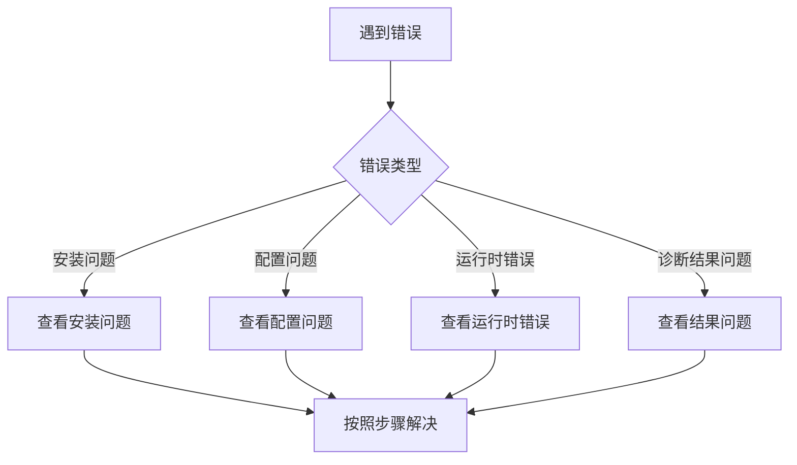

# 🔧 故障排除指南

本指南帮助您快速解决使用 Kube-OVN-LangGraph-Checker 时遇到的常见问题。

## 🚀 快速诊断流程

遇到问题时，按照以下流程快速定位：



## 🔥 Top 10 常见问题

### 1. API Key 无效

**症状**:
```
Error: AuthenticationError: Incorrect API key provided
```

**原因**:
- API Key 错误或已过期
- 账户余额不足
- API Key 权限不足
- 使用了错误的 API 端点

**解决方案**:

1. **验证 API Key**:
```bash
echo $OPENAI_API_KEY
# 应该显示您的 API Key

# 或检查 .env 文件
cat .env | grep OPENAI_API_KEY
```

2. **测试 API 连接**:
```bash
# OpenAI
curl https://api.openai.com/v1/models \
  -H "Authorization: Bearer $OPENAI_API_KEY"

# DeepSeek
curl https://api.deepseek.com/v1/models \
  -H "Authorization: Bearer $OPENAI_API_KEY"

# 智谱 AI
curl https://open.bigmodel.cn/api/paas/v4/models \
  -H "Authorization: Bearer $OPENAI_API_KEY"
```

3. **检查账户余额**:
   - 登录提供商控制台
   - 查看账户余额和使用情况

4. **重新生成 API Key**:
   - OpenAI: https://platform.openai.com/api-keys
   - DeepSeek: https://platform.deepseek.com/
   - 智谱 AI: https://open.bigmodel.cn/

5. **确认 API 端点**:
```bash
# .env 文件
OPENAI_API_BASE=https://api.openai.com/v1  # OpenAI
OPENAI_API_BASE=https://api.deepseek.com/v1  # DeepSeek
```

---

### 2. Kubernetes 连接失败

**症状**:
```
Error: Unable to connect to the server: dial tcp: lookup xxx on 53: server misbehaving
```

**原因**:
- kubeconfig 文件错误
- 集群不可达
- 网络问题
- TLS 证书过期

**解决方案**:

1. **检查 kubeconfig**:
```bash
# 查看 kubeconfig 位置
kubectl config view

# 查看当前上下文
kubectl config current-context

# 查看所有上下文
kubectl config get-contexts
```

2. **测试集群连接**:
```bash
# 检查集群信息
kubectl cluster-info

# 检查节点状态
kubectl get nodes

# 检查 API Server 连接
kubectl get --raw /
```

3. **切换到正确的上下文**:
```bash
kubectl config use-context your-cluster-name
```

4. **检查网络**:
```bash
# Ping API Server
ping kubernetes-api-server

# 检查 DNS
nslookup kubernetes.default.svc.cluster.local
```

5. **更新证书** (如果过期):
```bash
# 重新生成证书
kubectl config view --raw
```

---

### 3. 权限不足

**症状**:
```
Error: pods is forbidden: User "system:anonymous" cannot list pods
```

**原因**:
- RBAC 权限不足
- ServiceAccount 缺失
- 未正确认证

**解决方案**:

1. **检查当前用户**:
```bash
kubectl config view --minify | grep user
```

2. **测试权限**:
```bash
# 测试 Pod 列表权限
kubectl auth can-i list pods --all-namespaces

# 测试 Node 查看权限
kubectl auth can-i get nodes

# 测试 Kube-OVN CRD 权限
kubectl auth can-i get subnets --all-namespaces
```

3. **创建必需的 RBAC**:
```bash
kubectl apply -f - <<EOF
apiVersion: rbac.authorization.k8s.io/v1
kind: ClusterRole
metadata:
  name: kube-ovn-checker
rules:
- apiGroups: [""]
  resources: ["pods", "pods/log", "events", "nodes"]
  verbs: ["get", "list", "watch"]
- apiGroups: ["kubeovn.io"]
  resources: ["*", "ips", "subnets", "vpcs"]
  verbs: ["get", "list", "watch"]
- apiGroups: ["apps"]
  resources: ["deployments", "daemonsets", "statefulsets"]
  verbs: ["get", "list"]
---
apiVersion: rbac.authorization.k8s.io/v1
kind: ClusterRoleBinding
metadata:
  name: kube-ovn-checker
roleRef:
  apiGroup: rbac.authorization.k8s.io
  kind: ClusterRole
  name: kube-ovn-checker
subjects:
  - kind: User
    name: your-username
    apiGroup: rbac.authorization.k8s.io
EOF
```

---

### 4. 依赖包冲突

**症状**:
```
ERROR: pip's dependency resolver does not currently take into account...
```

**原因**:
- Python 版本不兼容
- 已安装的包版本冲突
- 虚拟环境未激活

**解决方案**:

1. **使用虚拟环境**:
```bash
# 创建虚拟环境
python -m venv venv

# 激活虚拟环境
source venv/bin/activate  # Linux/macOS
venv\Scripts\activate  # Windows

# 重新安装
pip install -e .
```

2. **升级 pip**:
```bash
pip install --upgrade pip
```

3. **清理并重新安装**:
```bash
# 卸载旧版本
pip uninstall kube-ovn-checker

# 清理缓存
pip cache purge

# 重新安装
pip install -e .
```

4. **检查 Python 版本**:
```bash
python --version  # 必须是 3.9+
```

---

### 5. 诊断超时

**症状**:
```
Error: Timeout after 300 seconds
```

**原因**:
- 集群规模大，收集数据慢
- 网络延迟
- LLM API 响应慢

**解决方案**:

1. **增加超时时间**:
```bash
# .env 文件
TOOL_TIMEOUT=60  # 增加到 60 秒
```

2. **使用更快的 LLM**:
```bash
# .env 文件
LLM_MODEL=gpt-4o-mini  # 比 gpt-4o 快
```

3. **减少并发工具**:
```bash
# .env 文件
MAX_CONCURRENT_TOOLS=3  # 降低并发数
```

4. **检查网络**:
```bash
# 测试 LLM API 延迟
time curl https://api.openai.com/v1/models \
  -H "Authorization: Bearer $OPENAI_API_KEY"

# 测试 Kubernetes API 延迟
time kubectl get nodes
```

---

### 6. 诊断结果为 Fallback

**症状**:
```
诊断状态: fallback
```

**含义**:
- LLM 未能给出明确结论
- 使用规则系统的兜底结果
- 可信度低于正常诊断

**处理**:

1. **查看收集的证据**:
```bash
# 查看诊断报告
cat diagnosis_report_*.json | jq '.evidence'
```

2. **重新描述问题**:
```bash
# 提供更多细节
./kube-ovn-checker "Pod nginx-deploy-xxx 在 default 命名空间无法启动，事件显示 FailedScheduling"
```

3. **人工审核**:
- 查看工具收集的所有数据
- 结合自己的知识判断
- 参考工具的建议但不完全依赖

---

### 7. 输出中文乱码

**症状**:
终端显示乱码或方块字符

**原因**:
- 终端不支持 UTF-8
- 字体缺失

**解决方案**:

**Linux/macOS**:
```bash
# 设置字符集
export LANG=zh_CN.UTF-8
export LC_ALL=zh_CN.UTF-8

# 添加到 ~/.bashrc 或 ~/.zshrc
echo 'export LANG=zh_CN.UTF-8' >> ~/.bashrc
echo 'export LC_ALL=zh_CN.UTF-8' >> ~/.bashrc
```

**Windows PowerShell**:
```powershell
# 设置控制台编码
[Console]::OutputEncoding = [System.Text.Encoding]::UTF8
chcp 65001
```

**Windows CMD**:
```cmd
chcp 65001
```

---

### 8. 内存不足

**症状**:
```
MemoryError: Killed
```

**原因**:
- 集群数据量大
- 并发工具调用多

**解决方案**:

1. **减少并发工具**:
```bash
# .env 文件
MAX_CONCURRENT_TOOLS=3  # 降低并发数
```

2. **增加系统内存**:
```bash
# 增加 swap 空间
sudo fallocate -l 2G /swapfile
sudo chmod 600 /swapfile
sudo mkswap /swapfile
sudo swapon /swapfile
```

3. **分批收集**:
```bash
# 针对特定资源而非全部
./kube-ovn-checker "检查 default 命名空间的问题"
```

---

### 9. 工具调用失败

**症状**:
```
Error: Tool collect_pod_logs failed
```

**原因**:
- Pod 不存在
- 权限不足
- kubectl-ko 工具缺失

**解决方案**:

1. **检查 Pod 名称**:
```bash
kubectl get pods --all-namespaces | grep pod-name
```

2. **验证 kubectl-ko**:
```bash
# kubectl-ko 应该自动从集群 Pod 复制
kubectl ko version

# 如果缺失，手动安装
wget https://github.com/kubeovn/kubectl-ko/releases/download/v1.12.0/kubectl-ko-linux-amd64
chmod +x kubectl-ko-linux-amd64
sudo mv kubectl-ko-linux-amd64 /usr/local/bin/kubectl-ko
```

3. **查看详细错误**:
```bash
# 启用调试日志
LOG_LEVEL=DEBUG ./kube-ovn-checker "test问题" > debug.log 2>&1

# 查看日志
cat debug.log
```

---

### 10. 达到最大轮数

**症状**:
```
Warning: Reached max_rounds=10 without convergence
```

**含义**:
- Agent 未能在 10 轮内收敛到结论
- 问题可能过于复杂

**处理**:

1. **增加最大轮数**:
```bash
# .env 文件
MAX_ROUNDS=15  # 增加到 15 轮
```

2. **重新描述问题**:
```bash
# 提供更多上下文
./kube-ovn-checker "Pod A 无法访问 Pod B，同节点，之前可以访问，最近突然不行"
```

3. **查看已收集的证据**:
```bash
# 查看报告
cat diagnosis_report_*.json | jq '.collected_evidence'
```

4. **人工分析**:
- 查看思维链
- 结合工具收集的证据
- 人工得出结论

---

## 🛠️ 调试技巧

### 启用调试日志

```bash
# 方法 1: 环境变量
LOG_LEVEL=DEBUG ./kube-ovn-checker "问题"

# 方法 2: 保存到文件
LOG_LEVEL=DEBUG ./kube-ovn-checker "问题" > debug.log 2>&1

# 查看日志
cat debug.log
```

### 查看诊断报告

```bash
# 查看最新报告
ls -lt diagnosis_report_*.json | head -1

# 格式化输出
cat diagnosis_report_*.json | jq '.'

# 查看特定字段
cat diagnosis_report_*.json | jq '.root_cause'
cat diagnosis_report_*.json | jq '.solutions'
```

### 测试工具

```bash
# 测试 kubectl 连接
kubectl get pods -A

# 测试 LLM API
curl https://api.openai.com/v1/models \
  -H "Authorization: Bearer $OPENAI_API_KEY"

# 测试权限
kubectl auth can-i list pods --all-namespaces
```

---

## 📝 收集诊断信息

提交 Bug Report 时，请提供以下信息：

### 必要信息

1. **完整的错误信息**
```bash
./kube-ovn-checker "问题" 2>&1 | tee error.log
```

2. **调试日志**
```bash
LOG_LEVEL=DEBUG ./kube-ovn-checker "问题" > debug.log 2>&1
```

3. **环境信息**
```bash
# 系统信息
uname -a

# Python 版本
python --version

# pip 版本
pip --version

# Kubernetes 版本
kubectl version

# 工具版本
./kube-ovn-checker --version
```

4. **配置信息**（隐藏敏感信息）
```bash
# .env 文件（移除 API Key）
cat .env | sed 's/OPENAI_API_KEY=.*/OPENAI_API_KEY=***REMOVED**/'
```

5. **复现步骤**
   - 详细的操作步骤
   - 问题描述
   - 预期行为
   - 实际行为

### 可选信息

- Kubernetes 集群规模（节点数、Pod 数）
- 使用的 LLM 提供商和模型
- 网络配置（Proxy、VPN）

---

## 🐛 提交 Bug Report

### GitHub Issues

https://github.com/xxx/kube-ovn-langgraph-checker/issues

### Issue 模板

```markdown
## 问题描述
简要描述遇到的问题

## 复现步骤
1. 运行命令: `./kube-ovn-checker "xxx"`
2. 等待...
3. 出现错误...

## 预期行为
应该正常完成诊断

## 实际行为
报错...

## 环境信息
- Python 版本: 3.11.0
- Kubernetes 版本: 1.28.0
- 工具版本: v0.1.0
- LLM 提供商: OpenAI
- LLM 模型: gpt-4o

## 错误日志
<details>
<summary>点击展开错误日志</summary>

```
错误日志内容...
```

</details>

## 其他信息
其他有助于解决问题的信息
```

---

## 💡 预防措施

### 定期维护

1. **更新工具**:
```bash
pip install --upgrade kube-ovn-checker
```

2. **更新依赖**:
```bash
pip install --upgrade -r requirements.txt
```

3. **清理旧报告**:
```bash
# 删除 7 天前的报告
find . -name "diagnosis_report_*.json" -mtime +7 -delete
```

### 监控和告警

1. **API 使用监控**:
   - 定期检查 API 使用量
   - 设置预算告警

2. **集群健康监控**:
   - 监控核心组件状态
   - 设置告警规则

3. **日志监控**:
   - 定期查看错误日志
   - 及时发现异常

---

## 📚 更多资源

- [快速开始](quick-start.md)
- [安装指南](installation.md)
- [配置指南](configuration.md)
- [常见问题](faq.md)

---

## 🆘 获取帮助

### 社区支持

- 💬 [GitHub Discussions](https://github.com/xxx/kube-ovn-langgraph-checker/discussions)
- 🐛 [GitHub Issues](https://github.com/xxx/kube-ovn-langgraph-checker/issues)

### 紧急支持

对于生产环境的紧急问题，请：
1. 查看 [案例库](examples/) 寻找类似问题
2. 使用 Kube-OVN 官方文档进行手动排查
3. 联系 Kube-OVN 社区支持

---

**下一步**: [常见问题](faq.md) | [案例库](examples/) | [安全考虑](security-considerations.md)
