---
# 控制平面架构
triggers:
  - 控制平面
  - 架构
  - controller
  - nbdb
  - sbdb

# 分类：通用基础文档
category: general

# 优先级：20（高优先级基础文档）
priority: 20
---

# Kube-OVN 控制平面深度分析

> 本文档为 LLM 优化的 Kube-OVN 控制平面架构文档，包含详细的 Mermaid 图表、数据结构说明和交互流程。

## 目录

- [总体架构](#总体架构)
- [kube-ovn-controller 架构](#kube-ovn-controller-架构)
- [OVN NBDB/SBDB 数据结构](#ovn-nbdbsbdb-数据结构)
- [CRD 资源管理](#crd-资源管理)
- [IPAM 机制](#ipam-机制)
- [流表计算与下发](#流表计算与下发)

---

## 总体架构

### 系统分层架构

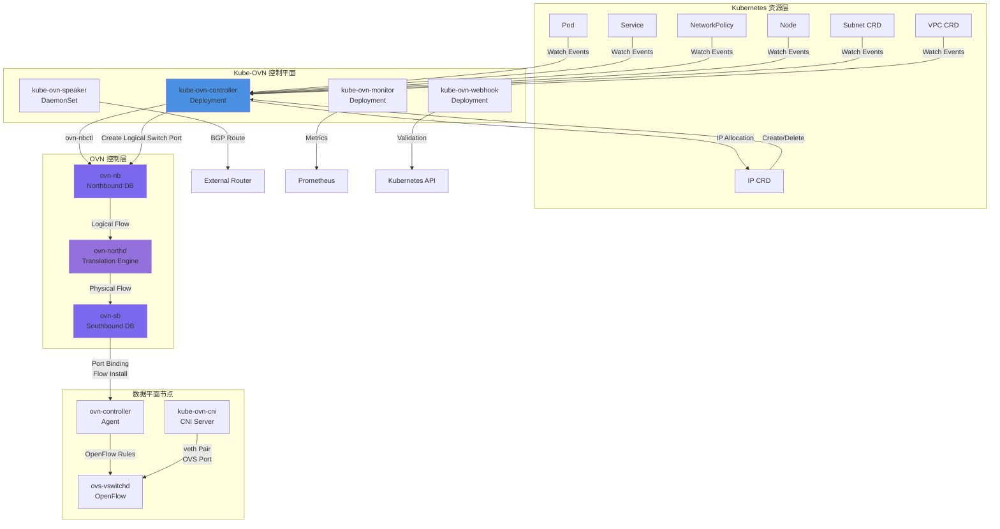
```mermaid
graph TB
    subgraph "Kubernetes 资源层"
        Pod[Pod]
        Service[Service]
        NetworkPolicy[NetworkPolicy]
        Node[Node]
        SubnetCRD[Subnet CRD]
        VPC_CRD[VPC CRD]
        IP_CRD[IP CRD]
    end

    subgraph "Kube-OVN 控制平面"
        Controller[kube-ovn-controller<br/>Deployment]
        Speaker[kube-ovn-speaker<br/>DaemonSet]
        Monitor[kube-ovn-monitor<br/>Deployment]
        Webhook[kube-ovn-webhook<br/>Deployment]
    end

    subgraph "OVN 控制层"
        OvnNB[ovn-nb<br/>Northbound DB]
        OvnSB[ovn-sb<br/>Southbound DB]
        OvnNorthd[ovn-northd<br/>Translation Engine]
    end

    subgraph "数据平面节点"
        OvsVswitchd[ovs-vswitchd<br/>OpenFlow]
        OvnController[ovn-controller<br/>Agent]
        KubeOvnCni[kube-ovn-cni<br/>CNI Server]
    end

    Pod -->|Watch Events| Controller
    Service -->|Watch Events| Controller
    NetworkPolicy -->|Watch Events| Controller
    Node -->|Watch Events| Controller
    SubnetCRD -->|Watch Events| Controller
    VPC_CRD -->|Watch Events| Controller
    IP_CRD -->|Create/Delete| Controller

    Controller -->|ovn-nbctl| OvnNB
    Controller -->|IP Allocation| IP_CRD
    Controller -->|Create Logical Switch Port| OvnNB

    Speaker -->|BGP Route| External[External Router]
    Monitor -->|Metrics| Prometheus[Prometheus]
    Webhook -->|Validation| K8sAPI[Kubernetes API]

    OvnNB -->|Logical Flow| OvnNorthd
    OvnNorthd -->|Physical Flow| OvnSB

    OvnSB -->|Port Binding<br/>Flow Install| OvnController
    OvnController -->|OpenFlow Rules| OvsVswitchd
    KubeOvnCni -->|veth Pair<br/>OVS Port| OvsVswitchd

    style Controller fill:#4A90E2
    style OvnNB fill:#7B68EE
    style OvnSB fill:#7B68EE
    style OvnNorthd fill:#9370DB
```

### 数据流时序图

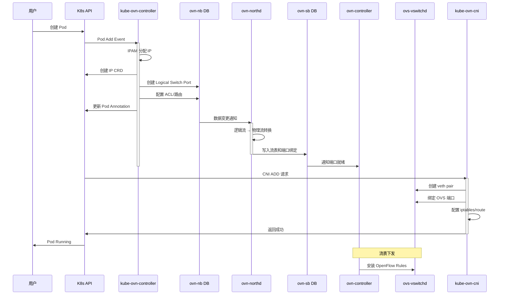
```mermaid
sequenceDiagram
    participant User as 用户
    participant K8s as K8s API
    participant Controller as kube-ovn-controller
    participant OvnNB as ovn-nb DB
    participant OvnNorthd as ovn-northd
    participant OvnSB as ovn-sb DB
    participant OvnCtrl as ovn-controller
    participant OVS as ovs-vswitchd
    participant CNI as kube-ovn-cni

    User->>K8s: 创建 Pod
    K8s->>Controller: Pod Add Event
    activate Controller

    Controller->>Controller: IPAM 分配 IP
    Controller->>K8s: 创建 IP CRD

    Controller->>OvnNB: 创建 Logical Switch Port
    Controller->>OvnNB: 配置 ACL/路由
    Controller->>K8s: 更新 Pod Annotation

    OvnNB->>OvnNorthd: 数据变更通知
    activate OvnNorthd
    OvnNorthd->>OvnNorthd: 逻辑流 → 物理流转换
    OvnNorthd->>OvnSB: 写入流表和端口绑定
    deactivate OvnNorthd

    OvnSB->>OvnCtrl: 通知端口就绪
    deactivate Controller

    K8s->>CNI: CNI ADD 请求
    activate CNI
    CNI->>OVS: 创建 veth pair
    CNI->>OVS: 绑定 OVS 端口
    CNI->>CNI: 配置 iptables/route
    CNI->>K8s: 返回成功
    deactivate CNI

    K8s->>User: Pod Running

    Note over OvnCtrl,OVS: 流表下发
    OvnCtrl->>OVS: 安装 OpenFlow Rules
```

---

## kube-ovn-controller 架构

### 核心模块划分

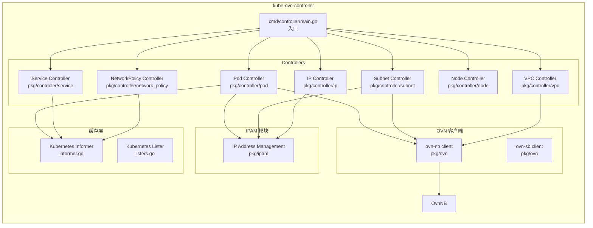
```mermaid
graph LR
    subgraph "kube-ovn-controller"
        Entry[cmd/controller/main.go<br/>入口]

        subgraph "Controllers"
            PodCtrl[Pod Controller<br/>pkg/controller/pod]
            SvcCtrl[Service Controller<br/>pkg/controller/service]
            NPCtrl[NetworkPolicy Controller<br/>pkg/controller/network_policy]
            SubnetCtrl[Subnet Controller<br/>pkg/controller/subnet]
            VPCtrl[VPC Controller<br/>pkg/controller/vpc]
            NodeCtrl[Node Controller<br/>pkg/controller/node]
            IPCtrl[IP Controller<br/>pkg/controller/ip]
        end

        subgraph "IPAM 模块"
            IPAM[IP Address Management<br/>pkg/ipam]
        end

        subgraph "OVN 客户端"
            OvnNBClient[ovn-nb client<br/>pkg/ovn]
            OvnSBClient[ovn-sb client<br/>pkg/ovn]
        end

        subgraph "缓存层"
            Informer[Kubernetes Informer<br/>informer.go]
            Lister[Kubernetes Lister<br/>listers.go]
        end

        Entry --> PodCtrl
        Entry --> SvcCtrl
        Entry --> NPCtrl
        Entry --> SubnetCtrl
        Entry --> VPCtrl
        Entry --> NodeCtrl
        Entry --> IPCtrl

        PodCtrl --> Informer
        SvcCtrl --> Informer
        NPCtrl --> Informer

        PodCtrl --> IPAM
        SubnetCtrl --> IPAM
        IPCtrl --> IPAM

        PodCtrl --> OvnNBClient
        SubnetCtrl --> OvnNBClient
        VPCtrl --> OvnNBClient

        OvnNBClient --> OvnNB
    end
```

### 控制器初始化流程

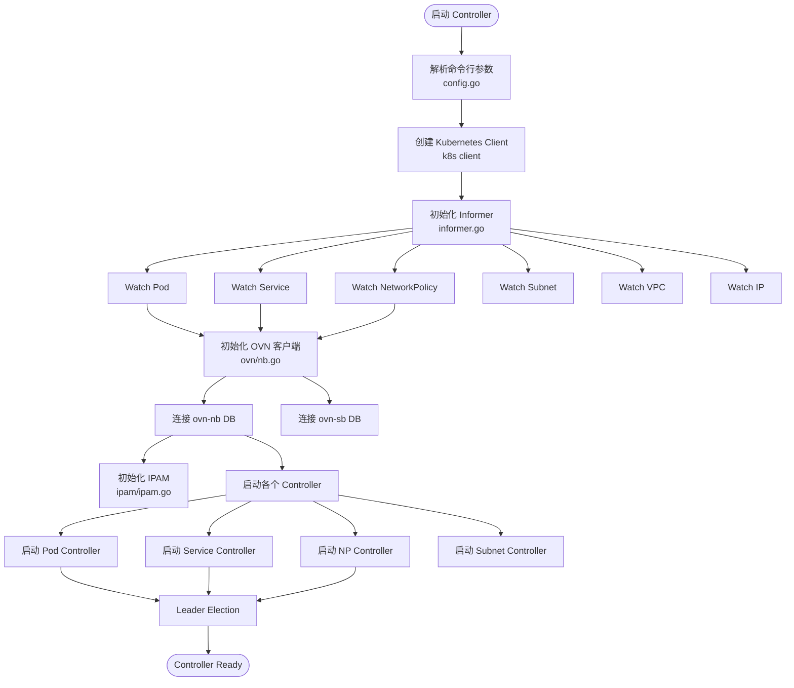
```mermaid
flowchart TD
    Start([启动 Controller]) --> ParseConfig[解析命令行参数<br/>config.go]
    ParseConfig --> InitClient[创建 Kubernetes Client<br/>k8s client]

    InitClient --> InitInformers[初始化 Informer<br/>informer.go]
    InitInformers --> WatchPod[Watch Pod]
    InitInformers --> WatchService[Watch Service]
    InitInformers --> WatchNP[Watch NetworkPolicy]
    InitInformers --> WatchSubnet[Watch Subnet]
    InitInformers --> WatchVPC[Watch VPC]
    InitInformers --> WatchIP[Watch IP]

    WatchPod --> InitOVN[初始化 OVN 客户端<br/>ovn/nb.go]
    WatchService --> InitOVN
    WatchNP --> InitOVN

    InitOVN --> ConnectNB[连接 ovn-nb DB]
    InitOVN --> ConnectSB[连接 ovn-sb DB]

    ConnectNB --> InitIPAM[初始化 IPAM<br/>ipam/ipam.go]
    ConnectNB --> InitControllers[启动各个 Controller]

    InitControllers --> RunPodCtrl[启动 Pod Controller]
    InitControllers --> RunSvcCtrl[启动 Service Controller]
    InitControllers --> RunNPCtrl[启动 NP Controller]
    InitControllers --> RunSubnetCtrl[启动 Subnet Controller]

    RunPodCtrl --> LeaderElect[Leader Election]
    RunSvcCtrl --> LeaderElect
    RunNPCtrl --> LeaderElect

    LeaderElect --> Ready([Controller Ready])
```

### Pod 创建的完整协调流程

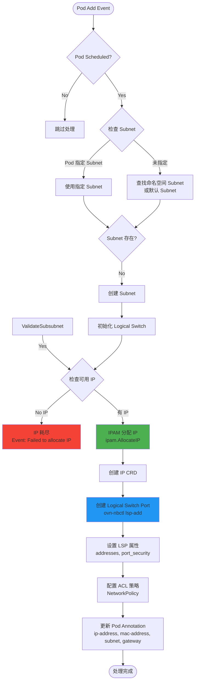
```mermaid
flowchart TD
    PodAdd([Pod Add Event]) --> CheckScheduled{Pod Scheduled?}
    CheckScheduled -->|No| Skip[跳过处理]
    CheckScheduled -->|Yes| CheckSubnet{检查 Subnet}

    CheckSubnet -->|Pod 指定 Subnet| UseNamedSubnet[使用指定 Subnet]
    CheckSubnet -->|未指定| FindSubnet[查找命名空间 Subnet<br/>或默认 Subnet]

    UseNamedSubnet --> ValidateSubnet{Subnet 存在?}
    FindSubnet --> ValidateSubnet

    ValidateSubnet -->|No| CreateSubnet[创建 Subnet]
    ValidateSubsubnet -->|Yes| CheckIPAvailable{检查可用 IP}

    CreateSubnet --> InitLS[初始化 Logical Switch]
    InitLS --> CheckIPAvailable

    CheckIPAvailable -->|No IP| IPExhausted[IP 耗尽<br/>Event: Failed to allocate IP]
    CheckIPAvailable -->|有 IP| AllocateIP[IPAM 分配 IP<br/>ipam.AllocateIP]

    AllocateIP --> CreateIPCRD[创建 IP CRD]
    CreateIPCRD --> CreateLSP[创建 Logical Switch Port<br/>ovn-nbctl lsp-add]

    CreateLSP --> SetLSP[设置 LSP 属性<br/>addresses, port_security]
    SetLSP --> ConfigACL[配置 ACL 策略<br/>NetworkPolicy]

    ConfigACL --> UpdatePodAnno[更新 Pod Annotation<br/>ip-address, mac-address, subnet, gateway]
    UpdatePodAnno --> Success([处理完成])

    style AllocateIP fill:#4CAF50
    style CreateLSP fill:#2196F3
    style IPExhausted fill:#F44336
```

### Controller 关键数据结构

```go
// Configuration 结构体
// 来源: pkg/controller/config.go
type Configuration struct {
    // OVN 数据库连接
    OvnNbAddr              string
    OvnSbAddr              string
    OvnTimeout             int

    // 默认网络配置
    DefaultLogicalSwitch   string
    DefaultCIDR            string
    DefaultGateway         string
    DefaultExcludeIps      string

    // 集群网络配置
    ClusterRouter          string
    NodeSwitch             string
    NodeSwitchCIDR         string
    ServiceClusterIPRange  string

    // Load Balancer
    ClusterTCPLoadBalancer         string
    ClusterUDPLoadBalancer         string
    ClusterSctpLoadBalancer        string

    // 功能开关
    EnableLb               bool
    EnableNP               bool
    EnableEipSnat          bool
    EnableExternalVpc       bool
    EnableMetrics          bool

    // 性能配置
    WorkerNum              int
    PprofPort              int
    GCInterval             int
    InspectInterval        int
}

// Pod Controller 结构
// 来源: pkg/controller/pod/controller.go
type Controller struct {
    config      *Configuration
    kubeClient  kubernetes.Interface
    ovnClient   *ovn.Client

    // Informer
    podsInformer     cache.SharedIndexInformer
    servicesInformer cache.SharedIndexInformer

    // Lister
    podsLister     corelisters.PodLister
    servicesLister corelisters.ServiceLister

    // IPAM
    ipam *ipam.IPAM

    // WorkQueue
    queue workqueue.RateLimitingInterface
}

// IPAM 结构
// 来源: pkg/ipam/ipam.go
type IPAM struct {
    // Subnet → IP 分配器映射
    subnets sync.Map

    // IP 段管理
    segments []*Segment

    // VPC 管理
    vpcs sync.Map
}

type Segment struct {
    // CIDR 信息
    cidr     *net.IPNet
    gateway  net.IP

    // IP 分配位图
    allocated map[string]struct{}
    available []net.IP

    // 排除 IP
    excludeIPs []net.IP

    // 统计
    usingIPs  int
    totalIPs  int
}
```

### Controller 工作队列机制

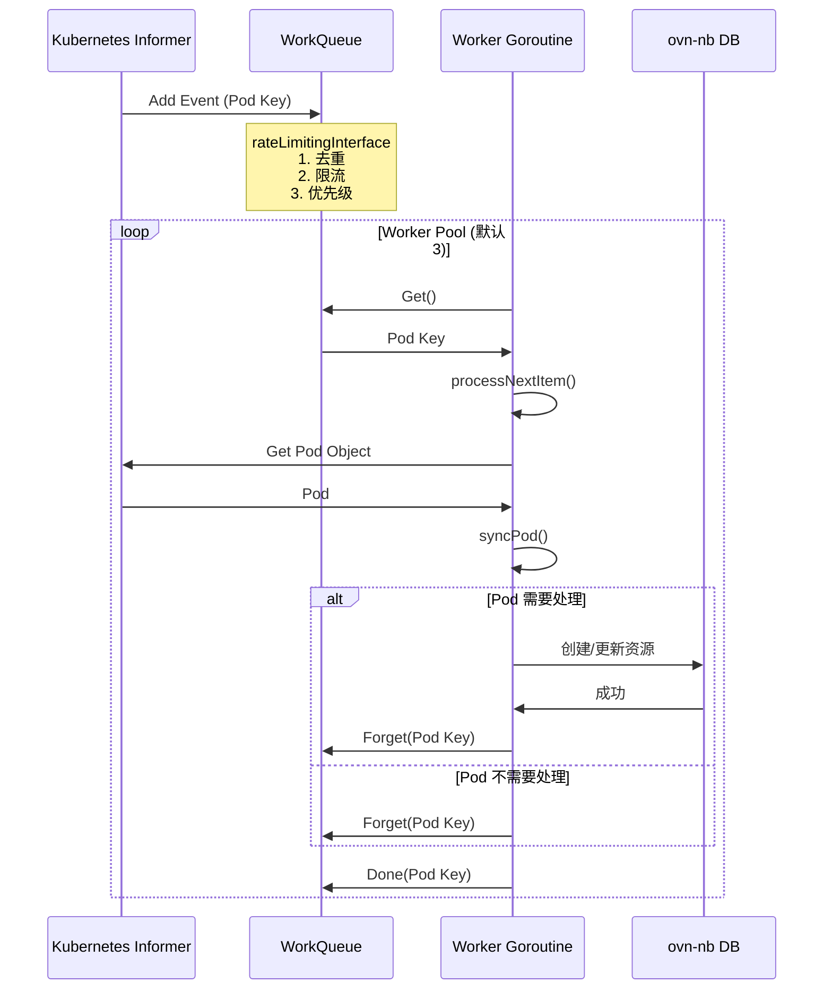
```mermaid
sequenceDiagram
    participant Informer as Kubernetes Informer
    participant Queue as WorkQueue
    participant Worker as Worker Goroutine
    participant OVN as ovn-nb DB

    Informer->>Queue: Add Event (Pod Key)
    Note over Queue: rateLimitingInterface<br/>1. 去重<br/>2. 限流<br/>3. 优先级

    loop Worker Pool (默认 3)
        Worker->>Queue: Get()
        Queue->>Worker: Pod Key

        Worker->>Worker: processNextItem()

        Worker->>Informer: Get Pod Object
        Informer->>Worker: Pod

        Worker->>Worker: syncPod()

        alt Pod 需要处理
            Worker->>OVN: 创建/更新资源
            OVN->>Worker: 成功

            Worker->>Queue: Forget(Pod Key)
        else Pod 不需要处理
            Worker->>Queue: Forget(Pod Key)
        end

        Worker->>Queue: Done(Pod Key)
    end
```

---

## OVN NBDB/SBDB 数据结构

### OVN 数据库架构

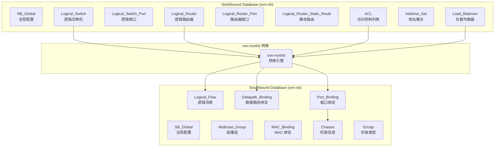
```mermaid
graph TB
    subgraph "Northbound Database (ovn-nb)"
        NB_Global[NB_Global<br/>全局配置]
        Logical_Switch[Logical_Switch<br/>逻辑交换机]
        Logical_Switch_Port[Logical_Switch_Port<br/>逻辑端口]
        Logical_Router[Logical_Router<br/>逻辑路由器]
        Logical_Router_Port[Logical_Router_Port<br/>路由器端口]
        Logical_Router_Static_Route[Logical_Router_Static_Route<br/>静态路由]
        ACL[ACL<br/>访问控制列表]
        Address_Set[Address_Set<br/>地址集合]
        Load_Balancer[Load_Balancer<br/>负载均衡器]
    end

    subgraph "Southbound Database (ovn-sb)"
        SB_Global[SB_Global<br/>全局配置]
        Logical_Flow[Logical_Flow<br/>逻辑流表]
        Multicast_Group[Multicast_Group<br/>组播组]
        Datapath_Binding[Datapath_Binding<br/>数据路径绑定]
        Port_Binding[Port_Binding<br/>端口绑定]
        MAC_Binding[MAC_Binding<br/>MAC 绑定]
        Chassis[Chassis<br/>机架信息]
        Encap[Encap<br/>封装类型]
    end

    subgraph "ovn-northd 转换"
        Northd[ovn-northd<br/>转换引擎]
    end

    Logical_Switch --> Northd
    Logical_Router --> Northd
    ACL --> Northd
    Load_Balancer --> Northd

    Northd --> Logical_Flow
    Northd --> Port_Binding
    Northd --> Datapath_Binding

    Port_Binding --> Chassis
```

### 关键表结构详解

#### 1. Logical_Switch (逻辑交换机)

```
对应: Kube-OVN Subnet
映射: ovn-default → 10.16.0.0/16

Schema:
┌─────────────────────────────────────────────────────────┐
│ Logical_Switch                                         │
├─────────────────────────────────────────────────────────┤
│ name: string (LS name)                                 │
│ ports: array of Logical_Switch_Port references         │
│ external_ids: {                                        │
│   "kube-ovn/subnet": "ovn-default"                     │
│   "vendor": "kube-ovn"                                 │
│ }                                                      │
│ acls: array of ACL references                          │
│ load_balancer: array of Load_Balancer references       │
└─────────────────────────────────────────────────────────┘

Kube-OVN 字段映射:
- name: Subnet.metadata.name
- external_ids["kube-ovn/subnet"]: Subnet CRD 名称
- external_ids["kube-ovn/cidr"]: Subnet.spec.cidr
- external_ids["kube-ovn/gateway"]: Subnet.spec.gateway
```

#### 2. Logical_Switch_Port (逻辑交换机端口)

```
对应: Kube-OVN Pod veth 接口

Schema:
┌─────────────────────────────────────────────────────────┐
│ Logical_Switch_Port                                    │
├─────────────────────────────────────────────────────────┤
│ name: string (LSP name)                                │
│ type: string ("", "router", "localnet", "l2gateway")   │
│ options: {                                             │
│   "requested-chassis": "node-1"                        │
│ }                                                      │
│ addresses: array of strings                            │
│   ["0a:00:00:00:00:01 10.16.0.5"]                     │
│ port_security: array of strings                        │
│   ["0a:00:00:00:00:01 10.16.0.5"]                     │
│ dynamic_addresses: ["dynamic"]                          │
│ external_ids: {                                        │
│   "kube-ovn/pod": "my-pod"                             │
│   "kube-ovn/namespace": "default"                       │
│ }                                                      │
│ up: boolean                                            │
│ enabled: boolean                                       │
└─────────────────────────────────────────────────────────┘

Kube-OVN 字段映射:
- name: <pod-name>_<namespace>
- addresses: "<mac> <ip>"
- port_security: "<mac> <ip>"
- external_ids["kube-ovn/pod"]: Pod 名称
- external_ids["kube-ovn/namespace"]: 命名空间
```

#### 3. Logical_Router (逻辑路由器)

```
对应: Kube-OVN VPC

Schema:
┌─────────────────────────────────────────────────────────┐
│ Logical_Router                                         │
├─────────────────────────────────────────────────────────┤
│ name: string (LR name)                                 │
│ ports: array of Logical_Router_Port references         │
│ static_routes: array of Logical_Router_Static_Route    │
│ nat: array of NAT rules                                │
│ load_balancer: array of Load_Balancer references      │
│ external_ids: {                                        │
│   "kube-ovn/vpc": "my-vpc"                             │
│ }                                                      │
└─────────────────────────────────────────────────────────┘

Kube-OVN 字段映射:
- name: <vpc-name>-lr
- external_ids["kube-ovn/vpc"]: VPC CRD 名称
```

#### 4. Logical_Router_Static_Route (静态路由)

```
对应: VPC 跨子网路由、外部路由

Schema:
┌─────────────────────────────────────────────────────────┐
│ Logical_Router_Static_Route                            │
├─────────────────────────────────────────────────────────┤
│ ip_prefix: string ("10.17.0.0/24")                     │
│ nexthop: string ("10.16.0.1")                          │
│ external_ids: {                                        │
│   "kube-ovn/subnet": "backend-subnet"                  │
│ }                                                      │
│ policy: string ("dst-ip")                               │
│ output_port: Logical_Router_Port reference              │
└─────────────────────────────────────────────────────────┘

路由规则:
- 同 VPC 内子网互访: ip_prefix=subnet-cidr, nexthop=gateway
- 外部访问: ip_prefix=external-cidr, nexthop=physical-gateway
```

#### 5. ACL (访问控制列表)

```
对应: Kubernetes NetworkPolicy

Schema:
┌─────────────────────────────────────────────────────────┐
│ ACL                                                    │
├─────────────────────────────────────────────────────────┤
│ action: string ("allow", "drop", "reject")             │
│ direction: string ("from-lport", "to-lport")           │
│ priority: integer (1-32767)                            │
│ match: string ("ip4.src == $ip4_addr_a")              │
│ external_ids: {                                        │
│   "kube-ovn/np": "allow-from-frontend"                │
│ }                                                      │
│ label: integer (用于逻辑流表匹配)                      │
└─────────────────────────────────────────────────────────┘

Kube-OVN 生成规则:
- Ingress: direction="from-lport", match="ip4.src==<pod-ip>"
- Egress: direction="to-lport", match="ip4.dst==<pod-ip>"
```

#### 6. Load_Balancer (负载均衡器)

```
对应: Kubernetes Service

Schema:
┌─────────────────────────────────────────────────────────┐
│ Load_Balancer                                          │
├─────────────────────────────────────────────────────────┤
│ name: string                                           │
│ vips: {                                                │
│   "10.96.0.1:80": "10.16.0.5:80,10.16.0.6:80"        │
│   "10.96.0.1:443": "10.16.0.5:443,10.16.0.7:443"      │
│ }                                                      │
│ protocol: string ("tcp", "udp", "sctp")                │
│ health_check: boolean                                  │
│ external_ids: {                                        │
│   "kube-ovn/service": "kubernetes/default/kubernetes"  │
│ }                                                      │
└─────────────────────────────────────────────────────────┘

VIP 格式: "<cluster-ip>:<port>"
Endpoints: "<pod1-ip>:<port>,<pod2-ip>:<port>"
```

### NBDB → SBDB 转换流程

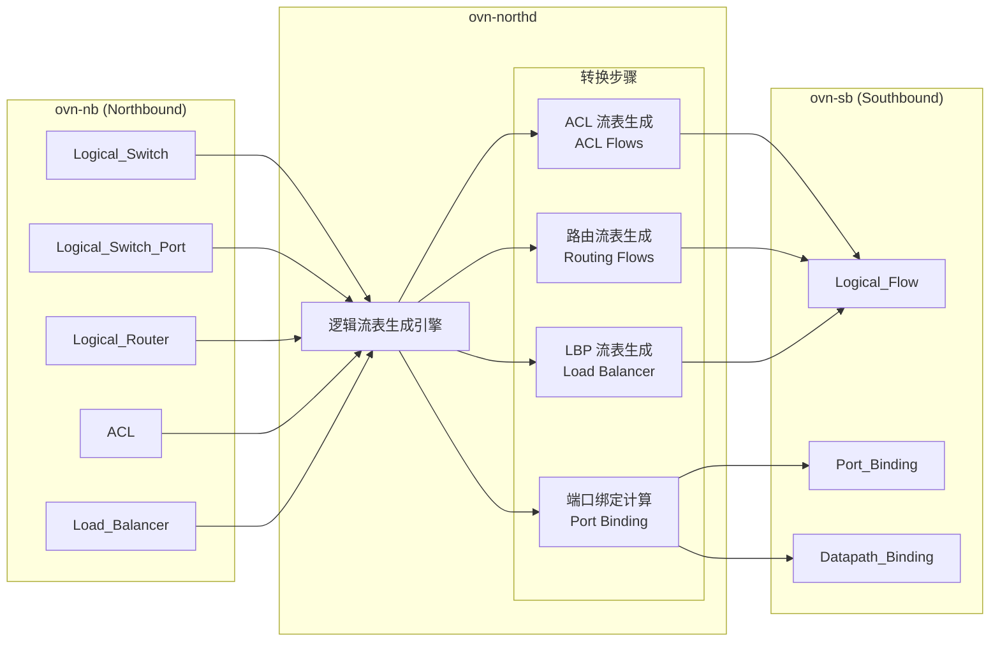
```mermaid
flowchart LR
    subgraph "ovn-nb (Northbound)"
        LS[Logical_Switch]
        LSP[Logical_Switch_Port]
        LR[Logical_Router]
        ACL[ACL]
        LB[Load_Balancer]
    end

    subgraph "ovn-northd"
        Translation[逻辑流表生成引擎]

        subgraph "转换步骤"
            S1[端口绑定计算<br/>Port Binding]
            S2[ACL 流表生成<br/>ACL Flows]
            S3[路由流表生成<br/>Routing Flows]
            S4[LBP 流表生成<br/>Load Balancer]
        end
    end

    subgraph "ovn-sb (Southbound)"
        LF[Logical_Flow]
        PB[Port_Binding]
        DB[Datapath_Binding]
    end

    LS --> Translation
    LSP --> Translation
    LR --> Translation
    ACL --> Translation
    LB --> Translation

    Translation --> S1
    Translation --> S2
    Translation --> S3
    Translation --> S4

    S1 --> PB
    S2 --> LF
    S3 --> LF
    S4 --> LF
    S1 --> DB
```

### Logical Flow 表结构

```
Logical_Flow 表: 存储逻辑流表规则

关键字段:
┌─────────────────────────────────────────────────────────┐
│ Logical_Flow                                           │
├─────────────────────────────────────────────────────────┤
│ logical_datapath: reference to Datapath                │
│ pipeline: string (ingress/egress)                      │
│ table_id: integer (0-45)                               │
│ priority: integer                                      │
│ match: string                                         │
│ actions: string                                       │
│ external_ids: {                                        │
│   "stage-name": "ls_in_acl"                            │
│ }                                                      │
└─────────────────────────────────────────────────────────┘

流表示例:
1. table=0, priority=100, match="eth.dst == $svc_monitor_mac"
   actions="eth.dst <-> eth.src; output"

2. table=10, priority=1000, match="ip4.dst == 10.96.0.1 && tcp.dst == 80"
   actions="ct_commit; ct(next)"

3. table=40, priority=1, match="ip4"
   actions="output"
```

---

## CRD 资源管理

### Subnet CRD 完整 Schema

```yaml
apiVersion: kubeovn.io/v1
kind: Subnet
metadata:
  name: ovn-default
  namespace: kube-system
  labels:
    # 用于关联 VPC
    vpc-name: "default"
spec:
  # === 网络配置 ===
  cidr: "10.16.0.0/16"                    # IP 地址块 (必填)
  gateway: "10.16.0.1"                     # 网关地址 (必填)
  gatewayType: "distributed"               # distributed | centralized

  # === IP 管理 ===
  availableIPs: 65534                      # 可用 IP 数 (自动计算)
  excludeIps:                              # 排除 IP 范围
    - "10.16.0.1"                          #   排除网关
    - "10.16.0.100-10.16.0.200"           #   排除范围

  # === VPC 关联 ===
  vpc: ""                                  # VPC 名称 (空 = default VPC)
  private: false                           # 私有子网

  # === NAT ===
  natOutgoing: false                       # 是否 SNAT

  # === 网关检查 ===
  disableGatewayCheck: false               # 禁用网关连通性检查

  # === MTU ===
  mtu: 1400                                # Pod 接口 MTU

  # === 协议 ===
  protocol: IPv4                           # IPv4 | IPv6 | Dual

  # === 默认子网 ===
  default: true                            # 是否为默认子网

  # === 高级配置 ===
  allowSubnets: []                         # 允许的子网列表
  acls: []                                # ACL 规则
  dhcpOptions: {}                         # DHCP 选项
  gatewayNode: ""                         # 集中式网关节点

status:
  # === 状态 ===
  phase: Ready                             # Ready | Initializing

  # === IP 使用统计 ===
  usingIPs: 15                             # 使用中的 IP 数
  availableIPs: 65519                     # 剩余可用 IP

  # === 条件 ===
  conditions:
    - type: Ready
      status: "True"
      lastTransitionTime: "2024-01-05T10:00:00Z"
      reason: "SubnetReady"
      message: "Subnet is ready"
```

### Subnet 状态机

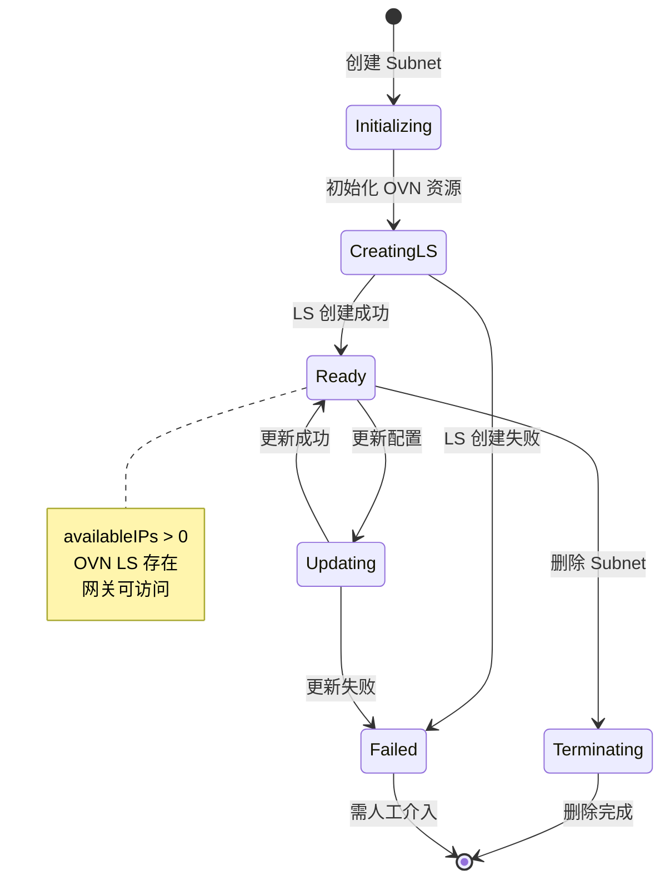
```mermaid
stateDiagram-v2
    [*] --> Initializing: 创建 Subnet
    Initializing --> CreatingLS: 初始化 OVN 资源
    CreatingLS --> Ready: LS 创建成功
    CreatingLS --> Failed: LS 创建失败

    Ready --> Updating: 更新配置
    Updating --> Ready: 更新成功
    Updating --> Failed: 更新失败

    Ready --> Terminating: 删除 Subnet
    Terminating --> [*]: 删除完成

    Failed --> [*]: 需人工介入

    note right of Ready
        availableIPs > 0
        OVN LS 存在
        网关可访问
    end note
```

### IP CRD 完整 Schema

```yaml
apiVersion: kubeovn.io/v1
kind: IP
metadata:
  name: my-pod.default                       # 格式: <pod-name>.<namespace>
  namespace: kube-system
  labels:
    subnet: "ovn-default"
    vpc: "default"
spec:
  # === Pod 关联 ===
  podName: "my-pod"                          # Pod 名称 (必填)
  namespace: "default"                       # 命名空间 (必填)

  # === IP 信息 ===
  ipAddress: "10.16.0.5"                     # 分配的 IP (必填)
  macAddress: "00:00:00:A5:C2:31"            # MAC 地址 (必填)

  # === 子网信息 ===
  subnet: "ovn-default"                      # 所属子网 (必填)
  vpc: "default"                             # 所属 VPC

  # === 类型 ===
  ipType: "IPv4"                             # IPv4 | IPv6

  # === 节点信息 ===
  nodeName: "node-1"                        # 所在节点

  # === 容器信息 ===
  containerID: "docker://abc123..."          # 容器 ID

status:
  # === 生命周期状态 ===
  phase: Using                               # Using | Released

  # === OVN 端口 ===
  logicalPort: "my-pod_default"              # Logical Switch Port 名称

  # === VPC 路由端口 ===
  vpcLogicalRouterPort: ""                   # VPC LRP (可选)

  # === 释放时间 ===
  releaseTime: null                          # 释放时间戳
```

### VPC CRD 完整 Schema

```yaml
apiVersion: kubeovn.io/v1
kind: Vpc
metadata:
  name: my-vpc
  namespace: kube-system
spec:
  # === 路由配置 ===
  staticRoutes: false                        # 静态路由模式

  # === NAT ===
  natOutgoing: false                         # 允许访问外部

  # === 私有 VPC ===
  private: false                             # 外部无法访问

  # === 自定义路由 ===
  customRoutes:
    - cidr: "192.168.0.0/16"
      nextHopIP: "10.16.0.1"
      policy: "policyDst"

  # === 默认 LS ===
  defaultLogicalSwitch: ""

status:
  # === 状态 ===
  phase: Ready                               # Ready | Initializing

  # === 子网统计 ===
  subnets: 3                                 # 关联的子网数量

  # === 逻辑路由器 ===
  logicalRouter: "my-vpc-lr"                 # 对应的 OVN LR
```

### CRD 生命周期对比

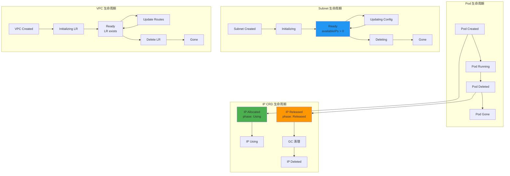
```mermaid
graph TB
    subgraph "Pod 生命周期"
        PodCreated[Pod Created] --> PodRunning[Pod Running]
        PodRunning --> PodDeleted[Pod Deleted]
        PodDeleted --> PodGone[Pod Gone]
    end

    subgraph "IP CRD 生命周期"
        PodCreated --> IPAlloc[IP Allocated<br/>phase: Using]
        IPAlloc --> IPUsing[IP Using]
        PodDeleted --> IPRelease[IP Released<br/>phase: Released]
        IPRelease --> IPGC[GC 清理]
        IPGC --> IPGone[IP Deleted]
    end

    subgraph "Subnet 生命周期"
        SubnetCreate[Subnet Created] --> SubnetInit[Initializing]
        SubnetInit --> SubnetReady[Ready<br/>availableIPs > 0]
        SubnetReady --> SubnetUpdate[Updating Config]
        SubnetUpdate --> SubnetReady
        SubnetReady --> SubnetDelete[Deleting]
        SubnetDelete --> SubnetGone[Gone]
    end

    subgraph "VPC 生命周期"
        VPCCreate[VPC Created] --> VPCInit[Initializing LR]
        VPCInit --> VPCReady[Ready<br/>LR exists]
        VPCReady --> VPCUpdate[Update Routes]
        VPCUpdate --> VPCReady
        VPCReady --> VPCDelete[Delete LR]
        VPCDelete --> VPCGone[Gone]
    end

    style IPAlloc fill:#4CAF50
    style IPRelease fill:#FF9800
    style SubnetReady fill:#2196F3
```

---

## IPAM 机制

### IPAM 架构

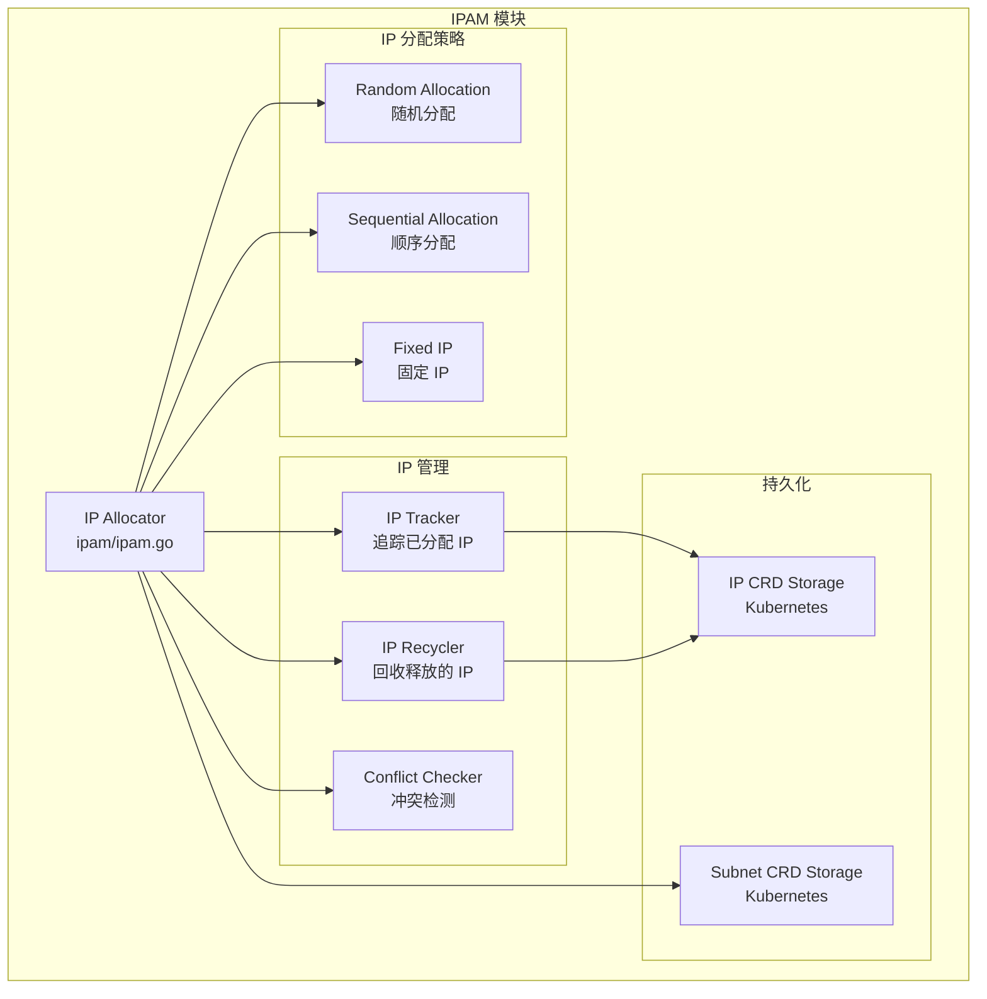
```mermaid
graph TB
    subgraph "IPAM 模块"
        Allocator[IP Allocator<br/>ipam/ipam.go]

        subgraph "IP 分配策略"
            Random[Random Allocation<br/>随机分配]
            Sequential[Sequential Allocation<br/>顺序分配]
            Fixed[Fixed IP<br/>固定 IP]
        end

        subgraph "IP 管理"
            Tracker[IP Tracker<br/>追踪已分配 IP]
            Recycler[IP Recycler<br/>回收释放的 IP]
            ConflictChecker[Conflict Checker<br/>冲突检测]
        end

        subgraph "持久化"
            IPStore[IP CRD Storage<br/>Kubernetes]
            SubnetStore[Subnet CRD Storage<br/>Kubernetes]
        end
    end

    Allocator --> Random
    Allocator --> Sequential
    Allocator --> Fixed

    Allocator --> Tracker
    Allocator --> Recycler
    Allocator --> ConflictChecker

    Tracker --> IPStore
    Recycler --> IPStore
    Allocator --> SubnetStore
```

### IP 分配算法

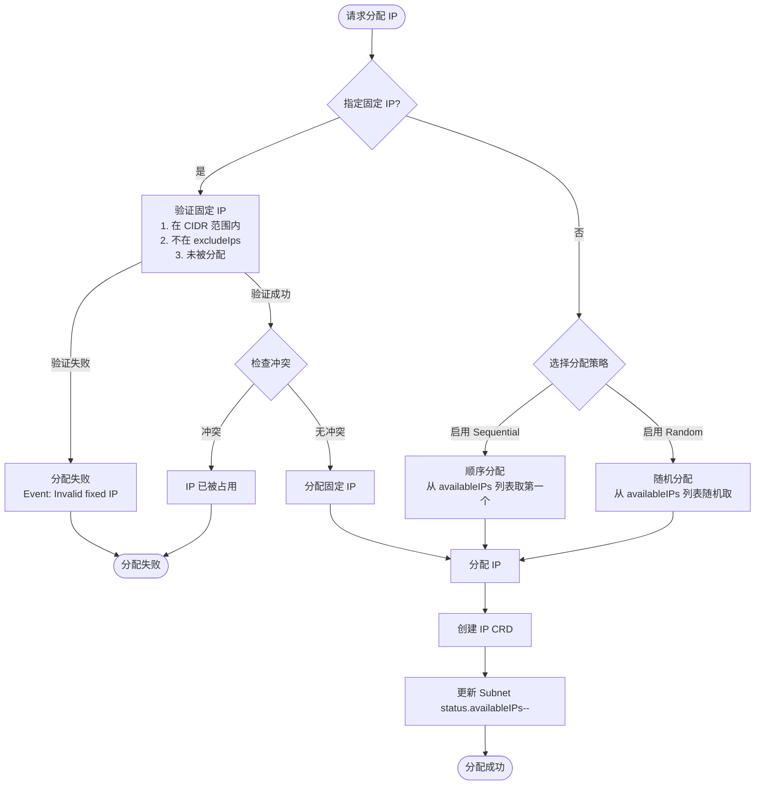
```mermaid
flowchart TD
    Start([请求分配 IP]) --> CheckFixed{指定固定 IP?}

    CheckFixed -->|是| ValidateFixed[验证固定 IP<br/>1. 在 CIDR 范围内<br/>2. 不在 excludeIps<br/>3. 未被分配]
    CheckFixed -->|否| ChooseStrategy{选择分配策略}

    ValidateFixed -->|验证失败| FixedFailed[分配失败<br/>Event: Invalid fixed IP]
    ValidateFixed -->|验证成功| CheckConflictFixed{检查冲突}

    CheckConflictFixed -->|冲突| FixedConflict[IP 已被占用]
    CheckConflictFixed -->|无冲突| AllocateFixed[分配固定 IP]

    ChooseStrategy -->|启用 Sequential| SeqAlloc[顺序分配<br/>从 availableIPs 列表取第一个]
    ChooseStrategy -->|启用 Random| RandAlloc[随机分配<br/>从 availableIPs 列表随机取]

    SeqAlloc --> AllocateIP[分配 IP]
    RandAlloc --> AllocateIP
    AllocateFixed --> AllocateIP

    AllocateIP --> CreateCR[创建 IP CRD]
    CreateCR --> UpdateSubnet[更新 Subnet status.availableIPs--]
    UpdateSubnet --> Success([分配成功])

    FixedFailed --> Fail([分配失败])
    FixedConflict --> Fail
```

### IP 分配代码路径

```
IP 分配调用链:

1. Pod Controller 监听到 Pod 创建事件
   ↓
2. pkg/controller/pod/controller.go: addPod()
   ↓
3. pkg/controller/pod/controller.go: syncPod()
   ↓
4. pkg/ipam/ipam.go: AllocateIP()
   ↓
5. pkg/ipam/ipam.go: allocateRandomIP() / allocateSequentialIP()
   ↓
6. pkg/ipam/ipam.go: createOrUpdateIPCR()
   ↓
7. pkg/ipam/ipam.go: updateSubnetStatus()
```

### IP 回收机制

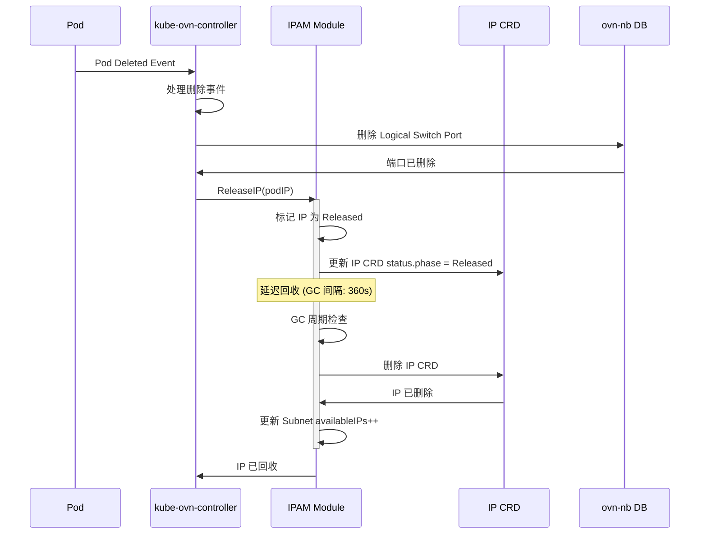
```mermaid
sequenceDiagram
    participant Pod as Pod
    participant Controller as kube-ovn-controller
    participant IPAM as IPAM Module
    participant IPStore as IP CRD
    participant OVN as ovn-nb DB

    Pod->>Controller: Pod Deleted Event
    Controller->>Controller: 处理删除事件

    Controller->>OVN: 删除 Logical Switch Port
    OVN->>Controller: 端口已删除

    Controller->>IPAM: ReleaseIP(podIP)
    activate IPAM

    IPAM->>IPAM: 标记 IP 为 Released
    IPAM->>IPStore: 更新 IP CRD status.phase = Released

    Note over IPAM: 延迟回收 (GC 间隔: 360s)
    IPAM->>IPAM: GC 周期检查
    IPAM->>IPStore: 删除 IP CRD
    IPStore->>IPAM: IP 已删除

    IPAM->>IPAM: 更新 Subnet availableIPs++

    deactivate IPAM
    IPAM->>Controller: IP 已回收
```

### IP 冲突检测

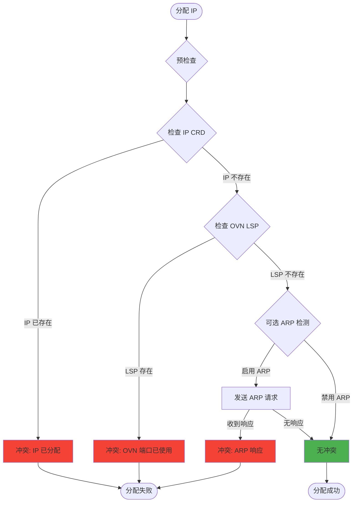
```mermaid
flowchart TD
    Alloc([分配 IP]) --> PreCheck{预检查}

    PreCheck --> CheckCRD{检查 IP CRD}
    CheckCRD -->|IP 已存在| Conflict1[冲突: IP 已分配]
    CheckCRD -->|IP 不存在| CheckOVN{检查 OVN LSP}

    CheckOVN -->|LSP 存在| Conflict2[冲突: OVN 端口已使用]
    CheckOVN -->|LSP 不存在| CheckARP{可选 ARP 检测}

    CheckARP -->|启用 ARP| ARPTest[发送 ARP 请求]
    CheckARP -->|禁用 ARP| Safe[无冲突]

    ARPTest -->|收到响应| Conflict3[冲突: ARP 响应]
    ARPTest -->|无响应| Safe

    Conflict1 --> Fail([分配失败])
    Conflict2 --> Fail
    Conflict3 --> Fail

    Safe --> Success([分配成功])

    style Conflict1 fill:#F44336
    style Conflict2 fill:#F44336
    style Conflict3 fill:#F44336
    style Safe fill:#4CAF50
```

### IPAM 性能优化

```
优化策略:

1. 内存缓存
   - Subnet IP 池缓存在 sync.Map
   - 避免频繁查询 OVN DB
   - 周期性同步 (默认 20s)

2. 批量分配
   - WorkerNum = 3 (可配置)
   - 并发处理多个 Pod 事件
   - WorkQueue 去重

3. GC 延迟回收
   - IP 释放后不立即删除
   - 延迟 360s 后清理
   - 避免 Pod 重建时 IP 变化

4. 分段管理
   - 大 CIDR 分段管理
   - 减少遍历开销
   - 每段独立位图

5. 预分配
   - 子网创建时预分配网关 IP
   - 避免 excludeIps 重复分配
```

---

## 流表计算与下发

### 流表生成流程

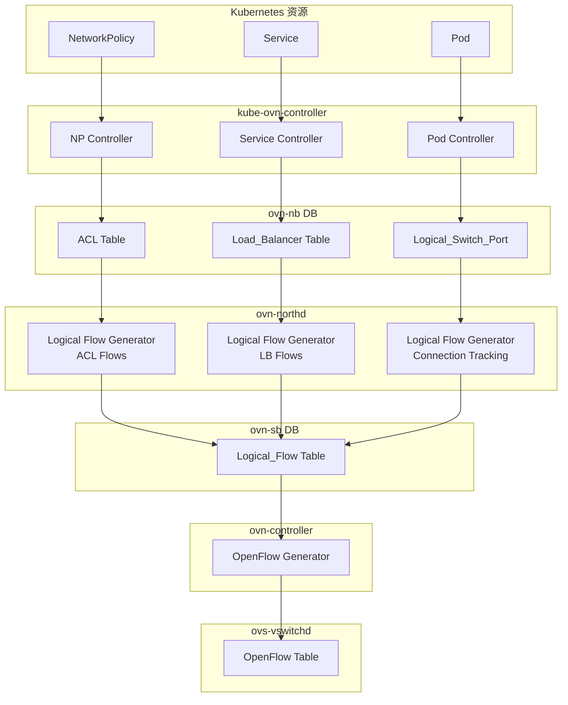
```mermaid
graph TB
    subgraph "Kubernetes 资源"
        NP[NetworkPolicy]
        Svc[Service]
        Pod[Pod]
    end

    subgraph "kube-ovn-controller"
        NPCtrl[NP Controller]
        SvcCtrl[Service Controller]
        PodCtrl[Pod Controller]
    end

    subgraph "ovn-nb DB"
        ACLTable[ACL Table]
        LBTable[Load_Balancer Table]
        LSP[Logical_Switch_Port]
    end

    subgraph "ovn-northd"
        LFA[Logical Flow Generator<br/>ACL Flows]
        LFB[Logical Flow Generator<br/>LB Flows]
        LFC[Logical Flow Generator<br/>Connection Tracking]
    end

    subgraph "ovn-sb DB"
        LF[Logical_Flow Table]
    end

    subgraph "ovn-controller"
        OFGen[OpenFlow Generator]
    end

    subgraph "ovs-vswitchd"
        OFTable[OpenFlow Table]
    end

    NP --> NPCtrl
    Svc --> SvcCtrl
    Pod --> PodCtrl

    NPCtrl --> ACLTable
    SvcCtrl --> LBTable
    PodCtrl --> LSP

    ACLTable --> LFA
    LBTable --> LFB
    LSP --> LFC

    LFA --> LF
    LFB --> LF
    LFC --> LF

    LF --> OFGen
    OFGen --> OFTable
```

### Logical Flow Pipeline

```
OVN 逻辑流表管线 (Pod Ingress 方向):

Table 0:   Ingress Port Security
Table 1-9: Ingress Port Security (续)

Table 10:  Ingress ACL (高层级)
Table 11:  Ingress ACL (低层级)

Table 20:  Ingress L2 Processing
           - MAC learning
           - DHCP response

Table 21:  Ingress L3 Processing
           - IP routing
           - TTL check

Table 22:  Ingress Load Balancing
           - Service VIP → Pod IP
           - DNAT + CT

Table 23:  Ingress ACL (后 LB)

Table 25:  Ingress Stateful ACL
           - conntrack commit

Table 30:  Ingress ARP/ND Resolution
           - ARP responder

Table 40:  Ingress Delivery
           - Output to port
```

### ACL 流表生成

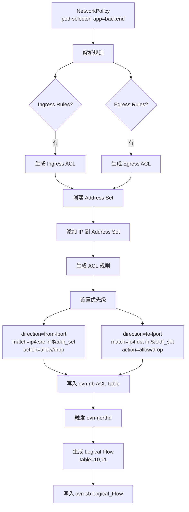
```mermaid
flowchart TD
    NP[NetworkPolicy<br/>pod-selector: app=backend] --> Parse[解析规则]

    Parse --> Ingress{Ingress Rules?}
    Parse --> Egress{Egress Rules?}

    Ingress -->|有| GenInACL[生成 Ingress ACL]
    Egress -->|有| GenExACL[生成 Egress ACL]

    GenInACL --> CreateAddrSet[创建 Address Set]
    GenExACL --> CreateAddrSet

    CreateAddrSet --> AddIPs[添加 IP 到 Address Set]
    AddIPs --> GenACLRule[生成 ACL 规则]

    GenACLRule --> SetPriority[设置优先级]
    SetPriority --> IngressRule[direction=from-lport<br/>match=ip4.src in $addr_set<br/>action=allow/drop]
    SetPriority --> EgressRule[direction=to-lport<br/>match=ip4.dst in $addr_set<br/>action=allow/drop]

    IngressRule --> WriteNB[写入 ovn-nb ACL Table]
    EgressRule --> WriteNB

    WriteNB --> NorthdTrigger[触发 ovn-northd]
    NorthdTrigger --> GenLF[生成 Logical Flow<br/>table=10,11]
    GenLF --> WriteSB[写入 ovn-sb Logical_Flow]
```

### Load Balancer 流表生成

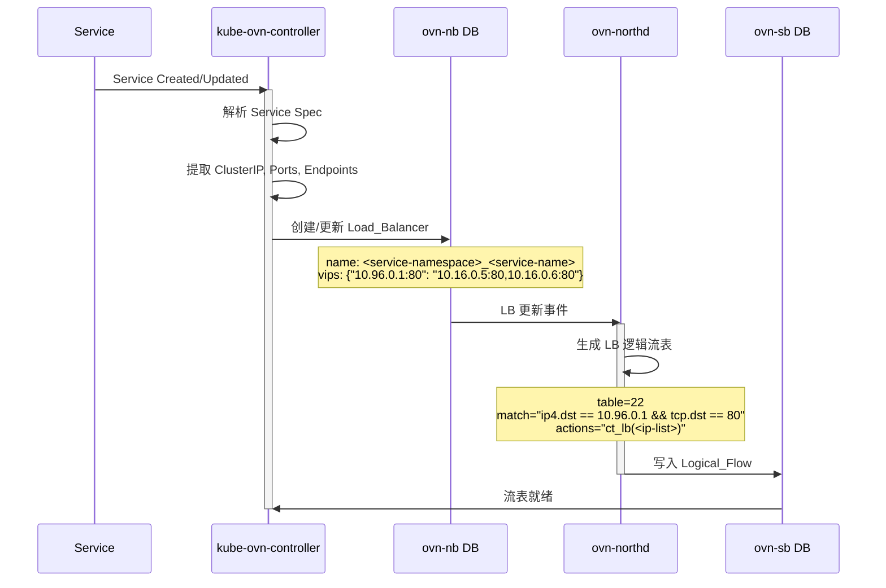
```mermaid
sequenceDiagram
    participant Svc as Service
    participant Ctrl as kube-ovn-controller
    participant NB as ovn-nb DB
    participant Northd as ovn-northd
    participant SB as ovn-sb DB

    Svc->>Ctrl: Service Created/Updated
    activate Ctrl

    Ctrl->>Ctrl: 解析 Service Spec
    Ctrl->>Ctrl: 提取 ClusterIP, Ports, Endpoints

    Ctrl->>NB: 创建/更新 Load_Balancer
    Note over NB: name: <service-namespace>_<service-name><br/>vips: {"10.96.0.1:80": "10.16.0.5:80,10.16.0.6:80"}

    NB->>Northd: LB 更新事件
    activate Northd

    Northd->>Northd: 生成 LB 逻辑流表
    Note over Northd: table=22<br/>match="ip4.dst == 10.96.0.1 && tcp.dst == 80"<br/>actions="ct_lb(<ip-list>)"

    Northd->>SB: 写入 Logical_Flow
    deactivate Northd

    SB->>Ctrl: 流表就绪
    deactivate Ctrl
```

### 流表下发到 OVS

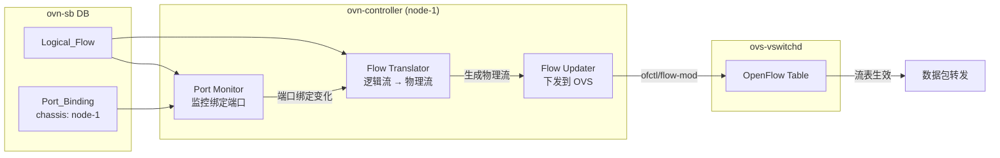
```mermaid
flowchart LR
    subgraph "ovn-sb DB"
        LF[Logical_Flow]
        PB[Port_Binding<br/>chassis: node-1]
    end

    subgraph "ovn-controller (node-1)"
        Monitor[Port Monitor<br/>监控绑定端口]
        Translator[Flow Translator<br/>逻辑流 → 物理流]
        Updater[Flow Updater<br/>下发到 OVS]
    end

    subgraph "ovs-vswitchd"
        OF[OpenFlow Table]
    end

    LF --> Monitor
    PB --> Monitor

    Monitor -->|端口绑定变化| Translator
    LF --> Translator

    Translator -->|生成物理流| Updater

    Updater -->|ofctl/flow-mod| OF

    OF -->|流表生效| VSwitchd[数据包转发]
```

### 流表关键配置

```
关键流表示例:

1. ARP Responder (table 30)
   match: "arp.tpa == 10.16.0.5 && arp.op == 1"
   actions: "eth.dst = eth.src; arp.op = 2; arp.tha = arp.sha; \
             arp.sha = 00:00:00:A5:C2:31; \
             arp.tpa = 10.16.0.5; outport = inport; \
             inport = \"\"; output;"

2. Service Load Balancer (table 22)
   match: "ip4.dst == 10.96.0.1 && tcp.dst == 80"
   actions: "ct_lb(backends=10.16.0.5:80,10.16.0.6:80);"

3. NetworkPolicy Drop (table 11)
   match: "ip4.src == $ip4_addr_a && ip4.dst == 10.16.0.5"
   actions: "drop;"

4. Conntrack Commit (table 25)
   match: "ip && ct.state == -trk"
   actions: "ct_commit;"

5. Output (table 40)
   match: "1"
   actions: "output;"
```

---

## 总结

### 关键组件职责

| 组件 | 职责 | 关键数据结构 |
|------|------|-------------|
| kube-ovn-controller | 网络资源翻译、IPAM、策略下发 | Pod Controller, Subnet Controller, IPAM |
| ovn-nb | 存储逻辑网络配置 | Logical_Switch, Logical_Router, ACL, Load_Balancer |
| ovn-sb | 存储物理流表、端口绑定 | Logical_Flow, Port_Binding, Datapath_Binding |
| ovn-northd | 逻辑流 → 物理流转换 | Translation Engine |
| ovn-controller | 流表下发、端口管理 | Flow Translator, Port Monitor |
| ovs-vswitchd | 数据包转发 | OpenFlow Table |

### 数据流关键路径

```
1. Pod 创建:
   Pod → Controller → IPAM → IP CRD + OVN LSP → Pod Annotation

2. 网络策略:
   NetworkPolicy → Controller → OVN ACL → Logical Flow → OpenFlow

3. Service:
   Service/Endpoints → Controller → OVN LB → Logical Flow (LB) → OpenFlow

4. IP 回收:
   Pod Delete → Controller → IP Release → GC → IP CRD Delete
```

### 诊断关键点

```
1. IP 分配失败:
   - 检查 Subnet availableIPs
   - 检查 IP CRD 冲突
   - 检查 OVN LSP 存在性

2. 网络策略不生效:
   - 检查 OVN ACL 表
   - 检查 Logical Flow table 10-11
   - 检查 Address Set

3. Service 不通:
   - 检查 OVN Load_Balancer 表
   - 检查 Endpoints
   - 检查 Logical Flow table 22

4. 流表未下发:
   - 检查 ovn-northd 日志
   - 检查 ovn-sb Logical_Flow
   - 检查 ovn-controller 连接
```

---

**文档版本**: v1.0
**最后更新**: 2026-01-08
**适用版本**: Kube-OVN v1.16.x
