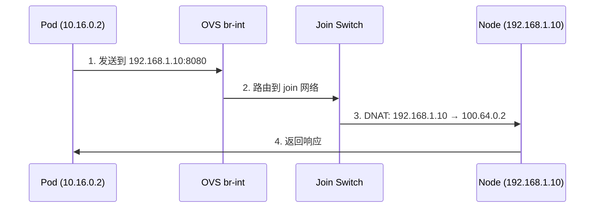
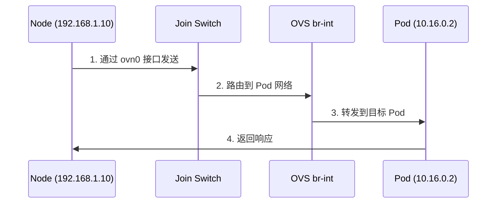

---
# Join 网络 (Pod 与 Node 通信)
triggers:
  - join网络
  - node通信
  - 节点访问
  - host访问

# 分类：Pod 到 Node/外部网络通信
category: pod_to_external

# 优先级：30 (常见场景)
priority: 30
---

# Join 网络 (Pod 与 Node 通信)

## 概述

Join 网络是 Kube-OVN 实现的 Pod 与 Node 双向通信的专用网络,使用独立的 IP 地址段 (`100.64.0.0/16`),使 Pod 可以访问 Node 上的服务(如 kube-apiserver、metrics-server)。

## 架构设计

### 组件关系

```
Pod (10.16.0.2)
  ↓ veth pair
OVS br-int
  ↓ 通过 patch 连接
join Logical Switch
  ↓ 100.64.0.0/16
Node eth0 (192.168.1.10)
```

### Join 网络配置

```yaml
# 默认配置
JOIN_CIDR: 100.64.0.0/16
NODE_SWITCH: join

# 每个 Node 分配一个 Join IP
Node1: 100.64.0.2 (映射到 192.168.1.10)
Node2: 100.64.0.3 (映射到 192.168.1.11)
Node3: 100.64.0.4 (映射到 192.168.1.12)
```

## 通信流程

### Pod 访问 Node IP



### Node 访问 Pod IP



## OVS 流表关键路径

### Pod → Node 流表

```bash
# Table 25: Join 网络路由
# DNAT: Node IP → Join IP
table=25, priority=100, ip, nw_dst=192.168.1.10,
       actions=set_field:100.64.0.2->nw_dst,
                goto_table(30)

# Table 30: 物理网卡输出
table=30, priority=100, ip,
       actions=output("eth0")
```

### Node → Pod 流表

```bash
# ovn0 接口 (Node 访问 Pod 的入口)
ip addr show ovn0
# ovn0: 100.64.0.2

# Table 0: ovn0 入口
table=0, priority=100, ip, in_port="ovn0",
       actions=goto_table(16)

# Table 16: 路由到 Pod 网络
table=16, priority=50, ip, nw_dst=10.16.0.2,
       actions=output("veth_pod")
```

## ovn0 接口

### 接口说明

`ovn0` 是 Node 上的虚拟网卡,用于 Node 访问 Pod:
- IP 地址: Join IP (如 `100.64.0.2`)
- 作用: Node 访问 Pod 的网关接口

### 查看 ovn0

```bash
# 查看 ovn0 接口
ip addr show ovn0

# 输出示例:
# 4: ovn0: <BROADCAST,MULTICAST,UP,LOWER_UP>
#     inet 100.64.0.2/16 brd 100.64.255.255

# 查看 ovn0 路由
ip route | grep ovn0
# 10.16.0.0/16 dev ovn0 scope link
```

## 常见使用场景

### 1. Pod 访问 kube-apiserver

```bash
# Pod 内部访问
kubectl exec -it <pod> -- curl https://192.168.1.10:6443

# 实际路径:
# Pod (10.16.0.2) → Node IP (192.168.1.10:6443)
```

### 2. Pod 访问 metrics-server

```bash
# Pod 访问 metrics-server
kubectl exec -it <pod> -- curl http://192.168.1.10:10250
```

### 3. Node 访问 Pod

```bash
# 从 Node 直接访问 Pod IP
curl http://10.16.0.2:8080

# 实际路径:
# Node → ovn0 → OVS br-int → Pod
```

## 诊断命令

### 1. Join 网络检查

```bash
# 查看 Join Logical Switch
kubectl-ko nbctl ls-list join

# 查看 Join 网络的端口
kubectl-ko nbctl lsp-list join

# 查看 Node 在 Join 网络的 IP
kubectl-ko nbctl lsp-get-addresses join_<node-name>
```

### 2. ovn0 接口检查

```bash
# 查看 ovn0 是否存在
ip addr show ovn0

# 查看 ovn0 IP
ip addr show ovn0 | grep "inet "

# 查看 ovn0 路由
ip route | grep ovn0
```

### 3. 连通性测试

```bash
# Pod 访问 Node IP
kubectl exec -it <pod> -- ping -c 3 192.168.1.10

# Pod 访问 Node 端口
kubectl exec -it <pod> -- curl http://192.168.1.10:10250

# Node 访问 Pod IP
curl http://10.16.0.2:8080

# Node 通过 ovn0 访问 Pod
ping -c 3 10.16.0.2
```

### 4. 流表检查

```bash
# 查看 Table 25 (Join 网络)
ovs-ofctl dump-flows br-int table=25

# 查找 Node IP 相关流
ovs-ofctl dump-flows br-int | grep "192.168.1.10"

# 追踪数据包
kubectl-ko nbctl trace-packet --ovn join \
  'inport=="pod" && ip4.src==10.16.0.2 && ip4.dst==192.168.1.10'
```

## 常见问题

| 症状 | 可能原因 | 诊断命令 | 解决方案 |
|------|---------|---------|---------|
| `no route to host` | ovn0 接口未配置 | `ip addr show ovn0` | 重启 kube-ovn-cni |
| `connection refused` | Node 服务未监听 | `netstat -tuln \| grep 6443` | 启动 kube-apiserver |
| 无法访问 Node IP | Join 网络未就绪 | `kubectl-ko nbctl ls-list join` | 重启 kube-ovn-controller |
| Node 无法访问 Pod | ovn0 路由缺失 | `ip route \| grep ovn0` | 添加 ovn0 路由 |
| 延迟过高 | Join 网络性能问题 | `ping -c 10 192.168.1.10` | 检查 Node 资源 |

## 配置参数

### JOIN_CIDR 配置

```yaml
# install.sh 或 Values.yaml
JOIN_CIDR: "100.64.0.0/16"
```

### 自定义 Join CIDR

```bash
# 如果需要修改 JOIN_CIDR
1. 备份集群
2. 停止所有 kube-ovn 组件
3. 修改配置
4. 重新安装 (风险高,不推荐)
```

## 性能特征

| 指标 | 典型值 | 说明 |
|------|--------|------|
| 延迟 | <1ms | 本地路由 |
| 吞吐量 | 10Gbps+ | 接近线速 |
| CPU 开销 | 5-10% | 轻量级 DNAT |

## 相关文档

- **Egress NAT**: `egress.md`
- **HostNetwork**: `hostnetwork.md`
- **外部访问对比**: `comparison-table.md`
