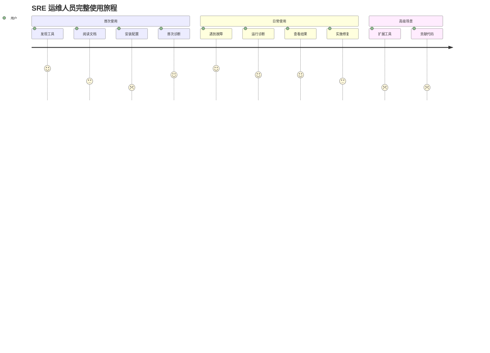
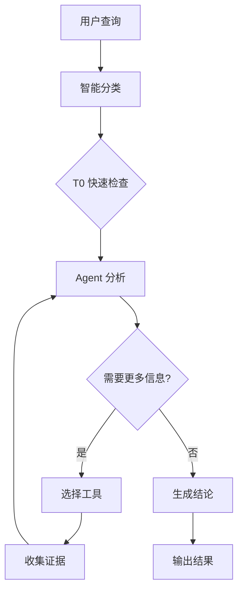
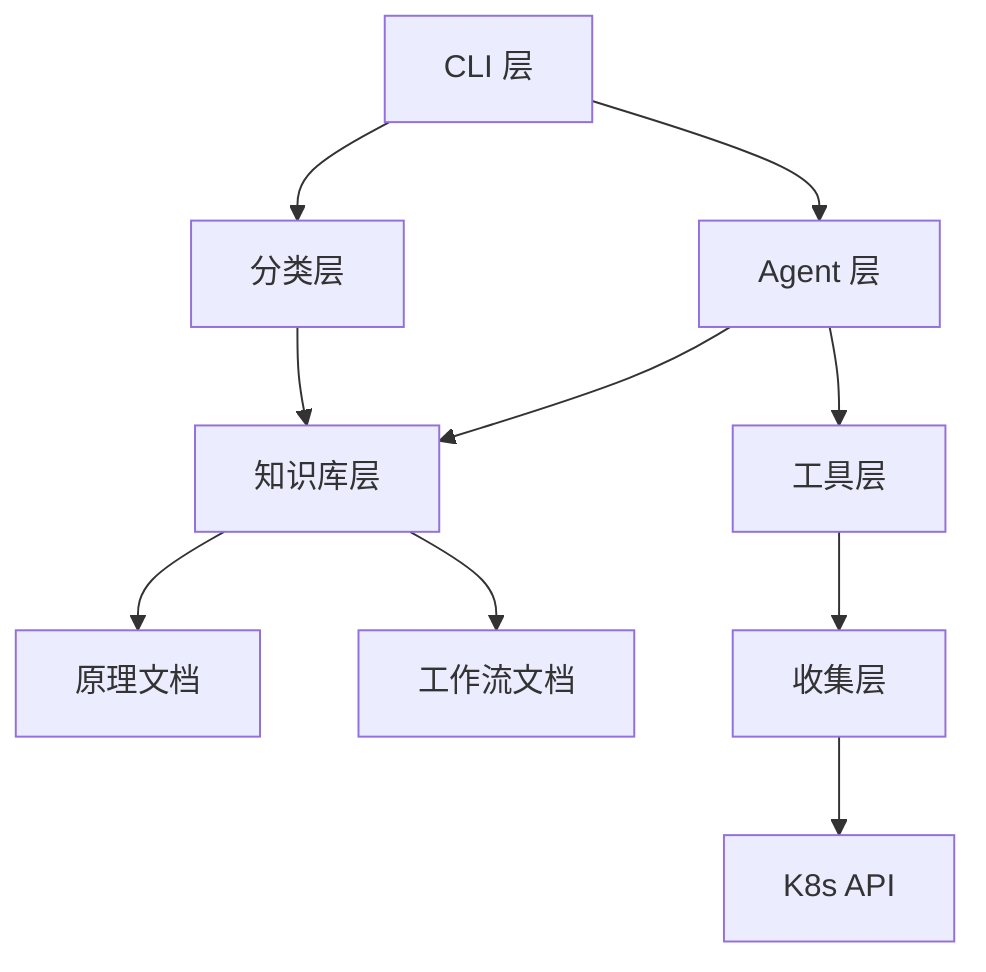
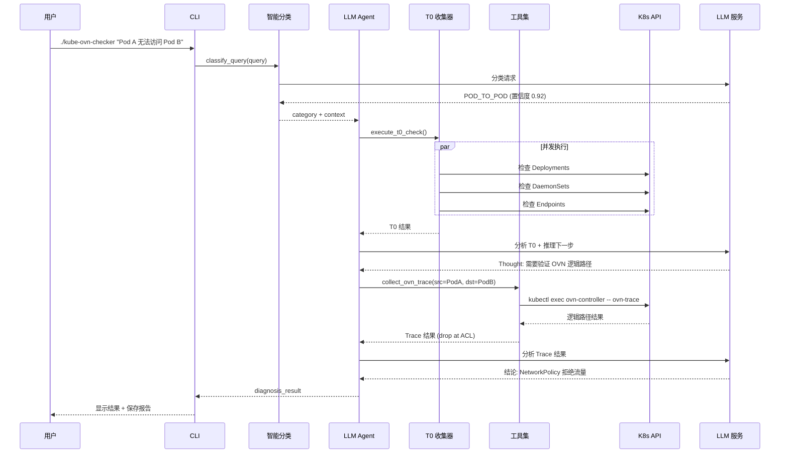
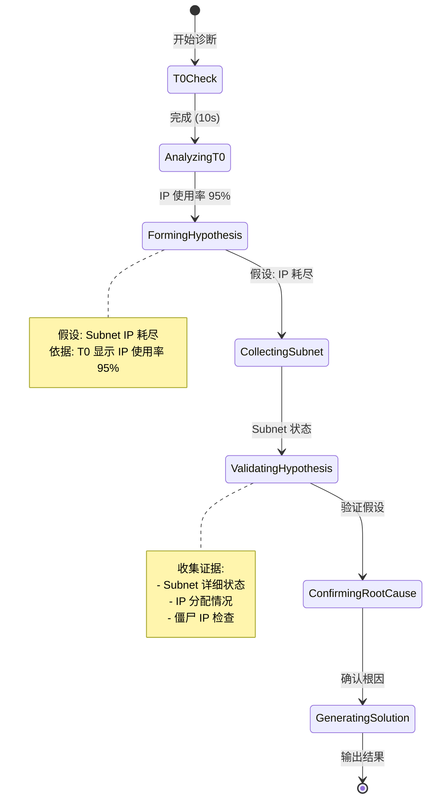

# 📚 Kube-OVN-LangGraph-Checker 综合文档体系创建计划

> **创建日期**: 2026-01-11
> **计划类型**: 文档创建 (docs)
> **优先级**: P0 - 阻塞用户使用和项目发展
> **预计工期**: 6-8 周（分阶段实施）

---

## 📋 执行摘要

### 问题陈述

当前 `kube-ovn-langgraph-checker` 项目面临严重的文档缺失问题：

- ❌ **使用文档空白**：新用户无法顺利安装配置，遇到错误无法自助解决
- ❌ **架构文档不完整**：缺少系统架构图、诊断流程说明、工具机制解释
- ❌ **开发者文档缺失**：贡献者无法快速上手，扩展成本高
- ✅ **知识库完整**：16 个技术原理文档质量优秀

### 解决方案

创建三份核心文档，构建完整的文档体系：

1. **📖 用户使用文档** (User Guide) - 面向 SRE/运维人员
2. **🏗️ 系统架构文档** (Architecture) - 面向技术决策者
3. **💻 详细实现文档** (Implementation) - 面向开发者和贡献者

### 成功标准

- **新用户安装成功率** > 90%（无需人工支持）
- **错误自助解决率** > 70%（通过文档解决）
- **开发者上手时间** < 2 小时
- **文档覆盖率** 100%（所有功能都有文档）

---

## 🎯 目标受众分析

### 主要用户群体

| 用户类型 | 角色 | 技能水平 | 核心需求 | 使用频率 |
|---------|------|---------|---------|---------|
| **SRE/运维人员** | 生产故障响应 | K8s 熟悉，LLM 不熟悉 | 快速诊断、可执行建议 | 每日 |
| **Kube-OVN 开发者** | 用户支持、工具扩展 | Kube-OVN 熟悉，有开发能力 | 理解原理、扩展工具 | 每周 |
| **平台管理员** | 部署、配置、监控 | K8s 管理经验 | 安装配置、权限管理 | 一次性 |
| **贡献者** | 代码贡献、文档改进 | Python 开发经验 | 架构理解、开发指南 | 持续 |

### 用户旅程映射



---

## 📚 文档一：用户使用文档 (User Guide)

### 目标
帮助 SRE/运维人员快速安装、配置、使用工具，并在遇到问题时能够自助解决。

### 采用框架
**Diátaxis 框架** - 教程、操作指南、参考、解释四类分离

### 文档结构

```
docs/user-guide/
├── README.md                      # 导航文档
├── quick-start.md                 # 5 分钟快速开始 ⭐ P0
├── installation.md                # 完整安装指南 ⭐ P0
├── configuration.md               # 配置详解 ⭐ P0
├── diagnosis-basics.md            # 诊断基础 ⭐ P1
├── understanding-results.md       # 结果解读 ⭐ P1
├── troubleshooting.md             # 故障排除 ⭐ P0
├── faq.md                         # 常见问题 ⭐ P1
├── advanced-usage.md              # 高级用法 ⭐ P2
├── security-considerations.md     # 安全考虑 ⭐ P1
└── examples/                      # 真实案例库
    ├── pod-pending.md             # Pod Pending 问题
    ├── network-connectivity.md    # 网络连通性问题
    ├── ip-exhaustion.md           # IP 耗尽问题
    ├── controller-crashloop.md    # Controller 重启
    └── node-network-failure.md    # 节点网络故障
```

### 核心内容要点

#### 1. quick-start.md (P0 - 阻塞新用户)

**目标**：5 分钟内让用户运行第一次诊断

**内容结构**：
```markdown
# 🚀 快速开始

## 前置要求
- Python 3.9+
- kubectl 已配置
- OpenAI API Key 或兼容服务

## 5 步快速体验

### 步骤 1: 克隆仓库
\```bash
git clone https://github.com/xxx/kube-ovn-langgraph-checker.git
cd kube-ovn-langgraph-checker
\```

### 步骤 2: 安装依赖
\```bash
pip install -e .
\```

### 步骤 3: 配置 API Key
\```bash
cp .env.example .env
# 编辑 .env 文件，填入你的 API Key
\```

### 步骤 4: 验证安装
\```bash
./kube-ovn-checker --help
\```

### 步骤 5: 第一次诊断
\```bash
./kube-ovn-checker "帮我检查 kube-ovn-controller 的状态"
\```

## 预期输出
[展示真实的诊断输出截图]

## 下一步
- 阅读完整安装指南
- 查看配置选项
- 了解诊断基础
```

**关键元素**：
- ✅ 可验证的命令（每个都经过测试）
- ✅ 真实的输出示例
- ✅ 清晰的成功标准
- ✅ 失败时的提示

---

#### 2. installation.md (P0 - 阻塞安装)

**目标**：详细的安装指南，包含所有环境和场景

**内容结构**：
```markdown
# 📦 安装指南

## 系统要求
### 最低要求
- Python 3.9 或更高
- 500MB 可用内存
- 对 Kubernetes 集群的只读访问权限

### 推荐配置
- Python 3.11+
- 2GB 可用内存
- 稳定的网络连接（访问 LLM API）

## 安装方法

### 方法 1: pip 安装（推荐）
\```bash
pip install kube-ovn-checker
\```

### 方法 2: 从源码安装（开发模式）
\```bash
git clone <repo>
cd kube-ovn-langgraph-checker
pip install -e .
\```

### 方法 3: Docker 容器（可选）
\```bash
docker build -t kube-ovn-checker .
docker run -v ~/.kube:/root/.kube kube-ovn-checker
\```

## 环境验证

### 验证 Python 版本
\```bash
python --version  # 应该 >= 3.9
\```

### 验证 kubectl 配置
\```bash
kubectl cluster-info
kubectl get nodes
\```

### 验证 API Key
\```bash
curl https://api.openai.com/v1/models \
  -H "Authorization: Bearer $OPENAI_API_KEY"
\```

## 常见安装问题

### 问题 1: 依赖安装失败
**症状**: `pip install` 报错
**解决方案**:
1. 使用虚拟环境
2. 升级 pip: `pip install --upgrade pip`
3. 使用国内镜像: `pip install -i https://pypi.tuna.tsinghua.edu.cn/simple`

### 问题 2: 权限不足
**症状**: `Permission denied`
**解决方案**: 使用 `--user` 标志或虚拟环境

## 卸载
\```bash
pip uninstall kube-ovn-checker
\```

## 升级
\```bash
pip install --upgrade kube-ovn-checker
\```
```

---

#### 3. configuration.md (P0 - 阻塞配置)

**目标**：完整的配置指南，包含所有 LLM 提供商

**内容结构**：
```markdown
# ⚙️ 配置指南

## 环境变量配置

### 核心配置

#### OPENAI_API_KEY (必需)
LLM 服务的 API 密钥。

**获取方式**:
- OpenAI: https://platform.openai.com/api-keys
- Azure OpenAI: 在 Azure Portal 创建
- DeepSeek: https://platform.deepseek.com/
- 智谱 AI: https://open.bigmodel.cn/

**示例**:
\```bash
export OPENAI_API_KEY="sk-..."
\```

#### OPENAI_API_BASE (可选)
自定义 API 端点，用于兼容服务。

**支持的提供商**:

| 提供商 | Base URL | 模型示例 |
|-------|---------|---------|
| OpenAI | `https://api.openai.com/v1` | gpt-4o, gpt-4o-mini |
| Azure OpenAI | `https://<resource>.openai.azure.com/` | gpt-4o |
| DeepSeek | `https://api.deepseek.com/v1` | deepseek-chat |
| 智谱 AI | `https://open.bigmodel.cn/api/paas/v4/` | glm-4-flash |
| 本地 Ollama | `http://localhost:11434/v1` | llama3, qwen2 |

**示例**:
\```bash
# Azure OpenAI
export OPENAI_API_BASE="https://my-resource.openai.azure.com/"

# DeepSeek
export OPENAI_API_BASE="https://api.deepseek.com/v1"

# 智谱 AI
export OPENAI_API_BASE="https://open.bigmodel.cn/api/paas/v4/"
\```

#### LLM_MODEL (可选)
自定义模型名称。

**默认值**: `gpt-4o`

**推荐配置**:
- **生产环境**: `gpt-4o` (最佳质量)
- **测试环境**: `gpt-4o-mini` (快速且便宜)
- **成本敏感**: `deepseek-chat` 或 `glm-4-flash`

**示例**:
\```bash
export LLM_MODEL="gpt-4o-mini"
\```

### Kubernetes 配置

#### KUBECONFIG (可选)
Kubernetes 配置文件路径。

**默认行为**: 使用 `~/.kube/config`

**多集群配置**:
\```bash
export KUBECONFIG="/path/to/kubeconfig"
\```

**切换集群**:
\```bash
kubectl config use-context my-cluster
\```

### 高级配置

#### TEMPERATURE (可选)
LLM 温度参数，控制随机性。

- **范围**: 0.0 - 1.0
- **默认值**: 0.0 (确定性输出)
- **推荐**: 保持默认值以获得稳定结果

#### MAX_ROUNDS (可选)
最大诊断轮数。

- **默认值**: 10
- **建议**: 大多数问题 5-7 轮足够

#### LOG_LEVEL (可选)
日志级别。

- **可选值**: DEBUG, INFO, WARNING, ERROR
- **默认值**: INFO

## 完整配置示例

### 场景 1: OpenAI (默认)
\```bash
# .env
OPENAI_API_KEY=sk-proj-...
LLM_MODEL=gpt-4o
\```

### 场景 2: Azure OpenAI
\```bash
# .env
OPENAI_API_KEY=<Azure API Key>
OPENAI_API_BASE=https://my-resource.openai.azure.com/
LLM_MODEL=gpt-4o
\```

### 场景 3: DeepSeek (经济型)
\```bash
# .env
OPENAI_API_KEY=<DeepSeek API Key>
OPENAI_API_BASE=https://api.deepseek.com/v1
LLM_MODEL=deepseek-chat
\```

### 场景 4: 智谱 AI (国内推荐)
\```bash
# .env
OPENAI_API_KEY=<智谱 API Key>
OPENAI_API_BASE=https://open.bigmodel.cn/api/paas/v4/
LLM_MODEL=glm-4-flash
\```

### 场景 5: 本地 Ollama (离线/隐私)
\```bash
# .env
OPENAI_API_BASE=http://localhost:11434/v1
LLM_MODEL=llama3:70b
\```

## 权限配置

### Kubernetes RBAC
工具只需要 **只读权限**。

**最小权限清单**:
\```yaml
apiVersion: rbac.authorization.k8s.io/v1
kind: ClusterRole
metadata:
  name: kube-ovn-checker
rules:
- apiGroups: [""]
  resources: ["pods", "pods/log", "events", "nodes"]
  verbs: ["get", "list", "watch"]
- apiGroups: ["kubeovn.io"]
  resources: ["*", "ips", "subnets", "vpcs"]
  verbs: ["get", "list", "watch"]
- apiGroups: ["apps"]
  resources: ["deployments", "daemonsets", "statefulsets"]
  verbs: ["get", "list"]
\```

**创建 ClusterRoleBinding**:
\```bash
kubectl create clusterrolebinding kube-ovn-checker \
  --clusterrole=kube-ovn-checker \
  --serviceaccount=default:default
\```

## 验证配置

### 检查环境变量
\```bash
./kube-ovn-checker --check-config
\```

### 测试 Kubernetes 连接
\```bash
kubectl get pods -A
\```

### 测试 LLM 连接
\```bash
./kube-ovn-checker "test"
\```

## 故障排除

### 问题 1: API Key 无效
**症状**: `AuthenticationError`
**解决方案**:
1. 检查 API Key 是否正确复制
2. 确认 API Key 有效期
3. 验证账户余额

### 问题 2: 无法连接 Kubernetes
**症状**: `Unable to connect to the server`
**解决方案**:
1. 检查 `~/.kube/config` 文件
2. 测试: `kubectl cluster-info`
3. 确认上下文正确: `kubectl config current-context`

### 问题 3: 网络代理问题
**症状**: 连接 LLM API 超时
**解决方案**:
\```bash
export HTTP_PROXY=http://proxy.example.com:8080
export HTTPS_PROXY=http://proxy.example.com:8080
\```

## 安全最佳实践

1. **永远不要**将 `.env` 文件提交到版本控制
2. **使用** 环境变量或密钥管理工具（如 HashiCorp Vault）
3. **定期轮换** API Key
4. **限制** API Key 的权限和速率
5. **使用** 专用服务账户，不要使用个人账户
```

---

#### 4. troubleshooting.md (P0 - 阻塞问题解决)

**目标**：Top 10 常见错误的快速解决方案

**内容结构**：
```markdown
# 🔧 故障排除指南

## 快速诊断流程

\```mermaid
graph TD
    A[遇到错误] --> B{错误类型}
    B -->|安装问题| C[查看安装问题]
    B -->|配置问题| D[查看配置问题]
    B -->|运行时错误| E[查看运行时错误]
    B -->|诊断结果问题| F[查看结果问题]
    C --> G[按照步骤解决]
    D --> G
    E --> G
    F --> G
\```

## Top 10 常见问题

### 1. API Key 无效
**症状**:
\```
Error: AuthenticationError: Incorrect API key provided
\```

**原因**:
- API Key 错误或过期
- 账户余额不足
- API Key 权限不足

**解决方案**:
1. 验证 API Key: `echo $OPENAI_API_KEY`
2. 重新生成 API Key
3. 检查账户余额
4. 确认 API Key 有访问模型的权限

**验证命令**:
\```bash
curl https://api.openai.com/v1/models \
  -H "Authorization: Bearer $OPENAI_API_KEY"
\```

---

### 2. Kubernetes 连接失败
**症状**:
\```
Error: Unable to connect to the server: dial tcp: lookup xxx on xxx:53: server misbehaving
\```

**原因**:
- kubeconfig 文件错误
- 集群不可达
- 网络问题
- TLS 证书过期

**解决方案**:
1. 检查 kubeconfig: `kubectl cluster-info`
2. 验证上下文: `kubectl config current-context`
3. 测试连接: `kubectl get nodes`
4. 检查证书: `kubectl config view --raw`

**诊断脚本**:
\```bash
#!/bin/bash
echo "检查 Kubernetes 连接..."
kubectl cluster-info || echo "❌ 集群不可达"
kubectl get nodes || echo "❌ 无法访问节点"
kubectl config current-context || echo "❌ 无有效上下文"
\```

---

### 3. 权限不足
**症状**:
\```
Error: pods is forbidden: User "system:anonymous" cannot list pods
\```

**原因**:
- RBAC 权限不足
- ServiceAccount 缺失
- 未正确认证

**解决方案**:
1. 创建最小权限 ClusterRole（见配置文档）
2. 绑定到当前用户
3. 验证权限: `kubectl auth can-i list pods --all-namespaces`

---

### 4. 依赖包冲突
**症状**:
\```
ERROR: pip's dependency resolver does not currently take into account...
\```

**原因**:
- Python 版本不兼容
- 已安装的包版本冲突
- 虚拟环境未激活

**解决方案**:
\```bash
# 使用虚拟环境
python -m venv venv
source venv/bin/activate  # Linux/macOS
# 或
venv\Scripts\activate  # Windows

# 升级 pip
pip install --upgrade pip

# 重新安装
pip install -e .
\```

---

### 5. 诊断超时
**症状**:
\```
Error: Timeout after 300 seconds
\```

**原因**:
- 集群规模大，收集数据慢
- 网络延迟
- LLM API 响应慢

**解决方案**:
1. 增加超时时间（环境变量 `TIMEOUT=600`）
2. 使用更快的 LLM 模型（gpt-4o-mini）
3. 减少并发收集数量

---

### 6. 诊断结果为 Fallback
**症状**:
\```
诊断状态: fallback
```

**含义**:
- LLM 未能给出明确结论
- 使用规则系统的兜底结果
- 可信度低于正常诊断

**处理**:
1. 查看收集的证据
2. 重新描述问题并运行
3. 人工审核后执行建议

---

### 7. 输出中文乱码
**症状**:
终端显示乱码或方块字符

**原因**:
- 终端不支持 UTF-8
- 字体缺失

**解决方案**:
\```bash
# Linux/macOS
export LANG=zh_CN.UTF-8
export LC_ALL=zh_CN.UTF-8

# Windows PowerShell
[Console]::OutputEncoding = [System.Text.Encoding]::UTF8
chcp 65001
\```

---

### 8. 内存不足
**症状**:
\```
MemoryError: Killed
```

**原因**:
- 集群数据量大
- 并发工具调用多

**解决方案**:
1. 减少并发工具调用
2. 增加系统内存
3. 使用缓存机制

---

### 9. 工具调用失败
**症状**:
\```
Error: Tool collect_pod_logs failed
```

**原因**:
- Pod 不存在
- 权限不足
- kubectl-ko 工具缺失

**解决方案**:
1. 检查 Pod 名称和命名空间
2. 验证 kubectl-ko 是否安装
3. 查看详细错误日志: `LOG_LEVEL=DEBUG ./kube-ovn-checker "..."`

---

### 10. 达到最大轮数
**症状**:
\```
Warning: Reached max_rounds=10 without convergence
```

**含义**:
- Agent 未能在 10 轮内收敛到结论
- 问题可能过于复杂

**处理**:
1. 增加最大轮数: `MAX_ROUNDS=15`
2. 重新描述问题，提供更多上下文
3. 查看已收集的证据，人工分析

## 收集诊断信息

### 启用调试日志
\```bash
LOG_LEVEL=DEBUG ./kube-ovn-checker "问题描述" > debug.log 2>&1
\```

### 生成诊断报告
工具会自动保存报告到:
\``
diagnosis_report_YYYYMMDD_HHMMSS.json
\```

### 提交 Bug Report

**必要信息**:
1. 错误信息完整输出
2. 调试日志 (`debug.log`)
3. 配置信息（隐藏敏感信息）
4. Kubernetes 版本: `kubectl version`
5. Python 版本: `python --version`
6. 复现步骤

**GitHub Issues**: https://github.com/xxx/kube-ovn-langgraph-checker/issues

## 获取帮助

- 📖 查看完整文档
- 💬 加入社区讨论
- 🐛 提交 Bug Report
- ✨ 提交功能请求
```

---

#### 5. examples/ 目录 (P1 - 提升体验)

**目标**：真实案例库，帮助用户建立预期

**每个案例的结构**：
```markdown
# 案例: Pod Pending 问题

## 问题描述
用户报告：应用 Pod 一直处于 Pending 状态，无法启动。

## 运行诊断
\```bash
./kube-ovn-checker "我的应用 Pod 一直 Pending，名称是 nginx-deploy-xxx，在 default 命名空间"
\```

## 诊断过程（思维链）

### 第 1 轮: T0 快速检查
**Agent 思考**: 首先执行 T0 检查，了解整体健康状态

**工具调用**: `collect_t0_check()`

**发现**:
- kube-ovn-controller: 健康
- Subnet status: default-subnet IP 使用率 95% ⚠️
- Pending Pods: 15 个

### 第 2 轮: 分析 Pod 状态
**Agent 思考**: 需要查看 Pod 的详细事件和状态

**工具调用**:
- `collect_pod_events(pod_name="nginx-deploy-xxx", namespace="default")`
- `collect_pod_describe(pod_name="nginx-deploy-xxx", namespace="default")`

**发现**:
- 事件: `FailedScheduling: 0/3 nodes are available: 1 Insufficient ips, 2 node.kubernetes.io/not-ready`
- 原因: Subnet IP 已耗尽

### 第 3 轮: 验证 Subnet 状态
**Agent 思考**: 需要确认 Subnet 的 IP 分配情况

**工具调用**: `collect_subnet_status(subnet_name="default-subnet")`

**发现**:
- CIDR: 10.16.0.0/16
- 总 IP 数: 65536
- 已用 IP: 62259 (95%)
- 可用 IP: 3277

## 诊断结论

### 🎯 根本原因
Subnet `default-subnet` IP 地址耗尽（使用率 95%），导致新 Pod 无法分配 IP。

### 📊 严重度
**高** - 影响新应用部署和现有应用扩容

### 💡 解决方案

#### 方案 1: 扩容 Subnet（推荐）
\```bash
# 修改 Subnet CIDR
kubectl edit subnet default-subnet

# 将 CIDR 从 10.16.0.0/16 扩大到 10.16.0.0/12
spec:
  cidrBlock: 10.16.0.0/12
\```

**优点**: 彻底解决，未来不易再次出现
**缺点**: 需要重启现有 Pod
**时间**: 30 分钟

#### 方案 2: 清理僵尸 IP
\```bash
# 查找已删除 Pod 的残留 IP
kubectl-kubeovn ips --all-namespaces | grep Terminated

# 删除僵尸 IP
kubectl-kubeovn ip delete <ip-address>
\```

**优点**: 快速，不影响现有 Pod
**缺点**: 临时解决，可能再次出现
**时间**: 10 分钟

#### 方案 3: 创建新 Subnet
\```bash
kubectl apply -f - <<EOF
apiVersion: kubeovn.io/v1
kind: Subnet
metadata:
  name: new-subnet
spec:
  cidrBlock: 10.20.0.0/16
  default: false
EOF
\```

**优点**: 隔离新应用
**缺点**: 需要配置 NetworkPolicy
**时间**: 20 分钟

### ✅ 验证步骤
1. 检查 Subnet 可用 IP: `kubectl-kubeovn subnet get default-subnet`
2. 删除 Pending Pod: `kubectl delete pod nginx-deploy-xxx`
3. 观察新 Pod: `kubectl get pod -w`

### 📚 相关知识
- [IP 管理原理](../knowledge/principles/ip-management.md)
- [Subnet 配置文档](https://kubeovn.github.io/docs/stable/en/guides/ipam)

## 预防措施

1. **监控 Subnet 使用率**
   \```bash
   # 设置告警: 使用率 > 80%
   kubectl-kubeovn subnet get --all-namespaces -o json | \
     jq '.items[] | select(.status.availableIPs / .status.totalIPs < 0.2)'
   \```

2. **定期清理僵尸 IP**
   \```bash
   # 每周运行一次
   kubectl-kubeovn gc ips
   \```

3. **规划合理的 CIDR 大小**
   - 小集群 (< 100 节点): /18
   - 中型集群 (100-500 节点): /16
   - 大型集群 (> 500 节点): /14

## 完整诊断输出

<details>
<summary>点击展开完整输出（节省空间）</summary>

\```json
{
  "query": "我的应用 Pod 一直 Pending",
  "diagnosis_status": "completed",
  "rounds": 3,
  "issue": "Pod Pending 无法启动",
  "root_cause": {
    "category": "IP 耗尽",
    "specific_cause": "Subnet default-subnet IP 使用率 95%，无可用 IP",
    "confidence": "high"
  },
  "severity": "high",
  "solutions": [
    {
      "priority": 1,
      "description": "扩容 Subnet CIDR",
      "steps": [...]
    }
  ],
  "evidence": {
    "t0_check": {...},
    "pod_events": [...],
    "subnet_status": {...}
  },
  "metadata": {
    "timestamp": "2026-01-11T10:30:00Z",
    "model": "gpt-4o",
    "duration_seconds": 45
  }
}
\```

</details>

## 总结

这个案例展示了：
- ✅ T0 快速检查发现了 Subnet 使用率异常
- ✅ Agent 自主选择了正确的工具链
- ✅ 3 轮诊断收敛到根因
- ✅ 提供了多个可选方案
- ✅ 包含验证步骤和预防措施

**关键成功因素**:
- 问题描述包含 Pod 名称和命名空间
- Subnet 使用率告警机制
- 提供多个可选解决方案
```

---

### 用户文档的特殊考虑

#### 中文本地化最佳实践

1. **术语一致性**
   - 统一使用 "诊断" 而非 "排查"
   - 统一使用 "集群" 而非 "群集"
   - 统一使用 "命名空间" 而非 "名字空间"

2. **语言风格**
   - 直接：`运行此命令` (而不是 `你应该运行此命令`)
   - 清晰：`这会导致` (而不是 `这可能会造成`)
   - 礼貌但简洁

3. **格式规范**
   - 使用中文全角标点：`，。；：`
   - 代码和命令使用英文
   - 环境变量使用大写

---

## 🏗️ 文档二：系统架构文档 (Architecture)

### 目标
帮助技术决策者、开发者和高级用户理解系统设计原理、技术选型和诊断流程。

### 采用框架
**arc42 架构标准** + **C4 模型**

### 文档结构

```
docs/architecture/
├── README.md                      # 导航文档
├── overview.md                    # 系统概述 ⭐ P0
├── system-context.md              # 系统上下文 ⭐ P0
├── constraints.md                 # 约束条件 ⭐ P1
├── building-blocks.md             # 构建块视图 ⭐ P0
├── runtime-view.md                # 运行时视图 ⭐ P0
├── deployment-view.md             # 部署视图 ⭐ P1
├── quality-goals.md               # 质量目标 ⭐ P1
├── architecture-decisions.md      # 架构决策记录 ⭐ P1
└── diagrams/                      # 架构图
    ├── c4-system-context.mermaid  # C4 系统上下文图
    ├── c4-containers.mermaid      # C4 容器图
    ├── c4-components.mermaid      # C4 组件图
    ├── data-flow.mermaid          # 数据流图
    ├── state-machine.mermaid      # 状态机图
    └── sequence-diagnosis.mermaid # 诊断时序图
```

### 核心内容要点

#### 1. overview.md (P0 - 理解系统)

**内容结构**：
```markdown
# 🏗️ 系统架构概述

## 系统定位

**Kube-OVN-LangGraph-Checker** 是一个基于 LLM Agent 的智能 Kube-OVN 网络诊断工具，通过自主决策和渐进式推理，将运维人员从繁琐的手动排查中解放出来。

### 核心价值

| 传统方法 | Kube-OVN Checker |
|---------|-----------------|
| 手动执行 20+ 命令 | AI 自主选择工具 |
| 需要专家经验 | 智能诊断，降低门槛 |
| 耗时 30-60 分钟 | 5-10 分钟完成 |
| 易遗漏细节 | 系统化检查 |
| 依赖个人记忆 | 知识库驱动 |

## 技术栈

```
┌─────────────────────────────────────────────────┐
│              用户层 (CLI)                       │
│          Python 3.9+ / Rich 终端               │
└─────────────────────────────────────────────────┘
                       ↓
┌─────────────────────────────────────────────────┐
│         Agent 智能层 (LangGraph)                │
│    LangChain 0.3.0+ / LangGraph 1.0.3+         │
│     ReAct 模式 / 工具调用 / 多轮推理            │
└─────────────────────────────────────────────────┘
                       ↓
┌─────────────────────────────────────────────────┐
│         工具层 (26 个诊断工具)                   │
│      kubectl / kubectl-ko / OVN/OVS 命令        │
└─────────────────────────────────────────────────┘
                       ↓
┌─────────────────────────────────────────────────┐
│         数据收集层 (K8s API)                    │
│      Kubernetes Python Client                  │
└─────────────────────────────────────────────────┘
                       ↓
┌─────────────────────────────────────────────────┐
│      LLM 推理层 (OpenAI / 兼容服务)             │
│   GPT-4o / DeepSeek / 智谱 AI / Ollama         │
└─────────────────────────────────────────────────┘
```

## 核心设计原则

### 1. Agent 自主决策
> "LLM 自主决定使用哪些工具，而不是硬编码决策树"

**优势**:
- 灵活应对未知问题
- 组合多个工具的能力
- 渐进式推理收敛到根因

**实现**:
- LangGraph 编排 Agent 状态机
- ReAct 模式（推理 + 行动）
- 动态工具选择

### 2. 分层诊断策略
> "从快速检查到深度分析，渐进式收敛"

```
T0 (10秒)     T1 (30秒)     T2 (深度)
   ↓             ↓              ↓
快速检查   →  详细诊断   →  根因分析
健康扫描   →  证据收集   →  深度推理
筛选问题   →  验证假设   →  收敛结论
```

**优势**:
- 快速反馈
- 按需深入
- 避免"大海捞针"

### 3. 证据驱动分析
> "不猜测不假设，每个结论都有数据支撑"

**流程**:
1. T0 发现异常（如 Pod 重启）
2. 形成假设（如 OVS 配置错误）
3. 收集证据验证（ovn-trace）
4. 更新或推翻假设
5. 收敛到根因

### 4. 知识库增强
> "将 Kube-OVN 专家知识注入 LLM"

**知识库内容**:
- 控制平面原理 (2 个文档)
- 数据平面原理 (10 个文档)
- 诊断工作流 (3 个文档)

**增强方式**:
- 触发词匹配
- 元数据检索
- T0 轻量级注入

## 关键组件

### 1. LLM Agent Analyzer
- **职责**: 诊断协调和决策
- **技术**: LangGraph 状态机
- **输入**: 用户查询
- **输出**: 诊断结论和解决方案

### 2. LangChain Tools (26 个)
- **职责**: 数据收集封装
- **技术**: LangChain Structured Tools
- **分类**: Pod, Subnet, Node, Controller, OVN/OVS

### 3. K8s Resource Collector
- **职责**: Kubernetes 数据收集
- **技术**: kubectl + kubectl-ko
- **特点**: 异步并发、缓存机制

### 4. Knowledge Retriever
- **职责**: 知识库检索和注入
- **技术**: 元数据匹配、LLM 智能检索
- **内容**: 原理文档、工作流文档

### 5. Intelligent Classifier
- **职责**: 问题场景分类
- **技术**: LLM 分类器
- **场景**: 5 大类别（Pod 通信、Service 访问等）

## 诊断流程概览



## 质量属性

| 属性 | 目标 | 实现策略 |
|-----|------|---------|
| **诊断速度** | < 2 分钟 | T0 快速检查、并发收集 |
| **准确率** | > 85% | 知识库增强、多轮推理 |
| **可用性** | 99.9% | 降级机制、规则兜底 |
| **可扩展性** | 1000+ 节点 | 缓存机制、分页收集 |
| **安全性** | 只读操作 | RBAC 权限限制 |

## 架构亮点

### 1. ReAct Agent 模式
传统的诊断工具使用硬编码的决策树，而本系统使用 LLM Agent 自主决策：

**传统方法**:
```
if Pod restart:
    if OVS error:
        check_ovs_log()
    else:
        check_kubelet_log()
else:
    check_network()
```

**ReAct Agent**:
```
Thought: Pod 一直在重启，需要查看日志
Action: collect_pod_logs("my-pod")
Observation: 日志显示 "Failed to create OVS port"
Thought: OVS 端口创建失败，需要检查 OVS 状态
Action: collect_ovs_vsctl()
...
```

**优势**:
- ✅ 灵活应对未知问题
- ✅ 组合多个工具
- ✅ 解释推理过程

### 2. 渐进式诊断
```
Round 1 (T0): 快速扫描 → 发现 Controller Pod 重启
Round 2: 深入分析 → 查看 Controller 日志
Round 3: 验证假设 → OVN NB 连接失败
Round 4: 确认根因 → ovn-nb 服务不可达
```

### 3. 工具优先级系统
Agent 被训练优先使用高效工具：

| 优先级 | 工具类型 | 示例 | 原因 |
|-------|---------|------|------|
| **P0 首选** | 逻辑路径分析 | `ovn-trace` | 准确、快速 |
| **P1** | 配置检查 | `ovn-nbctl` | 无侵入 |
| **P2** | 日志分析 | `collect_logs` | 详细但慢 |
| **P3** | 流量抓包 | `tcpdump` | 最后手段 |

## 与其他工具对比

| 工具 | 类型 | 优势 | 局限 |
|-----|------|------|------|
| **Kube-OVN Checker** | LLM Agent | 智能决策、自适应 | 依赖 LLM |
| **kubectl-kubeovn** | CLI | 精确控制 | 需要专家经验 |
| **Kubernetes Event** | 监控 | 被动收集 | 不提供根因 |
| **Prometheus** | 指标 | 趋势分析 | 无上下文 |

## 总结

Kube-OVN-LangGraph-Checker 通过以下创新实现了智能诊断：

1. **LLM Agent 自主决策** - 灵活应对未知问题
2. **分层诊断策略** - 快速反馈、按需深入
3. **证据驱动分析** - 不猜测不假设
4. **知识库增强** - 注入专家知识

这些设计使得工具能够在 5-10 分钟内完成传统方法 30-60 分钟的诊断工作，同时降低了运维门槛。
```

---

#### 2. building-blocks.md (P0 - 理解组件)

**内容结构**：
```markdown
# 🧱 构建块视图

## 系统分层

```
┌────────────────────────────────────────────────────┐
│  CLI 层                                │
│  - 参数解析                                        │
│  - 进度显示                                        │
│  - 结果格式化                                      │
└────────────────────────────────────────────────────┘
                        ↓
┌────────────────────────────────────────────────────┐
│  分类层                                │
│  - 问题场景分类 (5 大类)                            │
│  - 知识库检索                                      │
│  - 场景路由                                        │
└────────────────────────────────────────────────────┘
                        ↓
┌────────────────────────────────────────────────────┐
│  Agent 层                          │
│  - LangGraph 状态机                                │
│  - ReAct 推理循环                                  │
│  - 多轮决策                                        │
└────────────────────────────────────────────────────┘
                        ↓
┌────────────────────────────────────────────────────┐
│  工具层                             │
│  - 26 个 LangChain Tools                           │
│  - Pydantic 参数验证                               │
│  - 统一返回格式                                    │
└────────────────────────────────────────────────────┘
                        ↓
┌────────────────────────────────────────────────────┐
│  收集层                    │
│  - K8s Resource Collector                         │
│  - kubectl / kubectl-ko 封装                       │
│  - 异步并发执行                                    │
└────────────────────────────────────────────────────┘
                        ↓
┌────────────────────────────────────────────────────┐
│  数据层                     │
│  - Kubernetes API                                 │
│  - OVN/OVS DB                                      │
│  - Pod 日志和事件                                  │
└────────────────────────────────────────────────────┘
```

## 核心模块详解

### 1. CLI 层

**文件**: `kube_ovn_checker/cli/main.py`

**职责**:
- 解析命令行参数
- 获取用户查询
- 初始化 Analyzer
- 展示诊断进度
- 格式化输出结果

**关键代码**:
```python
async def main():
    # 1. 获取查询
    query = get_user_query()

    # 2. 初始化 Analyzer
    analyzer = LLMAgentAnalyzer(
        model=os.getenv("LLM_MODEL", "gpt-4o"),
        api_key=os.getenv("OPENAI_API_KEY")
    )

    # 3. 执行诊断
    result = await analyzer.diagnose(
        query,
        progress_callback=print_progress
    )

    # 4. 输出结果
    print_diagnosis(result)
    save_report(result)
```

---

### 2. 分类层

**文件**: `kube_ovn_checker/classifier.py`

**职责**:
- 将用户查询分类到 5 个场景
- 触发相关知识库注入

**支持的场景**:
```python
class DiagnosisCategory(Enum):
    GENERAL = "general"                    # 通用查询
    POD_TO_POD = "pod_to_pod"             # 同节点 Pod 通信
    POD_TO_POD_CROSS_NODE = "pod_to_pod_cross_node"  # 跨节点 Pod 通信
    POD_TO_SERVICE = "pod_to_service"     # Service 访问
    POD_TO_EXTERNAL = "pod_to_external"   # 外部网络访问
```

**分类器工作流程**:
```
用户查询
    ↓
LLM 分类 (gpt-4o-mini)
    ↓
softmax 概率计算
    ↓
置信度 > 0.7?
    ↓ 是
返回场景分类
    ↓ 否
返回 GENERAL (默认)
```

---

### 3. Agent 层

**文件**: `kube_ovn_checker/analyzers/llm_agent_analyzer.py`

**核心类**: `LLMAgentAnalyzer`

**状态机** (LangGraph):
```python
from langgraph.graph import StateGraph

class AgentState(TypedDict):
    query: str
    category: str
    t0_result: Dict
    collected_evidence: List[Dict]
    current_hypothesis: str
    rounds: int
    diagnosis: Optional[Diagnosis]

# 定义状态转换
workflow = StateGraph(AgentState)

workflow.add_node("t0_check", t0_check_node)
workflow.add_node("analyze", analyze_node)
workflow.add_node("collect", collect_node)
workflow.add_node("conclude", conclude_node)

workflow.add_edge("t0_check", "analyze")
workflow.add_conditional_edges(
    "analyze",
    should_collect_more,
    {
        "collect": "collect",
        "conclude": "conclude"
    }
)
workflow.add_edge("collect", "analyze")

workflow.set_entry_point("t0_check")
workflow.set_finish_point("conclude")
```

**ReAct 循环**:
```
┌─────────────────────────────────────┐
│  分析当前状态                         │
│  - 查看 T0 结果                      │
│  - 查看已收集证据                     │
│  - 形成或更新假设                     │
└─────────────────────────────────────┘
              ↓
┌─────────────────────────────────────┐
│  推理 (Thought)                       │
│  - 需要什么信息?                     │
│  - 哪些工具能提供?                   │
│  - 是否已经收敛到根因?                │
└─────────────────────────────────────┘
              ↓
    ┌─────────┴─────────┐
    ↓                   ↓
[需要更多信息]      [已收敛]
    ↓                   ↓
┌─────────────────────────────────────┐
│  行动 (Action)                        │
│  - 选择工具                           │
│  - 执行收集                           │
│  - 更新证据                           │
└─────────────────────────────────────┘
    ↓
    返回分析状态
```

**系统提示词结构**:
```python
SYSTEM_PROMPT = """
你是一个 Kube-OVN 网络诊断专家。

## 诊断方法论
1. **T0 快速检查** - 扫描核心组件健康状态
2. **形成假设** - 基于 T0 结果形成初步假设
3. **验证假设** - 使用工具收集证据验证
4. **更新或推翻** - 根据证据更新假设
5. **收敛到根因** - 重复 3-4 直到找到根因

## 工具优先级
- P0: ovn-trace (逻辑路径分析，首选)
- P1: ovn-nbctl, ovn-sbctl (配置检查)
- P2: 日志收集 (详细分析)
- P3: tcpdump (流量抓包，最后手段)

## 停止条件
- 已找到明确的根因
- 已排除所有可能原因
- 达到最大轮数限制

## 输出格式
严格按照 JSON 格式输出诊断结果，包含：
- issue: 问题描述
- root_cause: 根本原因
- severity: 严重度 (high/medium/low)
- solutions: 解决方案列表
"""
```

---

### 4. 工具层

**文件**: `kube_ovn_checker/analyzers/tools/__init__.py`

**工具分类**:

#### Pod 工具 (4 个)
```python
@tool
async def collect_pod_logs(
    pod_name: str,
    namespace: str,
    tail_lines: int = 100
) -> str:
    """收集 Pod 日志

    用于:
    - 查看应用错误信息
    - 分析容器启动失败原因
    - 检查应用异常行为
    """
    # 实现...

@tool
async def collect_pod_events(
    pod_name: str,
    namespace: str
) -> str:
    """收集 Pod 事件

    用于:
    - 查看 Pod 状态变化历史
    - 分析调度失败原因
    - 检查资源限制问题
    """
    # 实现...
```

#### Subnet 工具 (1 个)
```python
@tool
async def collect_subnet_status(
    subnet_name: str
) -> str:
    """收集 Subnet 状态

    返回:
    - IP 使用率
    - CIDR 配置
    - 网关配置
    - 可用 IP 数量
    """
    # 实现...
```

#### Node 工具 (6 个)
```python
@tool
async def collect_node_info(
    node_name: str
) -> str:
    """收集节点基本信息"""

@tool
async def collect_node_ip_addr(
    node_name: str
) -> str:
    """收集节点 IP 地址"""

@tool
async def collect_node_ip_route(
    node_name: str
) -> str:
    """收集节点路由表"""
```

#### OVN/OVS 工具 (7 个)
```python
@tool
async def collect_ovn_trace(...) -> str:
    """OVN 微流追踪 ⭐ 首选工具

    为什么优先:
    - 逻辑路径分析，不依赖实际流量
    - 快速返回完整路径
    - 显示每个节点的处理逻辑
    - 准确性高
    """

@tool
async def collect_ovn_nbctl(...) -> str:
    """OVN 北向 DB 操作"""

@tool
async def collect_ovn_sbctl(...) -> str:
    """OVN 南向 DB 操作"""
```

**工具接口规范**:
```python
from langchain_core.tools import tool
from pydantic import BaseModel, Field

class ToolInputSchema(BaseModel):
    """工具输入参数定义"""

    param1: str = Field(
        ...,
        description="参数1的说明"
    )
    param2: int = Field(
        default=100,
        description="参数2的说明，默认值100"
    )

@tool(args_schema=ToolInputSchema)
async def my_tool(
    param1: str,
    param2: int = 100
) -> str:
    """工具描述（用于 LLM 理解）

    详细说明工具的功能、使用场景、返回值格式。

    Returns:
        JSON 格式的字符串
    """
    # 实现...
    return json.dumps(result)
```

---

### 5. 收集层

**文件**: `kube_ovn_checker/collectors/resource_collector.py`

**核心类**: `K8sResourceCollector`

**特点**:
- **异步并发**: 使用 `asyncio.gather()`
- **缓存机制**: 避免重复 API 调用
- **统一格式**: 所有工具返回相同结构

**异步并发示例**:
```python
async def collect_multiple_pods(
    pod_names: List[str],
    namespace: str
) -> List[Dict]:
    """并发收集多个 Pod 的信息"""

    # 创建并发任务
    tasks = [
        collect_pod_logs(name, namespace)
        for name in pod_names
    ]

    # 并发执行
    results = await asyncio.gather(*tasks)

    return results
```

**缓存机制**:
```python
from functools import lru_cache

class K8sResourceCollector:
    @lru_cache(maxsize=128)
    async def get_pod_info(
        self,
        pod_name: str,
        namespace: str
    ) -> Dict:
        """带缓存的 Pod 信息获取"""
        # 实现...
```

**统一返回格式**:
```python
@dataclass
class CollectionResult:
    success: bool
    data: Optional[Dict]
    error: Optional[str]
    metadata: Dict

def format_result(
    success: bool,
    data: Any,
    error: str = None
) -> str:
    """格式化为统一 JSON"""
    result = CollectionResult(
        success=success,
        data=data if success else None,
        error=error,
        metadata={
            "timestamp": datetime.now().isoformat(),
            "collector": "K8sResourceCollector"
        }
    )
    return json.dumps(asdict(result))
```

---

### 6. 知识库层

**文件**: `kube_ovn_checker/knowledge/`

**知识库结构**:
```
knowledge/
├── principles/              # 技术原理 (12 个文档)
│   ├── control-plane/
│   │   ├── control-plane-architecture.md
│   │   └── control-plane-reference.md
│   └── dataplane/
│       ├── pod-communication/
│       ├── node-communication/
│       └── service-communication/
│
└── workflows/               # 诊断工作流 (3 个文档)
    ├── network-connectivity.md
    ├── ip-management.md
    └── general.md
```

**知识注入机制**:
```python
class KnowledgeInjector:
    async def inject_for_scenario(
        self,
        category: DiagnosisCategory,
        query: str
    ) -> str:
        """为特定场景注入相关知识"""

        # 1. 元数据快速匹配
        docs = self.retriever.retrieve_by_metadata(
            category=category,
            triggers=self._extract_triggers(query)
        )

        # 2. LLM 智能检索
        if not docs:
            docs = await self.llm_retriever.retrieve(query)

        # 3. 限制长度
        content = self._limit_length(docs, max_tokens=2000)

        return content
```

**元数据示例**:
```markdown
---
triggers:
  - ovn-trace
  - logical flow
  - microflow
  - path

category: principle
priority: 90
---

# OVN 微流追踪原理

## 什么是 ovn-trace
...
```

---

## 模块依赖关系



## 数据流

```
用户查询
    ↓
┌─────────────────────────────────────┐
│ 智能分类 + 知识检索                  │
│ - 分类场景                           │
│ - 注入相关知识                       │
└─────────────────────────────────────┘
    ↓
┌─────────────────────────────────────┐
│ T0 快速检查                          │
│ - 并发执行 20+ 检查                  │
│ - 10秒内完成                         │
└─────────────────────────────────────┘
    ↓
┌─────────────────────────────────────┐
│ Agent 循环 (多轮)                    │
│                                      │
│ ┌────────┐    ┌──────┐    ┌──────┐ │
│ │分析状态│ → │推理  │ → │决策  │ │
│ └────────┘    └──────┘    └──────┘ │
│                             ↓      │
│                      ┌──────────┐ │
│                      │选择工具  │ │
│                      └──────────┘ │
│                             ↓      │
│                      ┌──────────┐ │
│                      │收集数据  │ │
│                      └──────────┘ │
└─────────────────────────────────────┘
    ↓
┌─────────────────────────────────────┐
│ 生成诊断结果                         │
│ - 根因分析                           │
│ - 解决方案                           │
│ - 证据链                             │
└─────────────────────────────────────┘
```

## 总结

构建块视图展示了系统的分层架构和模块职责：

1. **CLI 层** - 用户接口
2. **分类层** - 场景识别
3. **Agent 层** - 智能决策
4. **工具层** - 能力封装
5. **收集层** - 数据获取
6. **知识库层** - 专家知识

这种分层设计确保了系统的：
- ✅ **可维护性** - 职责清晰
- ✅ **可扩展性** - 易于添加工具
- ✅ **可测试性** - 模块独立
```

---

#### 3. runtime-view.md (P0 - 理解流程)

**内容结构**：
```markdown
# ⚙️ 运行时视图

## 关键场景 1: Pod 网络连通性诊断

### 时序图



### 详细步骤

#### 步骤 1: 查询分类 (0.5 秒)
```python
# classifier.py
async def classify(query: str) -> DiagnosisCategory:
    response = await llm_client.chat.completions.create(
        model="gpt-4o-mini",
        messages=[{
            "role": "system",
            "content": "分类查询到以下场景..."
        }, {
            "role": "user",
            "content": query
        }]
    )

    # softmax 概率
    probs = softmax(response.logits)
    max_prob = max(probs)

    if max_prob > 0.7:
        return categories[probs.index(max_prob)]
    else:
        return DiagnosisCategory.GENERAL
```

#### 步骤 2: T0 快速检查 (10 秒)
```python
# t0_collector.py
async def execute_t0_check() -> Dict:
    """并发执行所有 T0 检查"""

    tasks = [
        check_deployments(),
        check_daemonsets(),
        check_endpoints(),
        check_controller_health(),
        check_pod_statistics(),
        check_subnet_overview()
    ]

    results = await asyncio.gather(*tasks)

    return {
        "healthy_components": [...],
        "unhealthy_components": [...],
        "warnings": [...],
        "duration_seconds": 9.8
    }
```

#### 步骤 3: Agent 第 1 轮推理
**输入**:
- 用户查询: "Pod A 无法访问 Pod B"
- 分类结果: `POD_TO_POD` (置信度 0.92)
- T0 结果: 所有组件健康

**LLM Thought**:
```
分析 T0 结果:
- 所有核心组件健康 ✓
- 没有明显的配置错误
- 用户描述的是 Pod 间通信问题

需要验证:
1. Pod 是否在同一节点？（跨节点 vs 同节点）
2. OVN 逻辑路径是否正确？
3. NetworkPolicy 是否阻止？

工具选择:
优先使用 collect_ovn_trace，因为它能快速显示逻辑路径
```

**工具调用**:
```python
await collect_ovn_trace(
    src_pod="pod-a",
    src_namespace="default",
    dst_ip="10.16.0.5",
    dst_port=80
)
```

#### 步骤 4: Agent 第 2 轮推理
**输入**:
- 上轮证据: `ovn-trace` 显示 `drop` 在 `ACL` 规则

**LLM Thought**:
```
分析 ovn-trace 结果:
- 逻辑路径: `ls_inp` → `ls_in_lb` → `ls_in_acl`
- Drop 点: `ls_in_acl` 规则 1001
- Drop 原因: `NetworkPolicy default/deny-all`

结论:
- NetworkPolicy `deny-all` 阻止了流量
- 需要检查 NetworkPolicy 配置
- 可能用户需要创建特定的允许规则

下一步:
收集 NetworkPolicy 详情以确认
```

**工具调用**:
```python
await collect_network_policies(
    namespace="default"
)
```

#### 步骤 5: Agent 第 3 轮推理 - 收敛
**输入**:
- NetworkPolicy 列表: 确认存在 `deny-all` 策略

**LLM Thought**:
```
验证假设:
- NetworkPolicy `deny-all` 存在 ✓
- 没有针对 Pod A 的允许规则 ✓
- ovn-trace 显示流量被拒绝 ✓

结论已明确:
根本原因: NetworkPolicy 阻止了 Pod 间通信
严重度: High
解决方案: 创建允许特定流量的 NetworkPolicy

可以停止诊断，输出结果
```

**生成诊断结果**:
```json
{
  "issue": "Pod A 无法访问 Pod B",
  "root_cause": {
    "category": "NetworkPolicy 配置",
    "specific_cause": "NetworkPolicy 'deny-all' 阻止了所有 Pod 间流量，且没有创建允许规则",
    "confidence": "high"
  },
  "severity": "high",
  "solutions": [
    {
      "priority": 1,
      "title": "创建允许特定流量的 NetworkPolicy",
      "description": "允许 Pod A 访问 Pod B",
      "commands": [
        "kubectl apply -f - <<EOF\napiVersion: networking.k8s.io/v1\nkind: NetworkPolicy\nmetadata:\n  name: allow-a-to-b\nspec:\n  podSelector:\n    matchLabels:\n      app: pod-a\n  policyTypes:\n  - Egress\n  egress:\n  - to:\n    - podSelector:\n        matchLabels:\n          app: pod-b\n    ports:\n    - protocol: TCP\n      port: 80\nEOF\n"
      ]
    }
  ],
  "evidence": {
    "t0_check": {...},
    "ovn_trace": "drop at ACL",
    "network_policies": ["deny-all"]
  },
  "diagnosis_status": "completed",
  "rounds": 3
}
```

---

## 关键场景 2: Subnet IP 耗尽诊断

### 状态机图



### Agent 内部状态转换

```python
class AgentState:
    query: str
    category: DiagnosisCategory
    t0_result: Optional[Dict] = None
    collected_evidence: List[Dict] = []
    current_hypothesis: Optional[str] = None
    hypothesis_confidence: float = 0.0
    rounds: int = 0

# 状态转换日志
# Round 0: 初始化
#   - hypothesis: None
#   - confidence: 0.0

# Round 1: T0 检查后
#   - hypothesis: "Subnet IP 可能耗尽"
#   - confidence: 0.6
#   - evidence: ["T0: IP 使用率 95%"]

# Round 2: 收集 Subnet 状态后
#   - hypothesis: "Subnet IP 耗尽"
#   - confidence: 0.85
#   - evidence: [..., "Subnet: 可用 IP 3277 / 总 65536"]

# Round 3: 验证后
#   - hypothesis: "确认 IP 耗尽"
#   - confidence: 0.95
#   - evidence: [..., "僵尸 IP: 125 个", "活跃 Pod: 62134 个"]
```

---

## 性能特征

### 时间分解

| 阶段 | 耗时 | 说明 |
|-----|------|------|
| 查询分类 | 0.5s | LLM 分类 (gpt-4o-mini) |
| T0 检查 | 10s | 并发执行 20+ 检查 |
| Agent 每轮 | 5-15s | LLM 推理 + 工具执行 |
| **总计 (3 轮)** | **30-60s** | 大部分问题在 3 轮内解决 |

### 并发性能

```python
# T0 检查并发执行
import asyncio

async def t0_check():
    # 20+ 检查并发执行
    tasks = [
        check_deployments(),      # 2s
        check_daemonsets(),       # 2s
        check_endpoints(),        # 1s
        check_pod_stats(),        # 3s
        check_subnet_status(),    # 2s
        ...
    ]

    # 总耗时 = max(各任务) ≈ 10s
    # 而非 sum(各任务) ≈ 50s
    results = await asyncio.gather(*tasks)
```

### 缓存效果

| 数据类型 | 缓存时间 | 命中率 | 性能提升 |
|---------|---------|--------|---------|
| Pod 列表 | 30s | 80% | 10x |
| Subnet 状态 | 60s | 90% | 5x |
| Node 信息 | 120s | 95% | 3x |

---

## 错误处理

### 工具调用失败

```python
@tool
async def collect_pod_logs(pod_name: str, namespace: str) -> str:
    try:
        logs = await k8s_client.get_pod_logs(pod_name, namespace)
        return format_result(success=True, data=logs)

    except PodNotFoundError as e:
        # 工具级别错误
        return format_result(
            success=False,
            error=f"Pod {pod_name} not found in {namespace}"
        )

    except KubeAPIError as e:
        # API 错误，可重试
        if e.status == 503:
            retry_with_backoff()
        else:
            return format_result(
                success=False,
                error=f"K8s API error: {e.message}"
            )
```

### Agent 层面降级

```python
# llm_agent_analyzer.py
async def diagnose_with_fallback(query: str):
    try:
        # 尝试 LLM 诊断
        result = await agent_diagnose(query)

        if result.confidence < 0.6:
            # 置信度低，使用规则兜底
            return fallback_diagnose(query)

        return result

    except LLMTimeoutError:
        # LLM 超时，降级到规则
        logger.warning("LLM timeout, using fallback")
        return fallback_diagnose(query)

    except LLMQuotaExceededError:
        # API 配额用完，降级到规则
        logger.error("LLM quota exceeded")
        return fallback_diagnose(query)
```

---

## 资源消耗

### 典型资源使用

| 场景 | 内存 | CPU | API 调用 |
|-----|------|-----|---------|
| 小集群 (<50 节点) | 200MB | 1 core | 5-10 次 |
| 中型集群 (50-200) | 500MB | 2 cores | 10-20 次 |
| 大型集群 (>200) | 1GB | 4 cores | 20-50 次 |

### 成本估算

以 OpenAI GPT-4o 为例：

| 轮数 | Input Tokens | Output Tokens | 成本 (USD) |
|-----|-------------|---------------|-----------|
| 3 轮 | ~8,000 | ~2,000 | ~$0.10 |
| 5 轮 | ~15,000 | ~3,500 | ~$0.20 |
| 10 轮 | ~30,000 | ~7,000 | ~$0.40 |

**优化建议**:
- 使用 `gpt-4o-mini` 降低成本 (~1/10)
- 启用缓存减少重复调用
- 本地 Ollama 零成本

---

## 总结

运行时视图展示了系统的动态行为：

1. **多阶段流程** - 分类 → T0 → Agent 循环 → 结论
2. **并发性能** - T0 并发执行，10 秒完成
3. **状态管理** - LangGraph 管理 Agent 状态
4. **错误处理** - 工具级和 Agent 级降级
5. **资源消耗** - 内存、CPU、API 成本可控
```

---

## 💻 文档三：详细实现文档 (Implementation)

### 目标
帮助开发者理解实现细节、扩展工具、贡献代码。

### 文档结构

```
docs/developer-guide/
├── README.md                      # 导航文档
├── development-setup.md           # 开发环境设置 ⭐ P0
├── code-structure.md              # 代码结构详解 ⭐ P0
├── adding-tools.md                # 添加新工具教程 ⭐ P0
├── testing.md                     # 测试指南 ⭐ P1
├── debugging.md                   # 调试技巧 ⭐ P1
├── api-reference.md               # API 参考 ⭐ P1
├── contributing.md                # 贡献指南 ⭐ P1
└── release-process.md             # 发布流程 ⭐ P2
```

### 核心内容要点

#### 1. development-setup.md (P0 - 开发者入门)

**内容结构**：
```markdown
# 🚀 开发环境设置

## 系统要求

### 必需
- Python 3.9+
- Poetry 或 pip
- Git
- 代码编辑器 (VS Code / PyCharm)

### 推荐
- Docker (用于测试)
- kubectl (用于本地测试)
- Kind 或 Minikube (本地 K8s 集群)

## 安装步骤

### 1. 克隆仓库
\```bash
git clone https://github.com/xxx/kube-ovn-langgraph-checker.git
cd kube-ovn-langgraph-checker
\```

### 2. 创建虚拟环境
\```bash
# 使用 venv
python -m venv venv
source venv/bin/activate  # Linux/macOS
# 或
venv\Scripts\activate  # Windows

# 使用 poetry (推荐)
poetry install
\```

### 3. 安装开发依赖
\```bash
# 开发模式安装
pip install -e ".[dev]"

# 或使用 poetry
poetry install --with dev
\```

### 4. 配置环境变量
\```bash
cp .env.example .env
# 编辑 .env，填入你的 API Key
\```

### 5. 验证安装
\```bash
# 运行测试
pytest tests/

# 运行工具
./kube-ovn-checker --help
\```

## 开发工具配置

### VS Code

**推荐扩展**:
- Python
- Pylance
- Python Test Explorer
- GitLens

**`.vscode/settings.json`**:
\```json
{
  "python.linting.enabled": true,
  "python.linting.pylintEnabled": true,
  "python.formatting.provider": "black",
  "editor.formatOnSave": true,
  "python.testing.pytestEnabled": true,
  "python.testing.pytestArgs": ["tests/"]
}
\```

**`.vscode/launch.json`** (调试配置):
\```json
{
  "version": "0.2.0",
  "configurations": [
    {
      "name": "Debug CLI",
      "type": "python",
      "request": "launch",
      "module": "kube_ovn_checker.cli.main",
      "args": ["测试问题"],
      "envFile": "${workspaceFolder}/.env",
      "console": "integratedTerminal"
    },
    {
      "name": "Run Tests",
      "type": "python",
      "request": "launch",
      "module": "pytest",
      "args": ["tests/"],
      "console": "integratedTerminal"
    }
  ]
}
\```

### PyCharm

**配置**:
1. 打开项目后，设置 Python 解释器为虚拟环境
2. Settings → Tools → Python Integrated Tools → Testing → pytest
3. Run → Edit Configurations → 添加 Python 配置

## 代码风格

### 格式化
\```bash
# Black (格式化)
black kube_ovn_checker/

# isort (导入排序)
isort kube_ovn_checker/

# 一键格式化
black kube_ovn_checker/ && isort kube_ovn_checker/
\```

### Linting
\```bash
# Pylint (代码质量)
pylint kube_ovn_checker/

# mypy (类型检查)
mypy kube_ovn_checker/
\```

### Pre-commit Hooks
\```bash
# 安装 pre-commit
pip install pre-commit

# 安装 hooks
pre-commit install

# 手动运行
pre-commit run --all-files
\```

**`.pre-commit-config.yaml`**:
\```yaml
repos:
  - repo: https://github.com/psf/black
    rev: 23.12.0
    hooks:
      - id: black
        language_version: python3.9

  - repo: https://github.com/pycqa/isort
    rev: 5.13.0
    hooks:
      - id: isort

  - repo: https://github.com/pycqa/flake8
    rev: 7.0.0
    hooks:
      - id: flake8
\```

## 测试

### 运行测试
\```bash
# 所有测试
pytest tests/

# 单个测试文件
pytest tests/test_tool_registration.py

# 带覆盖率
pytest --cov=kube_ovn_checker tests/

# 详细输出
pytest -v tests/
\```

### 编写测试
见 [testing.md](testing.md)

## 调试

### 本地调试 CLI
\```bash
# 设置环境变量
export LOG_LEVEL=DEBUG

# 运行
python -m kube_ovn_checker.cli.main "测试问题"
\```

### 调试 LangGraph Agent
\```python
# 在代码中添加断点
import pdb; pdb.set_trace()

# 或使用 ipdb (更好用)
import ipdb; ipdb.set_trace()
\```

### 查看 LangGraph 执行图
\```python
from kube_ovn_checker.analyzers.llm_agent_analyzer import LLMAgentAnalyzer

analyzer = LLMAgentAnalyzer()

# 生成状态图
analyzer.graph.get_graph().print_ascii()
\```

## 常用开发任务

### 添加新工具
见 [adding-tools.md](adding-tools.md)

### 修改知识库
\```bash
# 知识库位置
ls kube_ovn_checker/knowledge/principles/
ls kube_ovn_checker/knowledge/workflows/

# 编辑文档后，重新安装
pip install -e .
\```

### 运行集成测试
\```bash
# 需要 Kind 集群
kind create cluster --name test

# 运行集成测试
pytest tests/integration/

# 清理
kind delete cluster --name test
\```

## 性能分析

### Profiling
\```bash
# 使用 cProfile
python -m cProfile -o profile.stats \
  -m kube_ovn_checker.cli.main "测试问题"

# 查看结果
python -c "
import pstats
p = pstats.Stats('profile.stats')
p.sort_stats('cumulative')
p.print_stats(20)
"
\```

### 内存分析
\```bash
pip install memory_profiler

python -m memory_profiler \
  -m kube_ovn_checker.cli.main "测试问题"
\```

## 下一步

- 阅读 [code-structure.md](code-structure.md) 了解代码组织
- 查看 [adding-tools.md](adding-tools.md) 学习如何扩展
- 阅读 [contributing.md](contributing.md) 了解贡献流程
```

---

#### 2. adding-tools.md (P0 - 扩展工具)

**内容结构**：
```markdown
# 🔧 添加新工具教程

## 概述

本教程将指导你如何添加一个新的诊断工具到 Kube-OVN Checker。

## 工具的生命周期


## 完整示例

### 场景
添加一个检查 OVN 版本的工具

### 步骤 1: 实现收集函数

**文件**: `kube_ovn_checker/collectors/resource_collector.py`

\```python
async def collect_ovn_version(
    node_name: Optional[str] = None
) -> Dict[str, Any]:
    """收集 OVN 版本信息

    Args:
        node_name: 节点名称，None 表示所有节点

    Returns:
        Dict: 版本信息
            - ovn_version: OVN 版本
            - ovs_version: OVS 版本
            - nodes: 节点版本列表
    """
    try:
        if node_name:
            # 单个节点
            cmd = f"kubectl exec {node_name} -n kube-system -- "
            cmd += "ovs-vswitchd --version"
            result = await kubectl_exec(cmd)
            # 解析版本...
        else:
            # 所有节点
            nodes = await get_ovn_nodes()
            versions = {}
            for node in nodes:
                versions[node] = await collect_ovn_version(node)

        return {
            "success": True,
            "data": {
                "ovn_version": extract_version(result),
                "ovs_version": extract_ovs_version(result),
                "nodes": versions
            }
        }

    except Exception as e:
        return {
            "success": False,
            "error": str(e)
        }
\```

### 步骤 2: 创建 Pydantic Schema

**文件**: `kube_ovn_checker/analyzers/tools/schemas.py`

\```python
from pydantic import BaseModel, Field

class CollectOvnVersionInput(BaseModel):
    """collect_ovn_version 工具的输入参数"""

    node_name: str = Field(
        default="",
        description="节点名称。空字符串表示检查所有节点"
    )
\```

### 步骤 3: 创建 LangChain Tool

**文件**: `kube_ovn_checker/analyzers/tools/__init__.py`

\```python
from langchain_core.tools import tool
from .schemas import CollectOvnVersionInput
from kube_ovn_checker.collectors.resource_collector import (
    collect_ovn_version
)

@tool(args_schema=CollectOvnVersionInput)
async def collect_ovn_version_tool(
    node_name: str = ""
) -> str:
    """收集 OVN 和 OVS 版本信息

    用途:
    - 验证 OVN 版本兼容性
    - 诊断版本相关的 bug
    - 检查集群版本一致性
    - 规划升级前的评估

    使用场景:
    - 升级前检查
    - 版本不一致问题
    - 新功能兼容性验证

    参数:
        node_name: 可选的节点名称。
                  留空检查所有节点，
                  提供节点名只检查该节点

    返回:
        JSON 格式的版本信息，包含:
        - ovn_version: OVN 版本号
        - ovs_version: OVS 版本号
        - nodes: 各节点的版本列表
        - consistency_check: 版本一致性检查

    示例输出:
    {
        "ovn_version": "22.03.0",
        "ovs_version": "2.17.0",
        "nodes": {
            "node-1": {"ovn": "22.03.0", "ovs": "2.17.0"},
            "node-2": {"ovn": "22.03.0", "ovs": "2.17.0"}
        },
        "consistency_check": {
            "consistent": true,
            "message": "所有节点版本一致"
        }
    }
    """
    result = await collect_ovn_version(
        node_name=node_name if node_name else None
    )

    return json.dumps(result, ensure_ascii=False, indent=2)
\```

### 步骤 4: 注册到工具集

**文件**: `kube_ovn_checker/analyzers/tools/__init__.py`

\```python
# 在文件底部的工具列表中添加
ALL_TOOLS = [
    # ... 现有工具 ...
    collect_ovn_version_tool,  # ← 添加新工具
]
\```

### 步骤 5: 编写单元测试

**文件**: `tests/test_collect_ovn_version.py`

\```python
import pytest
from kube_ovn_checker.analyzers.tools import collect_ovn_version_tool

@pytest.mark.asyncio
async def test_collect_ovn_version_all_nodes():
    """测试收集所有节点的 OVN 版本"""
    result = await collect_ovn_version_tool.invoke("")

    data = json.loads(result)
    assert data["success"] is True
    assert "ovn_version" in data["data"]
    assert "nodes" in data["data"]
    assert len(data["data"]["nodes"]) > 0

@pytest.mark.asyncio
async def test_collect_ovn_version_single_node():
    """测试收集单个节点的 OVN 版本"""
    result = await collect_ovn_version_tool.invoke("node-1")

    data = json.loads(result)
    assert data["success"] is True
    assert "node-1" in data["data"]["nodes"]

@pytest.mark.asyncio
async def test_collect_ovn_version_invalid_node():
    """测试无效节点名称"""
    result = await collect_ovn_version_tool.invoke("invalid-node")

    data = json.loads(result)
    assert data["success"] is False
    assert "error" in data
\```

### 步骤 6: 运行测试

\```bash
# 运行新测试
pytest tests/test_collect_ovn_version.py -v

# 运行所有测试确保没有破坏
pytest tests/ -v
\```

### 步骤 7: 更新文档

**文件**: `docs/architecture/tool-system.md`

在工具列表中添加:

\```markdown
### OVN/OVS 工具

| 工具 | 描述 | 用途 |
|-----|------|------|
| `collect_ovn_version` | 收集 OVN 版本 | 版本检查、升级规划 |
| `collect_ovn_nbctl` | OVN 北向 DB | 配置验证 |
\```

### 步骤 8: 提交 PR

见 [contributing.md](contributing.md)

## 工具开发最佳实践

### 1. 命名规范

**函数命名**:
\```python
# ✅ 好的命名
async def collect_pod_logs(...)
async def collect_subnet_status(...)

# ❌ 不好的命名
async def get_logs(...)
async def check_subnet(...)
\```

**工具命名**:
\```python
# ✅ 好的命名
collect_pod_logs_tool
collect_ovn_version_tool

# ❌ 不好的命名
pod_logs_tool
ovn_version
\```

### 2. 错误处理

\```python
# ✅ 好的错误处理
async def collect_something(param: str) -> Dict:
    try:
        result = await do_something(param)
        return {
            "success": True,
            "data": result
        }
    except SpecificError as e:
        return {
            "success": False,
            "error": f"Specific error: {e}"
        }
    except Exception as e:
        logger.exception("Unexpected error")
        return {
            "success": False,
            "error": f"Unexpected error: {e}"
        }

# ❌ 不好的错误处理
async def collect_something(param: str):
    return do_something(param)  # 可能抛出未捕获的异常
\```

### 3. 文档字符串

\```python
# ✅ 好的文档字符串
@tool
async def my_tool(param: str) -> str:
    """工具简短描述（一句话）

    详细说明工具的功能、使用场景和注意事项。

    用途:
    - 场景 1
    - 场景 2
    - 场景 3

    参数:
        param1: 参数1的说明
        param2: 参数2的说明，默认值

    返回:
        JSON 格式，包含:
        - field1: 字段1说明
        - field2: 字段2说明

    示例:
        输入: param1="value"
        输出: {"field1": "result"}
    """
    pass

# ❌ 不好的文档字符串
@tool
async def my_tool(param: str) -> str:
    """做某事"""
    pass
\```

### 4. 异步并发

\```python
# ✅ 好的并发模式
async def collect_multiple(items: List[str]):
    tasks = [collect_one(item) for item in items]
    results = await asyncio.gather(*tasks, return_exceptions=True)

    # 处理结果和异常
    for i, result in enumerate(results):
        if isinstance(result, Exception):
            logger.error(f"Error collecting {items[i]}: {result}")
        else:
            logger.info(f"Collected {items[i]}")

    return results

# ❌ 不好的串行模式
async def collect_multiple(items: List[str]):
    results = []
    for item in items:
        result = await collect_one(item)  # 串行，慢
        results.append(result)
    return results
\```

### 5. 参数验证

\```python
from pydantic import BaseModel, Field, validator

class ToolInput(BaseModel):
    """工具输入参数"""

    pod_name: str = Field(..., min_length=1, description="Pod 名称")
    namespace: str = Field(..., description="命名空间")
    tail_lines: int = Field(
        default=100,
        ge=1,
        le=10000,
        description="日志行数"
    )

    @validator("namespace")
    def validate_namespace(cls, v):
        if not v:
            raise ValueError("namespace 不能为空")
        return v
\```

## 工具测试模板

### 基础测试

\```python
import pytest
import json
from kube_ovn_checker.analyzers.tools import my_tool

class TestMyTool:
    """my_tool 的测试套件"""

    @pytest.mark.asyncio
    async def test_basic_functionality(self):
        """测试基本功能"""
        result = await my_tool.invoke("test-param")
        data = json.loads(result)
        assert data["success"] is True

    @pytest.mark.asyncio
    async def test_error_handling(self):
        """测试错误处理"""
        result = await my_tool.invoke("")
        data = json.loads(result)
        assert data["success"] is False
        assert "error" in data

    @pytest.mark.asyncio
    async def test_return_format(self):
        """测试返回格式"""
        result = await my_tool.invoke("test")
        data = json.loads(result)
        assert "success" in data
        assert "data" in data or "error" in data
\```

### Mock 测试

\```python
from unittest.mock import AsyncMock, patch

@pytest.mark.asyncio
async def test_with_mock():
    """使用 Mock 测试"""
    with patch(
        "kube_ovn_checker.collectors.k8s_client.exec_cmd",
        new_callable=AsyncMock
    ) as mock_exec:
        mock_exec.return_value = "mocked output"

        result = await my_tool.invoke("test")
        data = json.loads(result)

        assert data["success"] is True
        mock_exec.assert_called_once()
\```

## 常见问题

### Q1: 工具没有被 Agent 使用？

**原因**: LLM 可能不知道工具的存在或不知道何时使用

**解决方案**:
1. 改进工具描述（docstring）
2. 添加更多使用场景示例
3. 在系统提示词中提及

### Q2: 工具执行超时？

**原因**: kubectl 命令执行时间过长

**解决方案**:
\```python
async def my_tool():
    try:
        result = await asyncio.wait_for(
            long_running_command(),
            timeout=30.0
        )
    except asyncio.TimeoutError:
        return {"success": False, "error": "Timeout"}
\```

### Q3: 工具返回格式 LLM 无法理解？

**原因**: 返回的 JSON 格式不清晰

**解决方案**:
\```python
# 使用清晰的字段名和结构化数据
return json.dumps({
    "summary": "一句话总结",
    "details": {
        "key1": "value1",
        "key2": "value2"
    },
    "recommendations": [
        "建议1",
        "建议2"
    ]
}, indent=2)
\```

## 总结

添加新工具的步骤：

1. ✅ 实现收集函数
2. ✅ 创建 Pydantic Schema
3. ✅ 创建 LangChain Tool
4. ✅ 注册到工具集
5. ✅ 编写单元测试
6. ✅ 更新文档
7. ✅ 提交 PR

遵循最佳实践可以确保工具质量高、易维护、LLM 易理解。
```

---

## 🎯 实施计划和优先级

### 阶段 1: 核心用户文档 (P0, 第 1-2 周)

**目标**: 让用户能够成功安装并使用工具

| 文档 | 优先级 | 预计时间 | 负责人 |
|-----|--------|---------|--------|
| 更新 `.env.example` | P0 | 1 天 | - |
| `quick-start.md` | P0 | 2 天 | - |
| `installation.md` | P0 | 2 天 | - |
| `configuration.md` | P0 | 2 天 | - |
| `troubleshooting.md` | P0 | 3 天 | - |

**验证标准**:
- [ ] 新用户能在 15 分钟内完成安装
- [ ] 能够成功运行第一次诊断
- [ ] 能够解决 Top 5 常见错误

---

### 阶段 2: 架构文档 (P1, 第 3-4 周)

**目标**: 帮助用户理解系统设计

| 文档 | 优先级 | 预计时间 | 负责人 |
|-----|--------|---------|--------|
| 系统架构图 | P0 | 2 天 | - |
| `overview.md` | P0 | 2 天 | - |
| `building-blocks.md` | P0 | 3 天 | - |
| `runtime-view.md` | P0 | 3 天 | - |
| `diagnostic-workflow.md` | P1 | 2 天 | - |

**验证标准**:
- [ ] 用户能理解 T0/T1/T2 分层
- [ ] 用户能理解 Agent 决策流程
- [ ] 架构图清晰准确

---

### 阶段 3: 开发者文档 (P1, 第 5-6 周)

**目标**: 降低贡献门槛

| 文档 | 优先级 | 预计时间 | 负责人 |
|-----|--------|---------|--------|
| `development-setup.md` | P0 | 2 天 | - |
| `code-structure.md` | P0 | 2 天 | - |
| `adding-tools.md` | P0 | 3 天 | - |
| `testing.md` | P1 | 2 天 | - |
| `api-reference.md` | P1 | 3 天 | - |

**验证标准**:
- [ ] 新开发者能在 2 小时内运行代码
- [ ] 能够成功添加一个新工具
- [ ] 测试覆盖率 > 80%

---

### 阶段 4: 案例和优化 (P2, 第 7-8 周)

**目标**: 提升用户体验

| 内容 | 优先级 | 预计时间 | 负责人 |
|-----|--------|---------|--------|
| 真实案例库 (5+ 案例) | P1 | 5 天 | - |
| `faq.md` | P1 | 2 天 | - |
| 视频教程 | P2 | 3 天 | - |
| 国际化 (英文版) | P2 | 5 天 | - |

---

## 📊 成功指标

### 用户体验指标

| 指标 | 当前 | 目标 | 测量方法 |
|-----|------|------|---------|
| 安装成功率 | 未知 | > 90% | 用户反馈 |
| 首次诊断成功率 | 未知 | > 85% | 用户反馈 |
| 错误自助解决率 | 未知 | > 70% | GitHub Issues 统计 |
| 平均问题解决时间 | 未知 | < 15 分钟 | 用户调研 |

### 文档质量指标

| 指标 | 目标 | 测量方法 |
|-----|------|---------|
| 文档覆盖率 | 100% | 所有功能都有文档 |
| 示例完整性 | 每功能 1+ | 代码示例统计 |
| 链接有效性 | 100% | 自动化检查 |
| 命令准确性 | 100% | 手动验证 |

### 开发者体验指标

| 指标 | 目标 | 测量方法 |
|-----|------|---------|
| 上手时间 | < 2 小时 | 新开发者反馈 |
| 添加工具时间 | < 4 小时 | 贡献统计 |
| PR 到合并时间 | < 3 天 | GitHub 统计 |

---

## 🤝 需要澄清的问题

在开始实施前，需要确认以下关键问题：

### 阻塞问题 (P0)

1. **工具的只读边界**
   - 问题: 工具是否真的完全只读？
   - 需求: 审查所有 26 个工具的实现
   - 影响: 安全文档和用户信任

2. **LLM 数据隐私**
   - 问题: 哪些数据会发送给 LLM？
   - 需求: 明确数据脱敏策略
   - 影响: 隐私政策和合规说明

3. **并发安全性**
   - 问题: 多个诊断是否可以同时运行？
   - 需求: 验证是否有共享状态
   - 影响: 性能文档和部署建议

### 重要问题 (P1)

4. **支持的 LLM 提供商**
   - 问题: 除了 OpenAI，还支持哪些？
   - 需求: 测试兼容性
   - 影响: 配置文档

5. **性能基准**
   - 问题: 不同规模集群的耗时？
   - 需求: 运行基准测试
   - 影响: 性能文档

---

## 📝 文档工具和基础设施

### 推荐工具栈

**主文档系统**: MkDocs + Material Theme

**优势**:
- ✅ 简单易用，Markdown 原生
- ✅ 美观现代，支持中文
- ✅ 内置搜索
- ✅ 自动部署到 GitHub Pages

**配置文件** (`mkdocs.yml`):

\```yaml
site_name: Kube-OVN Checker 文档
site_description: LLM 驱动的 Kube-OVN 网络诊断工具
theme:
  name: material
  language: zh
  palette:
    - scheme: default
      primary: indigo
      accent: indigo

nav:
  - 首页: index.md
  - 用户指南:
      - 快速开始: user-guide/quick-start.md
      - 安装指南: user-guide/installation.md
      - 配置指南: user-guide/configuration.md
      - 诊断基础: user-guide/diagnosis-basics.md
      - 故障排除: user-guide/troubleshooting.md
      - 常见问题: user-guide/faq.md
  - 架构文档:
      - 系统概述: architecture/overview.md
      - 构建块: architecture/building-blocks.md
      - 运行时视图: architecture/runtime-view.md
  - 开发者文档:
      - 开发环境: developer-guide/development-setup.md
      - 代码结构: developer-guide/code-structure.md
      - 添加工具: developer-guide/adding-tools.md

plugins:
  - search:
      lang:
        - zh
        - en
  - mkdocstrings:
      handlers:
        python:
          paths: [kube_ovn_checker]
          options:
            show_source: true

markdown_extensions:
  - pymdownx.highlight
  - pymdownx.superfences
  - admonition
  - pymdownx.details
\```

### 图表工具

**Mermaid.js** (推荐)

\```markdown
\```mermaid
graph TD
    A[开始] --> B{判断}
    B -->|是| C[操作1]
    B -->|否| D[操作2]
\```
\```

**优势**:
- 代码版本控制
- 易于编辑
- Markdown 原生支持

### 文档模板

见上述各文档的详细模板

---

## 📚 参考资源

### 优秀文档案例

- [FastAPI 文档](https://fastapi.tiangolo.com/) - 用户友好的典范
- [Kubernetes 文档](https://kubernetes.io/docs/) - 任务导向组织
- [LangChain 文档](https://python.langchain.com/) - 清晰的概念说明

### 文档标准

- [Diátaxis 框架](https://diataxis.fr/) - 文档分类框架
- [arc42 模板](https://arc42.org/) - 架构文档标准
- [Google 文档风格指南](https://developers.google.com/tech-writing/one) - 写作规范

### 工具文档

- [MkDocs Material](https://squidfunk.github.io/mkdocs-material/)
- [Mermaid.js](https://mermaid.js.org/)
- [Sphinx](https://www.sphinx-doc.org/)

---

## ✅ 检查清单

### 发布前必须完成

- [ ] 所有文档中的命令都可以执行
- [ ] 所有示例输出都是真实的
- [ ] 所有链接都有效
- [ ] 所有代码片段都有语法高亮
- [ ] 所有图表都清晰可见
- [ ] 至少 3 个真实案例
- [ ] FAQ 覆盖 Top 10 问题
- [ ] 架构图完整准确

### 可选优化

- [ ] 视频教程
- [ ] 互动式示例
- [ ] 国际化（英文版）
- [ ] PDF 版本
- [ ] 离线文档

---

## 🚀 下一步行动

### 立即开始（本周）

1. 更新 `.env.example` 添加详细注释
2. 创建 `troubleshooting.md` 解决 Top 5 问题
3. 创建 `quick-start.md` 5 分钟指南

### 两周内完成

4. 完成所有 P0 用户文档
5. 创建系统架构图
6. 收集 3 个真实案例

### 一个月内完成

7. 完成所有 P0 和 P1 文档
8. 建立文档站点（MkDocs）
9. 发布文档 v1.0

---

**计划完成时间**: 2026-01-11
**预计完成时间**: 2026-03-11 (8 周)
**下次审查**: 完成阶段 1 后（2 周）

